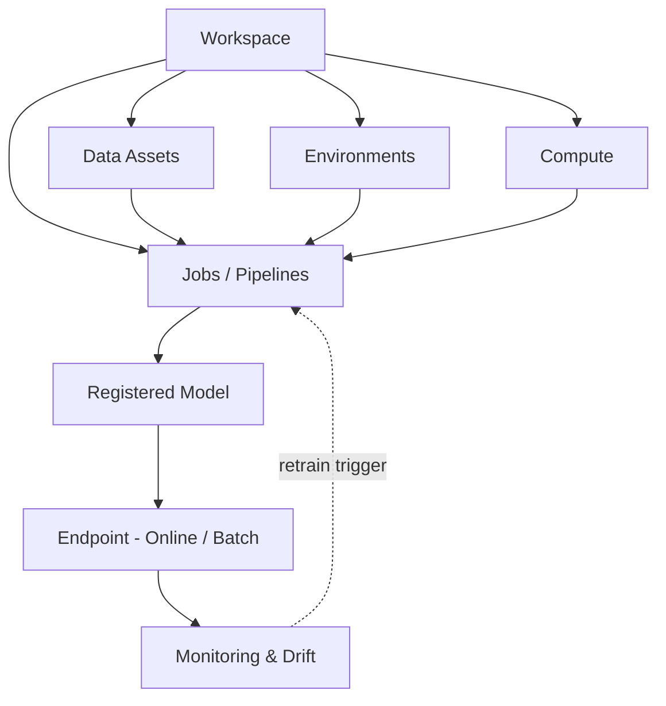
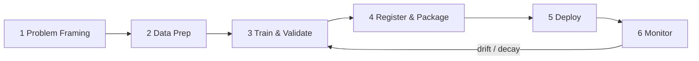
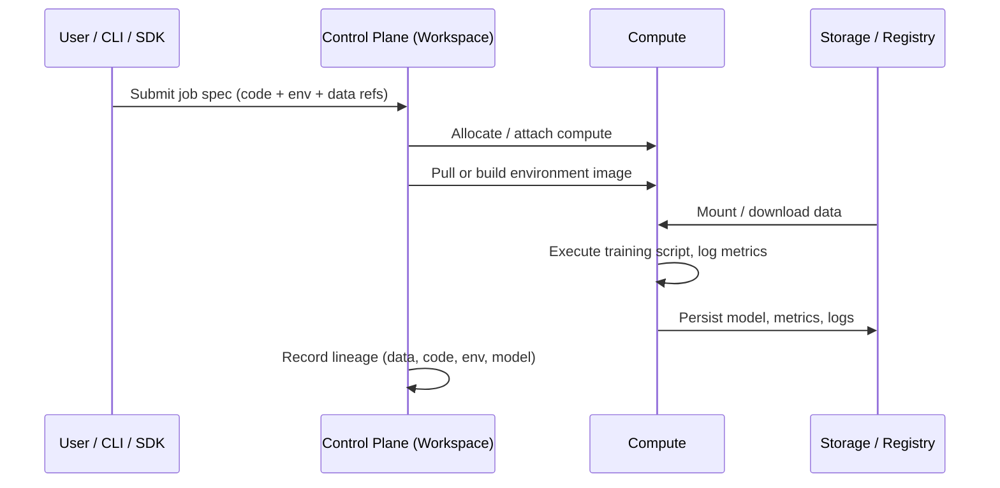

# Azure Machine Learning: Advanced

Atlanta, USA

[](https://github.com/)
[Cloud2BR OSS - Learning Hub](https://github.com/Cloud2BR-MSFTLearningHub)

Last updated: 2026-06-26

----------

This repository provides a structured Azure Machine Learning (Azure ML) overview from foundational concepts to advanced MLOps and production operations. It covers the **conceptual model**, the **mathematics**, **what happens in the backend**, the **minimum lifecycle stages**, and **how each piece looks** in practice.

## Training Site

Use the structured training navigation at [docs/index.md](docs/index.md).

GitHub Pages deployment is wired via [deploy-github-pages.yml](.github/workflows/deploy-github-pages.yml).
In GitHub, set **Settings -> Pages -> Source = GitHub Actions**.

This documentation site now builds with **MkDocs (Material theme)**.

Local preview:

```bash
pip install mkdocs mkdocs-material mkdocs-mermaid2-plugin pymdown-extensions
mkdocs serve
```

Production build:

```bash
mkdocs build --strict
```

> Note on math rendering: GitHub Markdown renders inline math with `$...$` and block math with `$$...$$`. All formulas below use that syntax so they display correctly on GitHub.

## Table of Contents

- [1) What Azure Machine Learning Is](#1-what-azure-machine-learning-is)
- [2) Minimum End-to-End ML Stages](#2-minimum-end-to-end-ml-stages)
- [3) Core Math Foundations](#3-core-math-foundations-and-why-they-matter)
- [4) What Happens in the Backend](#4-what-happens-in-the-backend)
- [5) Azure ML Conceptual Architecture](#5-azure-ml-conceptual-architecture)
- [6) Basic-to-Advanced Learning Path](#6-basic-to-advanced-learning-path)
- [7) Deployment Patterns](#7-deployment-patterns)
- [8) Monitoring, Reliability, and Model Risk](#8-monitoring-reliability-and-model-risk)
- [9) Security and Governance Baseline](#9-security-and-governance-baseline)
- [10) Practical Outcome for This Repository](#10-practical-outcome-for-this-repository)

## 1) What Azure Machine Learning Is

Azure ML is a managed platform to design, train, deploy, and monitor machine learning systems.

At a high level, it provides:

- **Workspace**: central control plane for assets and runs.
- **Compute**: managed clusters/instances for training and inference.
- **Data assets**: versioned references to data sources.
- **Model assets**: versioned trained artifacts.
- **Environments**: versioned, reproducible runtime definitions (base image + dependencies).
- **Jobs**: a unit of executable work (training, sweep, pipeline, command).
- **Pipelines**: reusable workflow graphs for ML tasks.
- **Endpoints**: managed online or batch serving interfaces.
- **Monitoring**: drift, performance, and operational telemetry.

### How it looks (asset relationships)



## 2) Minimum End-to-End ML Stages

The minimum lifecycle is:

1. **Problem framing** (objective, constraints, KPI).
2. **Data ingestion and preparation** (quality, labels, features).
3. **Training and validation** (experimentation + model selection).
4. **Registration and packaging** (model + environment).
5. **Deployment** (online or batch endpoint).
6. **Monitoring and iteration** (accuracy, latency, drift, retraining).

These stages map directly to Azure ML assets and jobs, enabling reproducibility and governance.



## 3) Core Math Foundations (and Why They Matter)

### Supervised Learning Objective

Given dataset $(x_i, y_i)$, learn parameters $\theta$ that minimize empirical risk:

$$
\min_{\theta} \frac{1}{N}\sum_{i=1}^{N}\mathcal{L}(f_{\theta}(x_i), y_i)
$$

Where:

- $f_{\theta}$ is the model.
- $\mathcal{L}$ is the loss function.
- $N$ is the number of training examples.

### Common Loss Functions

- **MSE (regression)**:

$$
\mathcal{L}_{MSE} = \frac{1}{N}\sum_{i=1}^{N}(y_i-\hat{y}_i)^2
$$

- **Binary cross-entropy (classification)**:

$$
\mathcal{L}_{BCE} = -\frac{1}{N}\sum_{i=1}^{N}\left[y_i\log(\hat{p}_i)+(1-y_i)\log(1-\hat{p}_i)\right]
$$

### Optimization (Gradient Descent)

$$
\theta_{t+1} = \theta_t - \eta \nabla_{\theta}\mathcal{L}
$$

Where $\eta$ is the learning rate. In Azure ML training jobs, this process executes on provisioned CPU/GPU compute, and each step's metrics can be logged for run comparison.

### Regularization

- **L2 (Ridge)** adds $\lambda \lVert\theta\rVert_2^2$.
- **L1 (Lasso)** adds $\lambda \lVert\theta\rVert_1$.

These reduce overfitting and improve generalization for production reliability. The regularized objective becomes:

$$
\min_{\theta} \frac{1}{N}\sum_{i=1}^{N}\mathcal{L}(f_{\theta}(x_i), y_i) + \lambda R(\theta)
$$

### Evaluation Metrics

- **Classification** — precision, recall, and their harmonic mean:

$$
\text{Precision} = \frac{TP}{TP+FP}, \quad \text{Recall} = \frac{TP}{TP+FN}, \quad F_1 = 2\cdot\frac{\text{Precision}\cdot\text{Recall}}{\text{Precision}+\text{Recall}}
$$

- **Regression** — root mean squared error:

$$
\text{RMSE} = \sqrt{\frac{1}{N}\sum_{i=1}^{N}(y_i-\hat{y}_i)^2}
$$

## 4) What Happens in the Backend

When a job is submitted:

1. Azure ML resolves the job spec (code, environment, inputs, outputs).
2. Compute is allocated or attached.
3. Container image/environment is pulled or built.
4. Data references are mounted/downloaded to runtime.
5. Script/notebook command executes and logs metrics/artifacts.
6. Outputs (model, metrics, logs) are persisted in workspace-linked storage.
7. Lineage links are created across data, code snapshot, environment, and model.

This backend process is what enables repeatability, auditability, and regulated deployment workflows.



## 5) Azure ML Conceptual Architecture

### Control Plane

- Workspace metadata
- Asset registry
- Access and role-based governance
- Experiment/run history

### Data Plane

- Storage accounts / data lake connectivity
- Compute execution nodes
- Model inference containers/endpoints

### Operational Plane

- CI/CD for ML (MLOps)
- Monitoring and alerts
- Responsible AI checks
- Security and compliance controls

## 6) Basic-to-Advanced Learning Path

### Beginner

- Understand ML lifecycle and Azure ML workspace components.
- Run first training experiment on compute instance.
- Track metrics and compare runs.

### Intermediate

- Create reusable training pipelines.
- Use data/model versioning and model registry.
- Deploy managed online endpoint with scaling and auth.

### Advanced

- Build full MLOps with CI/CD, approvals, and staged promotion.
- Implement feature engineering pipelines and retraining triggers.
- Add drift detection, canary releases, and rollback strategy.
- Apply responsible AI practices and governance policies.

## 7) Deployment Patterns

- **Real-time (Online Endpoint)**: low-latency scoring for APIs/apps.
- **Batch Endpoint**: scheduled/asynchronous large-scale scoring.
- **Edge/Hybrid**: deploy packaged models where connectivity is limited.

Trade-off dimensions:

- Latency vs throughput
- Cost vs availability
- Accuracy vs interpretability

## 8) Monitoring, Reliability, and Model Risk

Production ML requires both software and statistical observability:

- **Operational**: CPU/memory, request rate, p95 latency, error rate.
- **Model quality**: precision/recall/F1, calibration, AUC, RMSE.
- **Data quality**: schema violations, missingness, outliers.
- **Drift**:
  - Covariate drift: input feature distribution changes over time.

$$
P_t(X)\neq P_{t+\Delta}(X)
$$

  - Concept drift: target relationship changes, so the same inputs map to different outcomes.

$$
P_t(Y\mid X)\neq P_{t+\Delta}(Y\mid X)
$$

These equations indicate distributional change between time windows. In practice, teams detect drift with distance or hypothesis metrics. For example, the **Population Stability Index (PSI)** across $B$ bins:

$$
\text{PSI} = \sum_{b=1}^{B}(a_b - e_b)\ln\frac{a_b}{e_b}
$$

where $a_b$ and $e_b$ are the actual and expected proportions in bin $b$. Other common detectors include KL-divergence and the Kolmogorov–Smirnov (KS) test. Retraining is triggered when business and statistical thresholds are exceeded.

## 9) Security and Governance Baseline

Minimum practices:

- Private networking and controlled ingress/egress.
- Managed identity for compute and data access.
- Secret handling via Key Vault.
- RBAC and least-privilege permissions.
- Model/data lineage with versioned assets.
- Approval gates for production deployment.

## 10) Practical Outcome for This Repository

This repository is positioned as an Azure ML learning hub covering:

- End-to-end conceptual understanding.
- Mathematical grounding for ML training and evaluation.
- Azure ML backend/runtime behavior.
- Minimum and advanced operational stages for real deployments.

Use this as a baseline to add notebooks, pipeline examples, deployment templates, and monitoring playbooks in future increments.

<!-- START BADGE -->
<div align="center">
  
  <p>Refresh Date: 2026-04-07</p>
</div>
<!-- END BADGE -->
