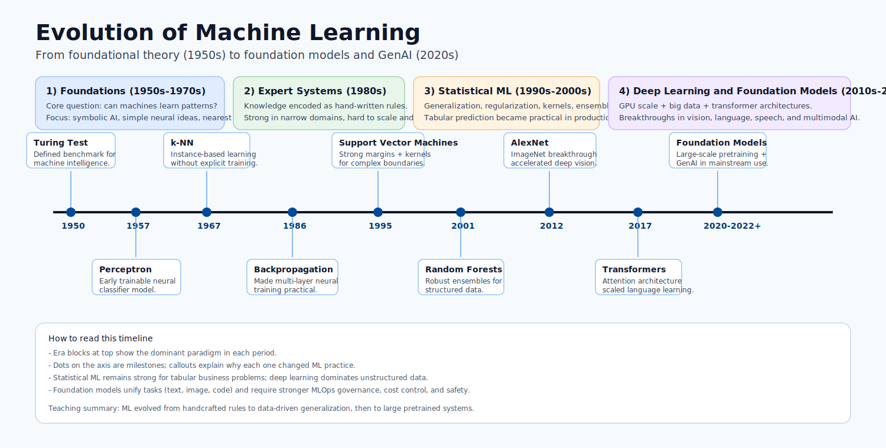


# Azure Machine Learning Training Hub

This training hub covers Azure Machine Learning from fundamentals to production
operations, with formulas, architecture, deployment guidance, and visual references.

Progression model:

- Beginner: understand AI/ML fundamentals and platform basics.
- Intermediate: build data, training, and evaluation workflows.
- Advanced: deploy, monitor, debug, and govern production ML systems.

## Evolution of Machine Learning

Machine learning as a scientific field started in the 1950s, then moved through
multiple eras based on compute power, data availability, and algorithmic advances.

> Image explanation: This visual shows machine learning evolution timeline. Use it to understand the concept in this section and connect it to practical Azure ML decisions.

### Milestone eras

1. Foundations (1950s-1970s): Turing test ideas, perceptrons, nearest-neighbor methods.
2. Expert systems era (1980s): rule-based AI in enterprise workflows.
3. Statistical ML era (1990s-2000s): SVMs, random forests, probabilistic modeling.
4. Deep learning era (2010s): GPUs and large datasets enabled deep neural networks.
5. Foundation model era (2020s+): transformers, large language models, multimodal AI.

### Why this matters for Azure ML learners

- It explains why modern MLOps includes both classic ML and deep learning workflows.
- It clarifies when simpler models can outperform larger neural models in tabular data.
- It frames current production needs: monitoring, governance, safety, and cost control.

## Learning Path

	

		<h3><a href="modules/00-introduction/">Introduction and Lifecycle</a></h3>
		
AI vs ML vs data science, AI categories, and end-to-end Azure ML lifecycle.

	

	

		<h3><a href="modules/01-ml-foundations/">ML Foundations</a></h3>
		
Full ML taxonomy: supervised, unsupervised, RL, semi/self-supervised, with formulas and selection guidance.

	

	

		<h3><a href="modules/02-azure-ml-environment/">Azure ML Environment</a></h3>
		
Workspace taxonomy, compute types, model registry, and endpoints.

	

	

		<h3><a href="modules/03-environment-setup/">Environment Setup</a></h3>
		
Conda/pip setup, package validation, and runtime consistency.

	

	

		<h3><a href="modules/04-data-preparation/">Data Preparation</a></h3>
		
Data collection, cleaning, schema handling, and split strategy.

	

	

		<h3><a href="modules/05-model-types/">Model Types</a></h3>
		
Algorithm families with representative mathematical formulations.

	

	

		<h3><a href="modules/06-training-automl/">Training and AutoML</a></h3>
		
AutoML search flow, compute choices, and practical training pipeline.

	

	

		<h3><a href="modules/07-performance-metrics/">Performance Metrics</a></h3>
		
Classification and regression metrics, formulas, and interpretation.

	

	

		<h3><a href="modules/08-results-explainability/">Results and Explainability</a></h3>
		
Result analysis, drift detection, and explainability methods.

	

	

		<h3><a href="modules/09-deployment/">Deployment</a></h3>
		
Registration, scoring, endpoint deployment, and serving patterns.

	

	

		<h3><a href="modules/10-deployment-debug-k8s/">Deployment Debugging</a></h3>
		
Kubernetes-focused troubleshooting for production endpoint issues.

	

## Reference

	

		<h3><a href="reference/">Reference Home</a></h3>
		
Supporting material for implementation and operations.

	

	

		<h3><a href="reference/cli-commands/">CLI Commands</a></h3>
		
Command-line references for setup, run, and deployment tasks.

	

	

		<h3><a href="reference/glossary/">Glossary</a></h3>
		
Core Azure ML and MLOps terms used throughout this training.

	

