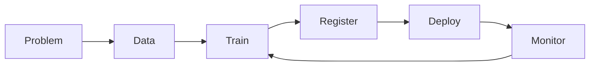

# Introduction and ML Lifecycle

Azure Machine Learning organizes the end-to-end lifecycle:

1. Problem framing
2. Data preparation
3. Training and validation
4. Model registration
5. Deployment
6. Monitoring and retraining

## Legacy Visuals (from original 04k notes)

## Web Service vs API

- A deployed Azure ML model is typically exposed as a REST API endpoint.
- In practice, teams often say "web service" for the deployed scoring interface.

