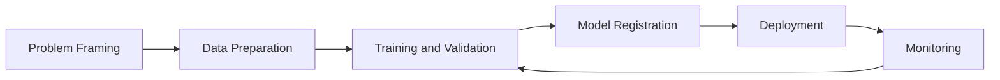
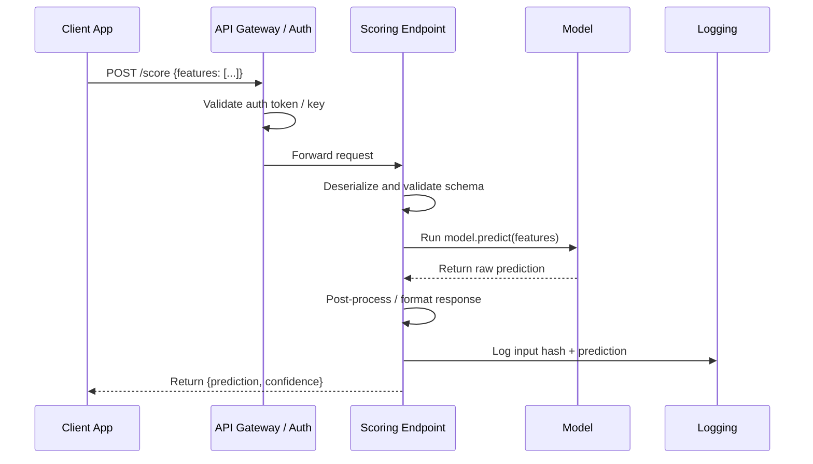

# Introduction and ML Lifecycle

This course is built for learners starting from scratch and progressing to production
MLOps thinking. The goal is not only to define terms, but to build intuition for how
real ML systems are designed, shipped, and operated.

## Who this is for

- Beginners who know little or nothing about ML.
- Engineers who can code but need end-to-end ML platform understanding.
- Teams preparing to deploy Azure ML workloads in production.

## Learning outcomes

By the end of this module, you should be able to:

1. Explain the difference between AI, ML, and data science.
2. Identify major AI and ML categories.
3. Describe the Azure ML lifecycle from problem framing to monitoring.
4. Explain how a deployed model is exposed as an API/web service.

## AI vs ML vs Data Science

| Topic | What it is | Goal | Typical output |
|---|---|---|---|
| AI (Artificial Intelligence) | Broad field of building systems that perform tasks requiring human-like intelligence | Reason, plan, perceive, generate, decide | Intelligent behavior |
| ML (Machine Learning) | Subset of AI where systems learn patterns from data | Predict/estimate outcomes from examples | Trained model |
| Data Science | Interdisciplinary practice of extracting insight from data | Understand data and support decisions | Analysis, dashboards, models |

Key relationship for beginners:

- **AI** is the umbrella.
- **ML** is one major way to build AI systems.
- **Data science** uses statistics, ML, and domain knowledge to solve business problems
  and communicate insights.

In short: AI is the mission, ML is one method, and data science is the broader practice.

## Major AI categories

| Category | Description | Real-world examples |
|---|---|---|
| Symbolic / Rule-based AI | Explicit rules and logic created by humans | Expert systems, business rule engines |
| Machine Learning AI | Learns from data instead of hard-coded rules | Fraud scoring, demand forecasting |
| Generative AI | Learns to generate new content | Text generation, image generation, code assistants |
| Classical Search/Planning | Finds actions to optimize a goal | Route planning, scheduling |

Practical note: many enterprise solutions combine categories. Example: a fraud system can
use supervised ML scoring plus rule-based guardrails.

## Types of ML at a glance

| Type | Data requirement | Typical task |
|---|---|---|
| Supervised learning | Labeled data $(X, y)$ | Classification, regression |
| Unsupervised learning | Unlabeled data $X$ | Clustering, anomaly detection |
| Reinforcement learning | Environment + reward signal | Sequential decision/control |
| Semi-supervised learning | Small labeled + large unlabeled | Classification with sparse labels |
| Self-supervised learning | Labels generated from data itself | Representation learning (NLP/CV) |

## Common confusion points

- A model can be "accurate" but still unusable if latency is too high.
- A model can be statistically strong but fail fairness/compliance checks.
- A model is not a product by itself; the surrounding data and ops system matters.
- Deep learning is a subset of ML, not a separate thing; it uses neural networks with many layers.
- "Training" a model means finding parameter values that minimise a loss function on data — not teaching in the human sense.

## Real-world example: e-commerce recommendation

To make this concrete, here is how the full technology stack maps to a product:

| Concern | Technology choice | ML lifecycle stage |
|---|---|---|
| Collect user events | Event streaming (Kafka, Event Hub) | Data ingestion |
| Store features | Feature store or Azure Data Lake | Data preparation |
| Train model | Azure ML training job | Training |
| Serve recommendations | Online endpoint (AKS) | Deployment |
| Detect stale model | Azure ML data drift monitor | Monitoring |

The model is one component. The pipeline around it is what makes it reliable.

## Why Azure ML matters

Azure Machine Learning gives you the managed platform to run the full lifecycle with
reproducibility and governance: versioned data/model assets, tracked runs, deployment
endpoints, and monitoring.

Azure Machine Learning organizes the end-to-end lifecycle:

1. Problem framing
2. Data preparation
3. Training and validation
4. Model registration
5. Deployment
6. Monitoring and retraining

This is not a linear path. Production systems continuously loop from monitoring back to
data and training when model quality or data distributions change.

### What each stage does

| Stage | Main question | Key output |
|---|---|---|
| Problem framing | What decision are we trying to improve? | Business KPI definition, success criteria |
| Data preparation | Do we trust the data and labels? | Validated, versioned dataset |
| Training | Which model learns the signal best? | Candidate models with tracked metrics |
| Registration | Is the artifact versioned and reproducible? | Registered model with lineage |
| Deployment | Can consumers call this model safely? | Live endpoint with auth and monitoring |
| Monitoring | Is quality stable over time in production? | Drift and quality alerts, retraining signals |

Note: Stage 1 (problem framing) is often underinvested. The single most common reason ML projects fail is a poorly defined business objective, not a weak model.

> Image explanation: This visual shows ml infrastructure tools for production. Use it to understand the concept in this section and connect it to practical Azure ML decisions.

> Image explanation: This visual shows ml workflow stages. Use it to understand the concept in this section and connect it to practical Azure ML decisions.

> Image explanation: This visual shows overview ml flow. Use it to understand the concept in this section and connect it to practical Azure ML decisions.

## Web Service vs API

- A deployed Azure ML model is typically exposed as a REST API endpoint.
- In practice, teams often say "web service" for the deployed scoring interface.

## Deep dive: every concept, explained

This section expands the terms used above so that no concept is left as a black box.

### What "learning from data" actually means

A classical program is a fixed function written by a human: `output = program(input)`.
Machine learning **inverts** this. You provide examples of inputs and desired outputs, and
an optimization procedure searches for a function that reproduces them and, crucially,
*generalizes* to unseen inputs. Formally, ML assumes the data is drawn from an unknown
joint distribution $P(X, Y)$, and the goal is to learn a function $f$ that minimizes the
**expected risk** over that distribution:

$$
R(f) = \mathbb{E}_{(x,y)\sim P}\big[\mathcal{L}(f(x), y)\big]
$$

Because $P$ is unknown, we minimize the **empirical risk** on a finite sample instead
(the training set). The entire discipline of ML is about making that approximation
trustworthy — which is why data quality, validation, and monitoring matter as much as the
algorithm.

### AI, ML, deep learning, and GenAI as nested sets

| Term | Precise scope | What distinguishes it |
|---|---|---|
| Artificial Intelligence | Any system exhibiting goal-directed "intelligent" behavior | Includes hand-written logic, search, and learning |
| Machine Learning | AI systems that improve from data | Parameters are *fit*, not hand-coded |
| Deep Learning | ML using multi-layer neural networks | Learns hierarchical feature representations automatically |
| Generative AI | Models that learn $P(X)$ (or $P(X\mid \text{prompt})$) to synthesize new data | Produces content rather than only labels/scores |

The mental model: each is a strict subset of the one before it. A logistic regression is
ML but not deep learning; a CNN is deep learning; a diffusion model or LLM is deep learning
*and* generative AI.

### Supervised, unsupervised, and reinforcement — the signal that drives learning

The families differ only in **what feedback signal is available**:

- **Supervised**: every example carries a correct answer $y$. The loss directly measures the
  gap between prediction and truth, so the gradient "knows" which direction to move.
- **Unsupervised**: there is no $y$. The objective instead rewards structure the model
  discovers itself — minimizing reconstruction error, maximizing cluster compactness, or
  maximizing likelihood of the data under a density model.
- **Reinforcement**: feedback is a delayed, scalar **reward** earned by interacting with an
  environment. The hard part is *credit assignment* — deciding which earlier actions caused
  a later reward.
- **Self-supervised** is the bridge that powers foundation models: it manufactures a
  supervised signal *from the data itself* (predict the masked word, the next token, the
  missing image patch), giving the scale benefits of supervised learning without manual labels.

### Why "the pipeline matters more than the model"

The lifecycle diagram is a closed loop on purpose. In production the dominant failure mode is
not a weak algorithm but a **distribution shift**: the data the model sees in production
drifts away from the data it was trained on (`P_train(X) ≠ P_prod(X)`), so a model that was
accurate at launch silently degrades. The monitoring → training feedback edge exists to
detect this and retrain. This is the core idea of **MLOps**: treating data, models, and
deployments as versioned, testable, observable assets rather than one-off artifacts.

### Latency, throughput, and why a "good" model can be unusable

Two operational terms appear throughout the course:

- **Latency** — time to serve a single request (often measured at the p95 or p99
  percentile, not the average, because tail latency is what users feel).
- **Throughput** — requests served per second (QPS) at acceptable latency.

A model that scores 0.99 AUC but needs 800 ms per call may be useless for a checkout flow
with a 100 ms budget. Model selection is therefore always a *joint* optimization over
accuracy, latency, cost, and governance constraints — a theme repeated in every later module.

### REST API, endpoint, and web service — the same idea at different layers

- A **REST API** is an HTTP contract: a client sends a request (usually JSON) to a URL and
  gets a structured response. "REST" means it uses standard HTTP verbs and is stateless.
- An **endpoint** in Azure ML is the concrete, addressable deployment of that API, with
  authentication, scaling, and traffic-routing attached.
- "**Web service**" is the informal name teams give the running endpoint. All three describe
  the same thing seen from the contract, the platform, and the team's vocabulary respectively.

Practical distinction:

- **API** describes the contract (request/response schema, authentication, versioning).
- **Web service** is the hosted implementation of that API.
- In Azure ML online endpoints, you design the API contract through the scoring payload
  and endpoint auth, and Azure hosts the service.

### Inference request flow (simple)

1. Client sends JSON payload to endpoint URI.
2. Endpoint auth validates identity/key.
3. Scoring script parses input and runs model.
4. API returns prediction response + metadata.

### Inference request flow (detailed)

Key production considerations for this flow:

- **Schema validation in the scoring script** protects against unexpected input shapes.
- **Logging input hashes** (not raw PII) enables later drift analysis and auditing.
- **Timeouts and retries** must be defined at both the gateway and client layers to avoid silent failures.

> Image explanation: This visual shows web service vs api. Use it to understand the concept in this section and connect it to practical Azure ML decisions.

> Image explanation: This visual shows web service vs api table. Use it to understand the concept in this section and connect it to practical Azure ML decisions.

## Quick self-check

1. Is every AI system an ML system?
2. In production, which stage catches drift issues?
3. What is the difference between API and web service?

