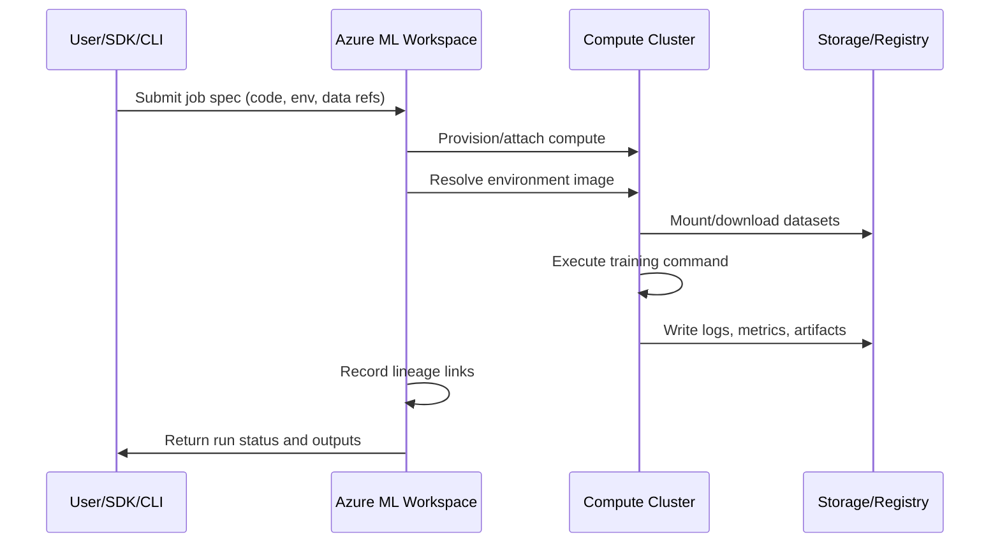

# Azure ML Environment

This module explains Azure ML platform building blocks and how to choose compute and
serving options based on scale, latency, and cost.

## Main workspace assets

- Workspace
- Compute Instance
- Compute Cluster
- Data assets
- Model registry
- Endpoints

## Control plane vs data plane

| Plane | Responsibility |
|---|---|
| Control plane | Asset metadata, run history, permissions, governance |
| Data plane | Actual compute execution, model inference, data movement |

## Workspace Taxonomy


> **Note - What this shows:** The Azure ML workspace taxonomy : how the workspace contains compute, data assets, models, and
> endpoints under one governance boundary. Use it to see which asset type owns each artifact you
> will create in later modules.


> **Note - What this shows:** How a versioned *environment* (base image + pinned dependencies) is reused across both training
> and inference. Sharing one environment is what prevents training/serving skew : the same code
> behaving differently in production than in training.

Key concepts:

- Experiment: a tracked training run.
- Registered model: trained artifact stored with version and lineage.
- Endpoint: deployment surface for scoring requests.

Additional key terms:

- Environment: pinned runtime dependencies and base image.
- Datastore: registered storage connection.
- Dataset/Data asset: versioned data reference used by jobs.


> **Note - What this shows:** The anatomy of an Azure ML endpoint: the deployment surface that receives scoring requests,
> applies authentication, and routes traffic to one or more model versions. This is the object
> consumers actually call.

## Compute guidance

- Compute Instance for development
- Compute Cluster for scalable training
- ACI or AKS for serving

Practical split:

- AML Compute Cluster: training, sweeps, AutoML parallel iterations.
- AKS Inference Cluster: production-grade deployment and autoscaling.

## Compute decision matrix

| Need | Recommended option |
|---|---|
| Notebook exploration and debugging | Compute Instance |
| Parallelized training and HPO | Compute Cluster |
| Quick endpoint prototype | ACI |
| Production, autoscale, high availability | AKS |

## Security and governance baseline

- Use managed identities for data access.
- Restrict network paths with private endpoints where possible.
- Use least-privilege RBAC.
- Keep lineage from data to model to endpoint for auditability.

## Backend execution flow (what happens after submit)



## Asset lineage map

| Asset | Versioned | Produced by | Consumed by |
|---|---|---|---|
| Data asset | Yes | Data registration job | Training/inference jobs |
| Environment | Yes | Environment build/pin | Training and deployment |
| Model | Yes | Training run output | Online/Batch endpoints |
| Endpoint deployment | Yes (revisioned) | Deploy pipeline | Consumers (apps/APIs) |

## Enterprise considerations

- Multi-workspace strategy: separate `dev`, `test`, `prod` with promotion gates.
- Registry strategy: central model registry for cross-workspace sharing.
- Access model: human access via RBAC groups; workload access via managed identity.
- Compliance trail: preserve run IDs, model versions, dataset versions, and deployment revisions.

## Azure ML RBAC roles reference

| Role | Typical assignee | Permissions |
|---|---|---|
| Owner | Platform team leads | Full control including role assignments |
| Contributor | ML engineers | Create/manage all assets, no role changes |

## Deep dive: every concept, explained

This section explains *why* each Azure ML building block exists and what problem it solves,
not just what it is called.

### The workspace as the unit of governance

A **workspace** is the top-level container that ties together compute, data, models, and
endpoints under one identity and access boundary. It exists so that everything about a project
: who can touch it, which runs produced which model, which data version trained it : is
recorded in one auditable place. Behind the scenes a workspace provisions associated Azure
resources: a **storage account** (artifacts, datasets), **Key Vault** (secrets), **Container
Registry** (environment images), and **Application Insights** (telemetry). Understanding this
mapping explains most permissions and networking issues you will hit later.

### Control plane vs data plane : why the split matters

- The **control plane** handles *metadata and intent*: "register this dataset", "start this
  job", "who is allowed to deploy". It is lightweight, always-on, and is where governance,
  lineage, and RBAC live.
- The **data plane** handles *actual work*: spinning up VMs, moving gigabytes, running training
  loops, serving inference. It is where cost and performance are determined.

This separation is why you can submit a job (control plane) and have it queue until compute
(data plane) is available, and why permission to *see* an asset is distinct from permission to
*run* expensive compute with it.

### Compute Instance vs Compute Cluster vs inference cluster

| Compute | Lifecycle | Why it exists |
|---|---|---|
| Compute Instance | Single, always-on dev VM | Interactive notebooks, debugging, attached to one user identity |
| Compute Cluster | Auto-scales 0→N nodes per job, then back to 0 | Parallel training, hyperparameter sweeps, AutoML trials; you pay only while jobs run |
| AKS / managed inference | Long-lived, autoscaling pods | Low-latency, high-availability serving with health probes |

The key economic idea: **training compute should scale to zero when idle** (bursty, batch),
while **serving compute stays warm** (steady, latency-sensitive). Choosing the wrong one is a
top cause of surprise cloud bills.

### Assets, versioning, and lineage

Every first-class asset (data, environment, model, endpoint deployment) is **versioned**. This
is not bureaucracy : it is what makes an ML system *reproducible* and *auditable*:

- **Data asset** : a versioned pointer to data in a datastore, so a run records *exactly* which
  snapshot it trained on.
- **Environment** : a pinned runtime (base image + dependency versions). Reusing the same
  environment for training and inference prevents the "works in training, breaks in production"
  class of bugs.
- **Model** : the trained artifact plus metadata linking it back to the run, data, and
  environment that produced it (its **lineage**).
- **Endpoint deployment** : a revisioned serving configuration, so traffic can be split or
  rolled back between versions.

Lineage is the chain `data v → run → model v → endpoint revision`. When a production prediction
is questioned (audit, incident, fairness review), lineage lets you reconstruct precisely how it
was produced.

### Identity and access concepts

- **Managed identity** : an Azure-managed credential attached to a workload (not a person) so
  jobs can read data or registries *without embedded secrets*. This is the secure default.
- **RBAC (role-based access control)** : permissions granted to identities via roles. The
  **least-privilege** principle means giving each identity the minimum role needed (e.g.
  Contributor for engineers, not Owner), limiting blast radius if credentials are compromised.
- **Private endpoint** : routes traffic to the workspace over a private network path instead of
  the public internet, reducing exposure for regulated workloads.

### The submit-to-result flow, demystified

When you submit a job, the control plane validates the spec, provisions or attaches data-plane
compute, resolves the environment image (pulling or building the container), mounts the
referenced data version, runs your command, streams logs/metrics/artifacts back to storage, and
records lineage. Knowing this sequence is what lets you debug a stuck run: each arrow in the
sequence diagram above is a place a job can fail (quota, image build, data mount, code error).
| AzureML Data Scientist | Data scientists | Run experiments, register models, deploy |
| AzureML Compute Operator | Ops team | Start/stop compute, view runs |
| Reader | Stakeholders | View assets and run history only |

## Environment versioning strategy

Azure ML environments are immutable once published. Recommended versioning approach:

1. Pin all packages with exact versions in `conda.yml` or `requirements.txt`.
2. Use environment name + version (e.g., `fraud-train:3`) as the reference in jobs.
3. Rebuild the environment when any dependency changes — never mutate existing versions.
4. Reuse the **same** environment for training and inference to guarantee compatibility.

```yaml
# Example conda.yml
name: fraud-train
channels:
  - defaults
dependencies:
  - python=3.10
  - pip:
    - scikit-learn==1.3.0
    - azureml-sdk==1.55.0
    - pandas==2.0.3
    - lightgbm==4.0.0
```

## Cost management tips

| Practice | Saves |
|---|---|
| Set compute cluster min nodes = 0 | Avoids idle compute charges |
| Use spot/low-priority VMs for training | 60–80% compute cost reduction |
| Set auto-shutdown on compute instances | Prevents overnight idle spend |
| Use ACI for low-QPS endpoints instead of AKS | Eliminates cluster overhead |

