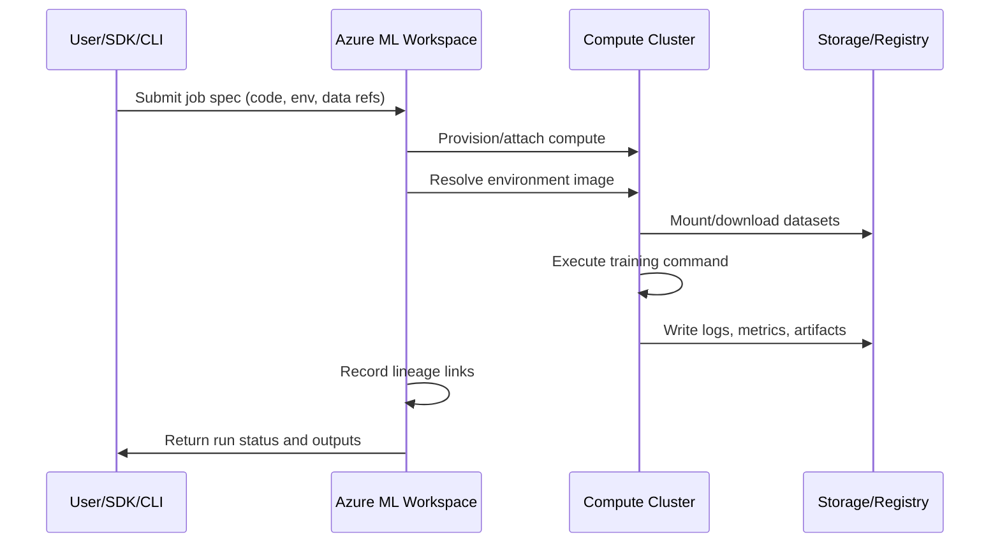

# Azure ML Environment

This module explains Azure ML platform building blocks and how to choose compute and
serving options based on scale, latency, and cost.

## Main workspace assets

- Workspace
- Compute Instance
- Compute Cluster
- Data assets
- Model registry
- Endpoints

## Control plane vs data plane

| Plane | Responsibility |
|---|---|
| Control plane | Asset metadata, run history, permissions, governance |
| Data plane | Actual compute execution, model inference, data movement |

## Workspace Taxonomy


> Image explanation: This visual shows azure ml workspace taxonomy. Use it to understand the concept in this section and connect it to practical Azure ML decisions.


> Image explanation: This visual shows azure ml environment taxonomy. Use it to understand the concept in this section and connect it to practical Azure ML decisions.

Key concepts:

- Experiment: a tracked training run.
- Registered model: trained artifact stored with version and lineage.
- Endpoint: deployment surface for scoring requests.

Additional key terms:

- Environment: pinned runtime dependencies and base image.
- Datastore: registered storage connection.
- Dataset/Data asset: versioned data reference used by jobs.


> Image explanation: This visual shows azure endpoint concept. Use it to understand the concept in this section and connect it to practical Azure ML decisions.

## Compute guidance

- Compute Instance for development
- Compute Cluster for scalable training
- ACI or AKS for serving

Practical split:

- AML Compute Cluster: training, sweeps, AutoML parallel iterations.
- AKS Inference Cluster: production-grade deployment and autoscaling.

## Compute decision matrix

| Need | Recommended option |
|---|---|
| Notebook exploration and debugging | Compute Instance |
| Parallelized training and HPO | Compute Cluster |
| Quick endpoint prototype | ACI |
| Production, autoscale, high availability | AKS |

## Security and governance baseline

- Use managed identities for data access.
- Restrict network paths with private endpoints where possible.
- Use least-privilege RBAC.
- Keep lineage from data to model to endpoint for auditability.

## Backend execution flow (what happens after submit)



## Asset lineage map

| Asset | Versioned | Produced by | Consumed by |
|---|---|---|---|
| Data asset | Yes | Data registration job | Training/inference jobs |
| Environment | Yes | Environment build/pin | Training and deployment |
| Model | Yes | Training run output | Online/Batch endpoints |
| Endpoint deployment | Yes (revisioned) | Deploy pipeline | Consumers (apps/APIs) |

## Enterprise considerations

- Multi-workspace strategy: separate `dev`, `test`, `prod` with promotion gates.
- Registry strategy: central model registry for cross-workspace sharing.
- Access model: human access via RBAC groups; workload access via managed identity.
- Compliance trail: preserve run IDs, model versions, dataset versions, and deployment revisions.

## Azure ML RBAC roles reference

| Role | Typical assignee | Permissions |
|---|---|---|
| Owner | Platform team leads | Full control including role assignments |
| Contributor | ML engineers | Create/manage all assets, no role changes |
| AzureML Data Scientist | Data scientists | Run experiments, register models, deploy |
| AzureML Compute Operator | Ops team | Start/stop compute, view runs |
| Reader | Stakeholders | View assets and run history only |

## Environment versioning strategy

Azure ML environments are immutable once published. Recommended versioning approach:

1. Pin all packages with exact versions in `conda.yml` or `requirements.txt`.
2. Use environment name + version (e.g., `fraud-train:3`) as the reference in jobs.
3. Rebuild the environment when any dependency changes — never mutate existing versions.
4. Reuse the **same** environment for training and inference to guarantee compatibility.

```yaml
# Example conda.yml
name: fraud-train
channels:
  - defaults
dependencies:
  - python=3.10
  - pip:
    - scikit-learn==1.3.0
    - azureml-sdk==1.55.0
    - pandas==2.0.3
    - lightgbm==4.0.0
```

## Cost management tips

| Practice | Saves |
|---|---|
| Set compute cluster min nodes = 0 | Avoids idle compute charges |
| Use spot/low-priority VMs for training | 60–80% compute cost reduction |
| Set auto-shutdown on compute instances | Prevents overnight idle spend |
| Use ACI for low-QPS endpoints instead of AKS | Eliminates cluster overhead |

