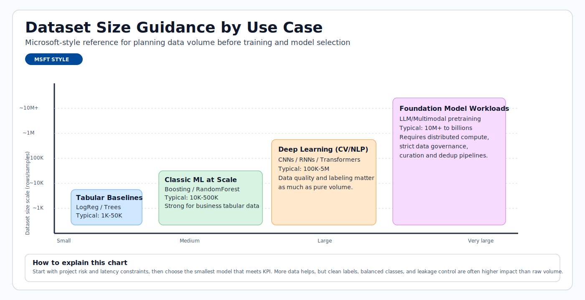

# Data Preparation

Data preparation is often the highest-effort stage of ML delivery. This module teaches
how to move from raw data to model-ready data with quality, reproducibility, and
leakage prevention.

## Data lifecycle overview

This sequence illustrates the lifecycle: business framing, data collection, feature
engineering, and dataset sizing for reliable model training.


> **Note - What this shows:** The data lifecycle by stage — from business framing through collection and feature engineering.
> Most delivery effort lives in these early stages, and defects here cap the quality any model
> can reach.


> **Note - What this shows:** How primary and secondary targets are collected alongside features. Defining the target
> precisely (and when it becomes known) is what later prevents target leakage.


> **Tip - Practical point:** Feature engineering should happen *while* you understand the data, but transforms must be fit
> on the training split only. Designing features and the split strategy together is how you keep
> preprocessing leakage-free.



> **Tip - How to use this chart:** Match your use case to a dataset-size band before committing to a model family. Tabular
> baselines need far less data than deep learning; foundation-model workloads need orders of
> magnitude more. Sizing data first avoids choosing a model you cannot feed.

> **Note - GB reference:** In dataset planning, vendor storage is typically decimal units:
> 1 KB = 1,000 bytes, 1 MB = 1,000,000 bytes, 1 GB = 1,000,000,000 bytes.
> Memory tools may show binary units instead: 1 GiB = 1,073,741,824 bytes,
> so 1 GB is approximately 0.93 GiB.

## Preparation checklist

- Remove duplicates and nulls
- Validate schema and dtypes
- Split train and test sets
- Register datasets in Azure ML

## Data quality dimensions

| Dimension | Why it matters |
|---|---|
| Completeness | Missing values can bias training |
| Consistency | Schema/type drift breaks pipelines |
| Accuracy | Noisy labels reduce model ceiling |
| Timeliness | Stale data hurts production relevance |

## Minimal preprocessing pipeline

1. Remove duplicates and invalid records.
2. Define feature and target columns.
3. Handle missing values (imputation strategy).
4. Encode categorical features.
5. Split data with leakage-safe strategy.

Useful split:

```python
from sklearn.model_selection import train_test_split
X_train, X_test, y_train, y_test = train_test_split(X, y, test_size=0.33, random_state=1)
```

For time-series forecasting, use chronological splits (never random shuffle across time).

The next visuals reinforce how supervised datasets are split and validated before
training, plus a dtype reference to prevent schema and conversion errors.


> **Note - What this shows:** The flow of data through training and testing stages. The test set branches off early and is
> untouched until final evaluation — the discipline that keeps offline scores honest.


> **Note - What this shows:** A train/test split. For class imbalance use a *stratified* split to preserve class ratios; for
> time series use a *chronological* split so the model never trains on future data.


> **Note - What this shows:** A reference of Python/pandas data types. Validating dtypes against your data contract catches
> schema drift and silent conversion bugs before they corrupt training.

## Data leakage warning

Leakage happens when future/target information enters training features. Typical causes:

- Fitting preprocessors on full data before split.
- Including post-outcome fields.
- Random split on temporal data.

Leakage creates inflated offline metrics and poor production behavior.

### Correct vs incorrect pipeline pattern

```python
# WRONG: fit scaler on full dataset before split
scaler = StandardScaler()
X_scaled = scaler.fit_transform(X)  # leaks test statistics into train
X_train, X_test = train_test_split(X_scaled, ...)

# CORRECT: fit scaler only on training data
X_train, X_test, y_train, y_test = train_test_split(X, y, test_size=0.2, random_state=42)
scaler = StandardScaler()
X_train_scaled = scaler.fit_transform(X_train)  # fit on train only
X_test_scaled = scaler.transform(X_test)         # transform test using train stats
```

Wrap this into a `sklearn.pipeline.Pipeline` so that fit/transform are always applied consistently:

```python
from sklearn.pipeline import Pipeline
from sklearn.preprocessing import StandardScaler
from sklearn.linear_model import LogisticRegression

pipeline = Pipeline([
    ("scaler", StandardScaler()),
    ("model", LogisticRegression())
])
pipeline.fit(X_train, y_train)   # scaler.fit only on X_train inside
pipeline.score(X_test, y_test)   # scaler.transform on X_test
```

## Data contract (recommended)

Define a contract before training so all producers/consumers align:

| Field | Type | Nullable | Allowed range/pattern | Notes |
|---|---|---|---|---|
| `customer_id` | string | No | UUID regex | Unique identifier |
| `event_ts` | datetime | No | ISO-8601 | Event timestamp (UTC) |
| `label` | int | Yes | 0 or 1 | Null for inference-only rows |
| `amount` | float | No | >= 0 | Monetary feature |

## Validation gates before training

1. **Schema gate**: columns and dtypes match contract.
2. **Quality gate**: null rates, duplicate rates, outlier checks within thresholds.
3. **Drift gate**: feature distribution shift below configured limits.
4. **Leakage gate**: no post-outcome features in training set.

## Split strategies by problem type

| Problem | Recommended split | Notes |
|---|---|---|
| IID tabular classification/regression | Random train/val/test split | Use stratified split if class imbalance exists |
| Time series | Chronological split (rolling/expanding windows) | Random shuffle destroys temporal order |

## Deep dive: every concept, explained

This section explains the reasoning behind each preparation step so the rules become
principles you can apply to new datasets.

### Why data preparation dominates the effort

A model can only learn the signal that survives in the data. Every defect — a mislabeled row,
a leaked feature, an inconsistent unit — sets a hard ceiling on achievable quality that no
algorithm can break through. This is the practical meaning of "garbage in, garbage out", and
it is why teams spend most of their time here.

### Imputation: choosing how to fill missing values

**Imputation** replaces missing values so models that cannot accept nulls can run. The method
encodes an assumption about *why* the value is missing:

| Strategy | Assumption | Risk |
|---|---|---|
| Mean/median fill | Missing at random; central value is representative | Shrinks variance, hides structure |
| Mode fill (categorical) | Most frequent category is a safe default | Over-represents the majority |
| Model-based (kNN/MICE) | Missingness predictable from other features | Costlier, can leak if fit on full data |
| "Missing" indicator | Missingness itself is informative | Adds dimensionality |

Crucially, the imputer must be **fit on the training split only**, then applied to validation
and test — otherwise statistics from held-out data leak into training.

### Encoding categorical features

Models operate on numbers, so categories must be converted:

- **One-hot encoding** creates a binary column per category. Safe for low-cardinality features;
  explodes dimensionality for high-cardinality ones.
- **Ordinal encoding** maps categories to integers. Only valid when categories have a true
  order (e.g. small/medium/large), otherwise it invents a fake ranking.
- **Target/mean encoding** replaces a category with the mean target for that category. Powerful
  for high cardinality but a *prime leakage source* — it must be computed within cross-validation
  folds, never on the full dataset.

Tree-based models (and CatBoost natively) tolerate raw categoricals better than linear models,
which is part of why they dominate tabular problems.

### Why scaling, and why fit-on-train only

**Feature scaling** (e.g. `StandardScaler`: subtract mean, divide by standard deviation) puts
features on comparable ranges. It matters for distance- and gradient-based models (kNN, SVM,
linear models, neural nets) where a large-magnitude feature would otherwise dominate; tree
models are scale-invariant and do not need it. The scaler's mean and standard deviation are
*learned parameters* — fitting them on the full dataset before splitting lets test-set
statistics influence the training transform, the leakage shown in the WRONG example above.

### Data leakage, formalized

**Leakage** is any situation where information unavailable at prediction time enters training.
It inflates offline metrics and collapses in production. Three mechanisms recur:

1. **Preprocessing leakage** — fitting scalers/imputers/encoders on data that includes the test
   split. Fixed by fitting transforms inside a `Pipeline` *after* the split.
2. **Target leakage** — a feature that is a proxy for, or computed from, the outcome (e.g.
   "account_closed_date" when predicting churn). Fixed by auditing each feature's availability
   timing relative to the prediction moment.
3. **Temporal leakage** — randomly shuffling time-ordered data so the model "sees the future".
   Fixed by chronological splits.

The `Pipeline` pattern is the structural defense: because `fit` only ever sees training data and
`transform` is reapplied identically to new data, leakage through preprocessing becomes
impossible by construction.

### Train / validation / test, and stratification

- **Train** fits parameters, **validation** tunes hyperparameters and compares models, **test**
  gives one final unbiased estimate.
- **Stratified splitting** preserves the class ratio in each split. Without it, a rare positive
  class (e.g. 1% fraud) can be under-represented or missing from a fold, making metrics noisy or
  undefined. Stratify on the label for classification; for time series, never shuffle at all.

### The data contract and validation gates as a quality firewall

The **data contract** (schema, types, nullability, ranges) turns implicit assumptions into an
enforceable agreement between data producers and the training pipeline. The four **validation
gates** (schema, quality, drift, leakage) are automated checks that *block* a bad dataset from
ever reaching training — the data-engineering equivalent of unit tests. This shifts failures
left, where they are cheap to fix, instead of discovering them as degraded production
predictions weeks later.
| Entity-correlated data (users/devices) | Group split by entity key | Prevents entity bleed-through |
| Rare event detection | Stratified random split | Ensures minority class in each fold |

### Stratified split example

```python
from sklearn.model_selection import train_test_split

# stratify= ensures label proportions are preserved in each split
X_train, X_test, y_train, y_test = train_test_split(
    X, y, test_size=0.2, random_state=42, stratify=y
)
```

## Feature engineering patterns

- Numeric: scaling, clipping, log transforms.
- Categorical: one-hot, target encoding (with leakage-safe folds).
- Time: lags, rolling aggregates, calendar/seasonality features.
- Text: tokenization, TF-IDF, embeddings.

### Log transform example (skewed numeric)

```python
import numpy as np
import pandas as pd

df["amount_log"] = np.log1p(df["amount"])  # log1p = log(1+x), safe for 0 values
```

### Rolling aggregate (time-series features)

```python
df = df.sort_values("event_ts")
df["spend_7d"] = df.groupby("customer_id")["amount"].transform(
    lambda x: x.rolling(window=7, min_periods=1).sum()
)
```

### Target encoding with leakage protection (cross-fold)

```python
from category_encoders import TargetEncoder
from sklearn.model_selection import cross_val_score

enc = TargetEncoder(smoothing=10)
X_encoded = enc.fit_transform(X_train[["category"]], y_train)
# The encoder estimates within-fold statistics when used inside a cross-validation pipeline
```

## Reproducibility checklist

- Persist transformation pipeline with model artifacts.
- Version dataset snapshots and schema definitions.
- Store split seeds and split indices for exact reruns.
- Record feature list and feature order used for training.

## Quick self-check

1. Why is random split wrong for most forecasting tasks?
2. Which quality dimension is impacted by schema mismatch?
3. What is one common source of data leakage?

