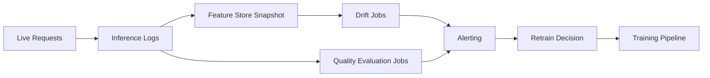


# Results and Explainability

This module teaches how to move from model score reporting to trustworthy model behavior
analysis for technical and non-technical stakeholders.

## Model review artifacts

- Confusion matrix
- ROC and precision-recall curves
- Feature importance
- SHAP and LIME explanations

## Global vs local explainability

| Type | Purpose | Example |
|---|---|---|
| Global | Explain overall model behavior | Top features across all samples |
| Local | Explain a single prediction | Why customer A was predicted high risk |

Use both:

- Global explains strategy-level behavior and helps data scientists verify that the model learned real signals (not leakage artifacts).
- Local supports case-level reviews, appeals, and regulatory audit trails.

### SHAP summary example (tabular model)

```python
import shap
import lightgbm as lgb

model = lgb.LGBMClassifier().fit(X_train, y_train)
explainer = shap.TreeExplainer(model)
shap_values = explainer.shap_values(X_test)

# Global importance plot
shap.summary_plot(shap_values[1], X_test, plot_type="bar")

# Local explanation for one prediction
shap.force_plot(explainer.expected_value[1], shap_values[1][0], X_test.iloc[0])
```

### Interpreting SHAP values

- SHAP value for feature $j$ on sample $i$: the change in model output attributable to feature $j$.
- Positive SHAP = pushes prediction higher. Negative SHAP = pushes prediction lower.
- The sum of all SHAP values equals the model output minus the expected value.

## Monitoring and Drift

Covariate drift (input distribution shift):

$$
P_t(X)\neq P_{t+\Delta}(X)
$$

Concept drift (mapping shift):

$$
P_t(Y\mid X)\neq P_{t+\Delta}(Y\mid X)
$$

Population Stability Index (PSI):

$$
\mathrm{PSI}=\sum_{b=1}^{B}(a_b-e_b)\ln\frac{a_b}{e_b}
$$

where $a_b$ and $e_b$ are actual and expected bin proportions.

Operational guidance:

- Set baseline windows from stable data periods.
- Alert on both drift metrics and business KPI changes.
- Trigger retraining only when thresholds persist, not from single spikes.


!!! note "How to read it"
    Good vs bad ROC curves. A model whose curve bows toward the top-left separates classes well
    (high AUC); one near the diagonal is little better than random. Compare candidates on the same
    validation split.


!!! note "How to read it"
    Good vs bad precision-recall curves. On imbalanced data PR curves are more honest than ROC — a
    curve staying high as recall increases means the model holds precision while catching more
    positives.

Use both global and local explanations before production release.

## Explainability stack in practice

- SHAP: strong for tabular model interpretability. Exact for tree models (TreeSHAP); approximate for others (KernelSHAP).
- LIME: local approximation around one prediction using a surrogate linear model.
- Permutation importance: model-agnostic global signal. Measures accuracy drop when a feature's values are randomly shuffled.

### Choosing between SHAP and LIME

| Criteria | SHAP | LIME |
|---|---|---|
| Consistency of explanations | High (game-theoretically grounded) | Varies with random sample |
| Speed for tree models | Fast (TreeSHAP is $O(TLD^2)$) | Slow (requires repeated prediction) |
| Works with any model | Yes (KernelSHAP) | Yes |
| Suitable for debugging | Yes | Yes, especially for black-box models |

### Permutation importance in code

```python
from sklearn.inspection import permutation_importance

result = permutation_importance(model, X_test, y_test, n_repeats=10, random_state=42)
for i in result.importances_mean.argsort()[::-1]:
    print(f"{X_test.columns[i]:<25} {result.importances_mean[i]:.4f} +/- {result.importances_std[i]:.4f}")
```

## Governance checklist

1. Document model assumptions and known limitations.
2. Validate performance by important user segments.
3. Track model version and explanation artifacts together.
4. Define escalation path for model incidents.

## Model card template (recommended)

| Section | What to document |
|---|---|
| Intended use | Business goal, target users, non-goals |
| Data | Sources, sampling, known biases |
| Metrics | Primary/secondary metrics and thresholds |
| Explainability | Methods used (SHAP/LIME/PFI) |
| Fairness | Segment-level results and mitigation notes |
| Safety limits | Conditions where model should not be used |
| Operations | Retraining cadence, alert thresholds, rollback plan |

## Monitoring architecture



## Response policy for drift alerts

1. Validate alert quality (rule out logging or pipeline issues).
2. Check business KPI movement vs statistical drift.
3. Trigger shadow retrain before production switch.
4. Use canary rollout for replacement model.

### Retraining cadence decision guide

| Signal | Recommended action |
|---|---|
| PSI > 0.2 on key features | Trigger drift investigation, consider retraining |
| Prediction quality SLO missed for 2+ consecutive weeks | Mandatory retrain + root cause |
| Label feedback lag (stale labels) | Collect fresh labels, then retrain |
| Regulatory audit or fairness review | Retrain on refreshed, audited dataset |
| No drift signal for 3+ months | Scheduled proactive retrain anyway |

### Monitoring checklist for new deployments

1. Baseline dataset stored and fingerprinted.
2. Feature drift monitor configured (PSI or KS-test per feature).
3. Prediction distribution monitor configured.
4. Alert thresholds set and PagerDuty/Teams webhook attached.
5. Model quality evaluation job scheduled (weekly or monthly).
6. Rollback deployment is tagged and accessible.

## Deep dive: every concept, explained

This section explains the theory behind the explainability and drift tools so you can trust
and defend their outputs.

### Why explainability is a requirement, not a nicety

A model that cannot be explained cannot be debugged, audited, or legally defended. Explainability
serves three distinct audiences: **data scientists** verifying the model learned real signal (not
a leakage artifact), **business stakeholders** trusting and adopting it, and **regulators/affected
users** who have a right to know why a decision was made. This is why the module separates global
from local explanations — they answer different questions for different people.

### Global vs local, precisely

- **Global** explanations describe the model's *overall* behavior: which features matter across
  all predictions. They answer "what did the model learn?"
- **Local** explanations describe *one* prediction: why this customer was scored high-risk. They
  answer "why this decision?" and are what an appeals or audit process needs.

A model can have sensible global behavior yet a wrong local explanation for an edge case, so both
views are required before release.

### SHAP: a fair division of credit

**SHAP (SHapley Additive exPlanations)** borrows the **Shapley value** from cooperative game
theory. The idea: treat each feature as a "player" and the prediction as the "payout", then
fairly distribute the payout among features by averaging each feature's marginal contribution
over *all possible orderings* of the others. This yields the **additivity property** the module
notes: the SHAP values for one example sum to (model output − expected output). Concretely, a
positive SHAP value pushed the prediction up; a negative one pushed it down; their total explains
the entire gap from the baseline.

Why SHAP is preferred for tabular models:

- It is **consistent and locally accurate** (grounded in axioms), so explanations do not change
  arbitrarily.
- **TreeSHAP** computes exact Shapley values for tree ensembles in polynomial time
  ($O(TLD^2)$ for $T$ trees, $L$ leaves, depth $D$), making it fast enough for production.
- For non-tree models, **KernelSHAP** approximates the same values model-agnostically (slower).

### LIME and permutation importance — the complementary tools

- **LIME** (Local Interpretable Model-agnostic Explanations) explains one prediction by sampling
  perturbed points around it and fitting a simple **surrogate** (usually linear) model locally.
  It works on any black box but, because it relies on random sampling, its explanations can vary
  between runs — the consistency weakness noted in the comparison table.
- **Permutation importance** is a global, model-agnostic signal: shuffle one feature's values and
  measure how much accuracy drops. A large drop means the model relied on that feature. It is
  cheap and intuitive but can be misled by correlated features (shuffling one when its correlate
  remains intact understates importance).

### Drift: the two distributions that can shift

Production failure usually traces to a distribution changing out from under the model:

- **Covariate (data) drift** — the inputs change: $P_t(X) \neq P_{t+\Delta}(X)$. Example: a new
  customer segment with different spending patterns. The mapping may still be valid, but the model
  sees inputs unlike its training data.
- **Concept drift** — the *relationship* changes: $P_t(Y\mid X) \neq P_{t+\Delta}(Y\mid X)$.
  Example: fraud tactics evolve, so the same features now imply a different risk. This is more
  dangerous because the learned function is now simply wrong.

Distinguishing them matters: covariate drift may be fixed by re-weighting or collecting new data;
concept drift generally requires retraining on fresh labels.

### PSI, intuitively

The **Population Stability Index** $\text{PSI}=\sum_b (a_b-e_b)\ln\tfrac{a_b}{e_b}$ compares a
feature's *current* binned distribution ($a_b$) against a *baseline* ($e_b$). Each term grows when
a bin's share moves away from its baseline share, so PSI is a single number measuring "how much
has this distribution moved?" Common thresholds: **< 0.1** no meaningful shift, **0.1–0.2**
moderate (investigate), **> 0.2** significant (likely retrain). It is essentially a symmetrized
relative-entropy measure, which is why it pairs naturally with KS-tests in drift monitors.

### Why retraining is threshold-and-persistence based, not reflexive

The operational guidance — alert on persistent drift, validate against business KPIs, shadow-test
before switching — exists because retraining is costly and risky. A single drift spike may be a
logging glitch; reacting to it churns models needlessly. The discipline is: confirm the signal is
real *and* sustained *and* tied to a KPI movement, then retrain into a **shadow** or **canary**
deployment before promoting. This ties explainability/monitoring back to the deployment module's
release strategies.

