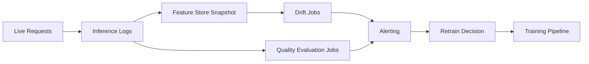


# Results and Explainability

This module teaches how to move from model score reporting to trustworthy model behavior
analysis for technical and non-technical stakeholders.

## Model review artifacts

- Confusion matrix
- ROC and precision-recall curves
- Feature importance
- SHAP and LIME explanations

## Global vs local explainability

| Type | Purpose | Example |
|---|---|---|
| Global | Explain overall model behavior | Top features across all samples |
| Local | Explain a single prediction | Why customer A was predicted high risk |

Use both:

- Global explains strategy-level behavior and helps data scientists verify that the model learned real signals (not leakage artifacts).
- Local supports case-level reviews, appeals, and regulatory audit trails.

### SHAP summary example (tabular model)

```python
import shap
import lightgbm as lgb

model = lgb.LGBMClassifier().fit(X_train, y_train)
explainer = shap.TreeExplainer(model)
shap_values = explainer.shap_values(X_test)

# Global importance plot
shap.summary_plot(shap_values[1], X_test, plot_type="bar")

# Local explanation for one prediction
shap.force_plot(explainer.expected_value[1], shap_values[1][0], X_test.iloc[0])
```

### Interpreting SHAP values

- SHAP value for feature $j$ on sample $i$: the change in model output attributable to feature $j$.
- Positive SHAP = pushes prediction higher. Negative SHAP = pushes prediction lower.
- The sum of all SHAP values equals the model output minus the expected value.

## Monitoring and Drift

Covariate drift (input distribution shift):

$$
P_t(X)\neq P_{t+\Delta}(X)
$$

Concept drift (mapping shift):

$$
P_t(Y\mid X)\neq P_{t+\Delta}(Y\mid X)
$$

Population Stability Index (PSI):

$$
\mathrm{PSI}=\sum_{b=1}^{B}(a_b-e_b)\ln\frac{a_b}{e_b}
$$

where $a_b$ and $e_b$ are actual and expected bin proportions.

Operational guidance:

- Set baseline windows from stable data periods.
- Alert on both drift metrics and business KPI changes.
- Trigger retraining only when thresholds persist, not from single spikes.


> Image explanation: This visual shows roc good vs bad. Use it to understand the concept in this section and connect it to practical Azure ML decisions.


> Image explanation: This visual shows precision-recall good vs bad. Use it to understand the concept in this section and connect it to practical Azure ML decisions.

Use both global and local explanations before production release.

## Explainability stack in practice

- SHAP: strong for tabular model interpretability. Exact for tree models (TreeSHAP); approximate for others (KernelSHAP).
- LIME: local approximation around one prediction using a surrogate linear model.
- Permutation importance: model-agnostic global signal. Measures accuracy drop when a feature's values are randomly shuffled.

### Choosing between SHAP and LIME

| Criteria | SHAP | LIME |
|---|---|---|
| Consistency of explanations | High (game-theoretically grounded) | Varies with random sample |
| Speed for tree models | Fast (TreeSHAP is $O(TLD^2)$) | Slow (requires repeated prediction) |
| Works with any model | Yes (KernelSHAP) | Yes |
| Suitable for debugging | Yes | Yes, especially for black-box models |

### Permutation importance in code

```python
from sklearn.inspection import permutation_importance

result = permutation_importance(model, X_test, y_test, n_repeats=10, random_state=42)
for i in result.importances_mean.argsort()[::-1]:
    print(f"{X_test.columns[i]:<25} {result.importances_mean[i]:.4f} +/- {result.importances_std[i]:.4f}")
```

## Governance checklist

1. Document model assumptions and known limitations.
2. Validate performance by important user segments.
3. Track model version and explanation artifacts together.
4. Define escalation path for model incidents.

## Model card template (recommended)

| Section | What to document |
|---|---|
| Intended use | Business goal, target users, non-goals |
| Data | Sources, sampling, known biases |
| Metrics | Primary/secondary metrics and thresholds |
| Explainability | Methods used (SHAP/LIME/PFI) |
| Fairness | Segment-level results and mitigation notes |
| Safety limits | Conditions where model should not be used |
| Operations | Retraining cadence, alert thresholds, rollback plan |

## Monitoring architecture



## Response policy for drift alerts

1. Validate alert quality (rule out logging or pipeline issues).
2. Check business KPI movement vs statistical drift.
3. Trigger shadow retrain before production switch.
4. Use canary rollout for replacement model.

### Retraining cadence decision guide

| Signal | Recommended action |
|---|---|
| PSI > 0.2 on key features | Trigger drift investigation, consider retraining |
| Prediction quality SLO missed for 2+ consecutive weeks | Mandatory retrain + root cause |
| Label feedback lag (stale labels) | Collect fresh labels, then retrain |
| Regulatory audit or fairness review | Retrain on refreshed, audited dataset |
| No drift signal for 3+ months | Scheduled proactive retrain anyway |

### Monitoring checklist for new deployments

1. Baseline dataset stored and fingerprinted.
2. Feature drift monitor configured (PSI or KS-test per feature).
3. Prediction distribution monitor configured.
4. Alert thresholds set and PagerDuty/Teams webhook attached.
5. Model quality evaluation job scheduled (weekly or monthly).
6. Rollback deployment is tagged and accessible.

