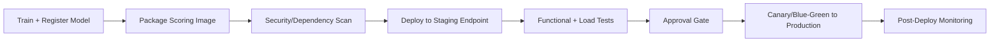
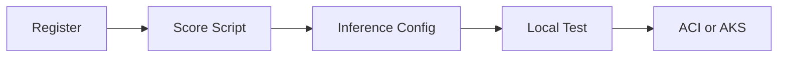


# Deployment

This module covers the path from model artifact to production endpoint, including
deployment patterns, release strategies, and operational safeguards.


> Image explanation: This visual shows training vs deployment model. Use it to understand the concept in this section and connect it to practical Azure ML decisions.


> Image explanation: This visual shows ml deployment flow. Use it to understand the concept in this section and connect it to practical Azure ML decisions.


> Image explanation: This visual shows deployment overview. Use it to understand the concept in this section and connect it to practical Azure ML decisions.

## Deployment steps

1. Register model
2. Build scoring script with init and run
3. Create inference environment
4. Validate local deployment
5. Deploy to ACI or AKS

### Scoring script structure (Azure ML SDK v2)

```python
import json
import numpy as np
import joblib
from azureml.core.model import Model

def init():
    global model
    model_path = Model.get_model_path("fraud-model")
    model = joblib.load(model_path)

def run(raw_data: str) -> str:
    data = json.loads(raw_data)
    features = np.array(data["features"])
    prediction = model.predict(features)
    probability = model.predict_proba(features)
    return json.dumps({
        "prediction": prediction.tolist(),
        "probability": probability.tolist()
    })
```

Key rules for a production-grade scoring script:

- `init()` runs once at startup; load model here, not in `run()`.
- `run()` is called for every request; keep it stateless.
- Validate input schema inside `run()` before calling the model.
- Never log raw PII; log hashed IDs and prediction metadata only.

## Endpoint types

| Type | Best for | Trade-off |
|---|---|---|
| Online endpoint | Real-time predictions | Requires low-latency ops |
| Batch endpoint | Large offline scoring jobs | Not real-time |

## Release strategies

- Blue/green: switch traffic to a fully prepared new version.
- Canary: send a small percentage of traffic to new version first.
- Shadow: mirror traffic for observation without serving responses.

### When to use each strategy

| Strategy | Use when | Risk level |
|---|---|---|
| Blue/green | Rollback must be instant; new version is well-tested | Low (with rollback ready) |
| Canary | Need to validate new model on real traffic at low exposure | Medium |
| Shadow | Need to compare new model with zero customer exposure | Very low (no production impact) |
| Rolling update | Stateless microservice with no model-specific state | Low |

### Configuring canary traffic split (Azure ML managed online endpoint)

```yaml
# deployment.yml
$schema: https://azuremlschemas.azureedge.net/latest/managedOnlineDeployment.schema.json
name: blue
endpoint_name: fraud-endpoint
model: azureml:fraud-model:3
code_configuration:
  code: ./src
  scoring_script: score.py
environment: azureml:fraud-infer:2
instance_type: Standard_DS2_v2
instance_count: 1
```

After deploying both `blue` and `green`:

```bash
# Route 10% traffic to canary (green)
az ml online-endpoint update \
  --name fraud-endpoint \
  --traffic "blue=90 green=10"
```

## Reliability checklist

1. Health probes and liveness checks configured.
2. Request/response schema validation in scoring script.
3. Timeouts and retries defined at client and service layer.
4. Rollback criteria defined before release.

## Security checklist

- Enforce auth keys/tokens and rotate credentials.
- Restrict network exposure (private endpoints when possible).
- Log access and prediction metadata for audits.

## CI/CD deployment pipeline (recommended)



## Capacity planning basics

Required replica estimate:

$$
R \approx \left\lceil \frac{QPS\cdot t_{p95}}{u}\right\rceil
$$

where:

- $QPS$: expected requests per second
- $t_{p95}$: p95 service time (seconds)
- $u$: target utilization per replica (e.g., 0.6 to 0.8)

## Runtime SLI/SLO table

| SLI | Typical SLO |
|---|---|
| Availability | >= 99.9% |
| p95 latency | <= 250 ms |
| Error rate | <= 1% |
| Freshness of model version | <= 30 days (policy dependent) |



## Quick self-check

1. When is batch endpoint better than online endpoint?
2. Why run a local validation step before cloud deployment?
3. What is the advantage of canary release?

