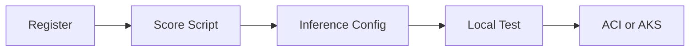

# Deployment

These visuals show the transition from training artifacts to production scoring
services, including the operational deployment flow.

Deployment steps:

1. Register model
2. Build scoring script with init and run
3. Create inference environment
4. Validate local deployment
5. Deploy to ACI or AKS

