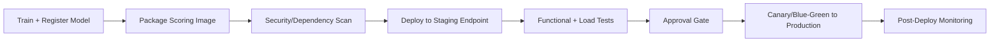
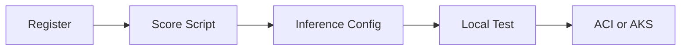

# Deployment

This module covers the path from model artifact to production endpoint, including
deployment patterns, release strategies, and operational safeguards.


> **Note - What this shows:** The contrast between the *training* model (offline, batch, optimized for accuracy) and the
> *deployment* model (online, stateless, optimized for latency). The same artifact serves two very
> different runtime contexts.


> **Note - What this shows:** The deployment flow from registered model to live endpoint. Each stage : package, validate
> locally, deploy, route traffic : is a checkpoint where a release can be caught before customers
> are affected.


> **Note - What this shows:** A high-level overview of deployment options (online vs batch endpoints). Choose by *who is
> waiting*: a user/app in real time → online endpoint; a whole table scored overnight → batch
> endpoint.

## Deployment steps

1. Register model
2. Build scoring script with init and run
3. Create inference environment
4. Validate local deployment
5. Deploy to ACI or AKS

### Scoring script structure (Azure ML SDK v2)

```python
import json
import numpy as np
import joblib
from azureml.core.model import Model

def init():
    global model
    model_path = Model.get_model_path("fraud-model")
    model = joblib.load(model_path)

def run(raw_data: str) -> str:
    data = json.loads(raw_data)
    features = np.array(data["features"])
    prediction = model.predict(features)
    probability = model.predict_proba(features)
    return json.dumps({
        "prediction": prediction.tolist(),
        "probability": probability.tolist()
    })
```

Key rules for a production-grade scoring script:

- `init()` runs once at startup; load model here, not in `run()`.
- `run()` is called for every request; keep it stateless.
- Validate input schema inside `run()` before calling the model.
- Never log raw PII; log hashed IDs and prediction metadata only.

## Endpoint types

| Type | Best for | Trade-off |
|---|---|---|
| Online endpoint | Real-time predictions | Requires low-latency ops |
| Batch endpoint | Large offline scoring jobs | Not real-time |

## End-to-end example: calling a deployed model

This walks through exactly what a deployed model looks like in practice : the API, what you send,
how to call it, and what comes back : using the `fraud-endpoint` from the scoring script above.


> **Note - How to read this diagram:** The client sends an HTTPS `POST` with a JSON body of feature
> rows. The endpoint authenticates the call, validates the schema, and routes it to a warm replica.
> Inside, `init()` has already loaded the registered model once, so `run()` only does the fast
> prediction and returns a JSON body with the predicted class and per-class probability.

### 1. What the API looks like

After deployment, Azure ML gives you two things:

| Item | Example | Where to get it |
|---|---|---|
| Scoring URI | `https://fraud-endpoint.eastus.inference.ml.azure.com/score` | `az ml online-endpoint show -n fraud-endpoint --query scoring_uri` |
| Auth key/token | `Bearer <primary-key>` | `az ml online-endpoint get-credentials -n fraud-endpoint` |

The contract is a simple HTTP POST:

| Field | Value |
|---|---|
| Method | `POST` |
| Path | `/score` |
| Headers | `Content-Type: application/json`, `Authorization: Bearer <key>` |
| Body | JSON object: `{"features": [[...], [...]]}` |

### 2. The request you send

```json
{
  "features": [
    [0.21, 1.4, 0.0, 7, 1, 0.55],
    [1.02, 0.3, 2.1, 2, 0, 0.10]
  ]
}
```

Each inner array is one record, with values in the **exact same column order used during training**.
Here we send two transactions in a single call (batching reduces per-request overhead).

### 3. How to call it

=== "curl"

    ```bash
    curl -X POST "https://fraud-endpoint.eastus.inference.ml.azure.com/score" \
      -H "Content-Type: application/json" \
      -H "Authorization: Bearer $ENDPOINT_KEY" \
      -d '{"features": [[0.21, 1.4, 0.0, 7, 1, 0.55], [1.02, 0.3, 2.1, 2, 0, 0.10]]}'
    ```

=== "Python"

    ```python
    import os
    import requests

    url = "https://fraud-endpoint.eastus.inference.ml.azure.com/score"
    headers = {
        "Content-Type": "application/json",
        "Authorization": f"Bearer {os.environ['ENDPOINT_KEY']}",
    }
    payload = {"features": [[0.21, 1.4, 0.0, 7, 1, 0.55],
                            [1.02, 0.3, 2.1, 2, 0, 0.10]]}

    response = requests.post(url, json=payload, headers=headers, timeout=10)
    response.raise_for_status()
    result = response.json()

    for i, (label, proba) in enumerate(zip(result["prediction"], result["probability"])):
        confidence = max(proba)
        print(f"row {i}: class={label} confidence={confidence:.0%}")
    ```

=== "JavaScript"

    ```javascript
    const res = await fetch("https://fraud-endpoint.eastus.inference.ml.azure.com/score", {
      method: "POST",
      headers: {
        "Content-Type": "application/json",
        Authorization: `Bearer ${process.env.ENDPOINT_KEY}`,
      },
      body: JSON.stringify({
        features: [
          [0.21, 1.4, 0.0, 7, 1, 0.55],
          [1.02, 0.3, 2.1, 2, 0, 0.10],
        ],
      }),
    });
    const result = await res.json();
    console.log(result.prediction, result.probability);
    ```

### 4. The response you get back

```json
{
  "prediction": [1, 0],
  "probability": [
    [0.08, 0.92],
    [0.86, 0.14]
  ]
}
```

### 5. How to read the result

| Row | `prediction` | `probability` `[P(class0), P(class1)]` | Meaning |
|---|---|---|---|
| 0 | `1` | `[0.08, 0.92]` | Flagged as **fraud** with 92% confidence |
| 1 | `0` | `[0.86, 0.14]` | Predicted **legitimate** with 86% confidence |

- `prediction` is the model's chosen class per row (here `1 = fraud`, `0 = legitimate`).
- `probability` gives the confidence per class; the values in each row sum to `1.0`.
- Your application decides the **action threshold**: e.g. auto-block at `P(fraud) >= 0.90`, send to
  manual review between `0.50` and `0.90`, and allow below `0.50`. The model returns scores; the
  business rule turns them into decisions.

> **Tip - Handle errors in the client:** Expect non-`200` responses too : `401/403` (bad or expired
> key), `400` (schema/shape mismatch), `429` (throttling, back off and retry), and `503` (replica
> cold-start or overload). Always set a timeout and a small retry with backoff, as noted in the
> reliability checklist below.

## Release strategies


> **Tip - How to choose:** All three protect the live model (v1) while validating a new one (v2). **Blue-green** flips 100%
> of traffic at once and rolls back by flipping back : simplest, but the blast radius is the whole
> user base for the moment of the switch. **Canary** sends a small slice (e.g. 5%) to v2 and ramps
> up only while metrics stay healthy : the safest progressive rollout. **Shadow** mirrors real
> traffic to v2 but discards its responses, so you can test on production load with zero customer
> impact before any real cutover.

- Blue/green: switch traffic to a fully prepared new version.
- Canary: send a small percentage of traffic to new version first.
- Shadow: mirror traffic for observation without serving responses.

### When to use each strategy

| Strategy | Use when | Risk level |
|---|---|---|
| Blue/green | Rollback must be instant; new version is well-tested | Low (with rollback ready) |
| Canary | Need to validate new model on real traffic at low exposure | Medium |
| Shadow | Need to compare new model with zero customer exposure | Very low (no production impact) |
| Rolling update | Stateless microservice with no model-specific state | Low |

### Configuring canary traffic split (Azure ML managed online endpoint)

```yaml
# deployment.yml
$schema: https://azuremlschemas.azureedge.net/latest/managedOnlineDeployment.schema.json
name: blue
endpoint_name: fraud-endpoint
model: azureml:fraud-model:3
code_configuration:
  code: ./src
  scoring_script: score.py
environment: azureml:fraud-infer:2
instance_type: Standard_DS2_v2
instance_count: 1
```

After deploying both `blue` and `green`:

```bash
# Route 10% traffic to canary (green)
az ml online-endpoint update \
  --name fraud-endpoint \
  --traffic "blue=90 green=10"
```

## Reliability checklist

1. Health probes and liveness checks configured.
2. Request/response schema validation in scoring script.
3. Timeouts and retries defined at client and service layer.
4. Rollback criteria defined before release.

## Security checklist

- Enforce auth keys/tokens and rotate credentials.
- Restrict network exposure (private endpoints when possible).
- Log access and prediction metadata for audits.

## CI/CD deployment pipeline (recommended)



## Capacity planning basics

Required replica estimate:

$$
R \approx \left\lceil \frac{QPS\cdot t_{p95}}{u}\right\rceil
$$

where:

- $QPS$: expected requests per second
- $t_{p95}$: p95 service time (seconds)
- $u$: target utilization per replica (e.g., 0.6 to 0.8)

## Runtime SLI/SLO table

| SLI | Typical SLO |
|---|---|
| Availability | >= 99.9% |
| p95 latency | <= 250 ms |
| Error rate | <= 1% |
| Freshness of model version | <= 30 days (policy dependent) |



## Quick self-check

1. When is batch endpoint better than online endpoint?
2. Why run a local validation step before cloud deployment?
3. What is the advantage of canary release?

## Deep dive: every concept, explained

This section explains the deployment concepts so each operational choice has a clear rationale.

### Why `init()` and `run()` are split

The scoring script has two functions by design:

- **`init()`** runs **once** when the container starts. Loading the model (often hundreds of MB)
  is expensive, so doing it here : into a global : means it happens a single time, not per request.
- **`run()`** executes **per request** and must be **stateless**: no shared mutable state between
  calls, so concurrent requests cannot corrupt each other. Statelessness is also what makes the
  service horizontally scalable : any replica can handle any request.

This separation directly determines latency: model load is a one-time **cold-start** cost;
`run()` is the **warm** per-request path you optimize.

### Online vs batch endpoints : matching shape to workload

| Dimension | Online endpoint | Batch endpoint |
|---|---|---|
| Trigger | Synchronous HTTP request | Scheduled / on-demand job |
| Latency goal | Milliseconds per request | Throughput over millions of rows |
| Scaling | Keep replicas warm | Spin up, process, scale to zero |
| Use when | A user/app waits for the answer | Scoring a whole table overnight |

The decision is about *who is waiting*: a checkout fraud check needs an online endpoint; scoring
yesterday's entire transaction log is cheaper and simpler as a batch job.

### Release strategies and the risk they manage

All three strategies exist to limit the blast radius of a bad model:

- **Blue/green** keeps the old version (blue) fully running while the new (green) is prepared,
  then flips 100% of traffic at once. Rollback is instant : flip back. Best when you trust the new
  version and need zero-downtime cutover.
- **Canary** routes a *small* slice (e.g. 10%) to the new version and watches metrics before
  ramping up. It validates on **real traffic** at controlled exposure : the safest way to catch
  problems that offline tests miss.
- **Shadow** sends a copy of traffic to the new model but discards its responses, so it is
  evaluated against production inputs with **zero customer impact**. Ideal for high-stakes models
  where even 10% exposure is too risky.

The Azure traffic-split (`blue=90 green=10`) is the concrete mechanism that implements canary on a
managed online endpoint.

### Capacity planning: where the replica formula comes from

$R \approx \lceil \tfrac{QPS\cdot t_{p95}}{u}\rceil$ is **Little's Law** applied to serving.
$QPS\cdot t_{p95}$ is the average number of requests *in flight* at any moment (arrival rate �:
service time); dividing by target utilization $u$ (e.g. 0.7, leaving headroom for bursts and
tail latency) gives the replica count, rounded up. Using $t_{p95}$ rather than the mean sizes the
fleet for realistic worst-case service time, so the SLO holds under load rather than only on
average.

### SLIs, SLOs, and why model freshness is one of them

An **SLI** is a measured signal (availability, p95 latency, error rate); an **SLO** attaches a
target ("p95 ≤ 250 ms"). Including **model-version freshness** as an SLO is what distinguishes ML
serving from ordinary web serving : a perfectly available endpoint serving a stale, drifted model
is still failing its job. This connects deployment health back to the drift monitoring from the
previous module.

### Why local validation precedes cloud deployment

Validating the scoring container locally catches the cheap, common failures : bad dependencies,
model-load errors, schema mismatches : in seconds, before paying for cloud provisioning and
before risking a failed production rollout. It is the deployment analog of running unit tests
before merging: fail fast, fail cheap.

### Security concepts in serving

- **Auth keys/tokens** ensure only authorized callers reach the endpoint; **rotating** them
  limits damage from a leaked credential.
- **Private endpoints** keep traffic off the public internet for regulated data.
- Logging **prediction metadata but never raw PII** (log hashed IDs, not personal fields) gives
  auditability without creating a data-protection liability : the same principle the scoring-script
  rules enforce.

