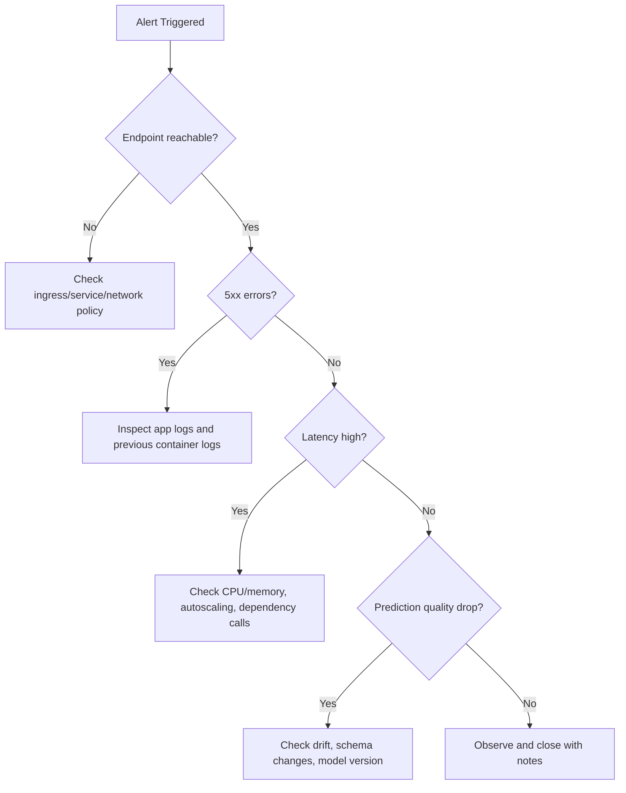

# Deployment Debugging with Kubernetes

This module provides a practical incident-response path for ML endpoints running on
Kubernetes-backed infrastructure.


## Key tools

- kubectl
- kind
- minikube
- kubeadm

## Debugging workflow

1. Confirm deployment and pod status.
2. Inspect pod events and restart causes.
3. Inspect container logs (current and previous).
4. Validate service/endpoints and ingress paths.
5. Validate model input payload and schema.
6. Confirm model version and environment alignment.

## Useful commands

```bash
kubectl get pods
kubectl describe pod <pod-name>
kubectl logs <pod-name>
```

Additional high-value commands:

```bash
kubectl get events --sort-by=.lastTimestamp
kubectl logs <pod-name> --previous
kubectl get svc
kubectl get endpoints
```

### Systematic triage sequence

```bash
# 1. Check pod state
kubectl get pods -n <namespace>

# 2. If any pods are not Running, describe to see events
kubectl describe pod <pod-name> -n <namespace>

# 3. Check container logs (running)
kubectl logs <pod-name> -n <namespace> -c <container-name>

# 4. Check previous container logs (if CrashLoopBackOff)
kubectl logs <pod-name> -n <namespace> --previous

# 5. Check service endpoints are populated
kubectl get endpoints <service-name> -n <namespace>

# 6. Port-forward for direct endpoint test
kubectl port-forward svc/<service-name> 8080:80 -n <namespace>
curl -X POST http://localhost:8080/score -d '{"features":[...]}' -H 'Content-Type: application/json'
```

## Common failure patterns

| Symptom | Likely cause | First check |
|---|---|---|
| CrashLoopBackOff | Bad dependency/model load failure | `kubectl logs --previous` |
| 5xx from endpoint | Scoring code exception | container logs + payload schema |
| Timeout errors | Resource pressure or cold start | CPU/memory, readiness probes |
| Wrong predictions after release | Model/version mismatch | image tag + model registry version |

## SRE-style runbook basics

- Define severity levels and escalation contacts.
- Keep rollback commands ready.
- Capture post-incident timeline and root cause.
- Convert incident learnings into tests/alerts.

## Incident severity matrix

| Severity | Criteria | Typical response target |
|---|---|---|
| Sev-1 | Production outage or major business impact | Immediate response |
| Sev-2 | Partial degradation with workaround | <= 1 hour |
| Sev-3 | Non-critical defect or low-impact issue | Planned fix |

## Troubleshooting decision tree



## What to capture in postmortem

1. Detection time and symptom timeline.
2. Root cause and contributing factors.
3. What worked/failed in response.
4. Corrective actions and owners.

### Postmortem template

| Section | Content |
|---|---|
| Incident title | One-line description |
| Date/time | Detection → mitigation → full resolution |
| Severity | Sev-1 / 2 / 3 and impact scope |
| Detection | How was it found (alert, user report, monitoring)? |
| Root cause | Technical root cause (not blame) |
| Contributing factors | Infrastructure, process, or tooling gaps |
| Timeline | Minute-by-minute key actions |
| Impact | Customers / SLO breach duration / data gap |
| What went well | Positive signals in the response |
| What went wrong | Process or tooling failures |
| Action items | Specific, owned, time-bound fixes |

### Turning incidents into improvements

Every Sev-1 and Sev-2 incident should produce at least one concrete prevention action:

| Root cause pattern | Prevention action |
|---|---|
| Model version mismatch | Add version hash check to deployment script |
| Missing schema validation | Add input schema check to scoring script |
| No liveness probe | Add readiness and liveness probes to deployment YAML |
| Stale model drift | Automate weekly drift check + alert |
| Unreproducible environment | Pin all dependencies + register environment version |

## Quick self-check

1. Which command helps diagnose why a pod restarted?
2. Why should you check `--previous` logs?
3. What is one sign of model/version mismatch?
