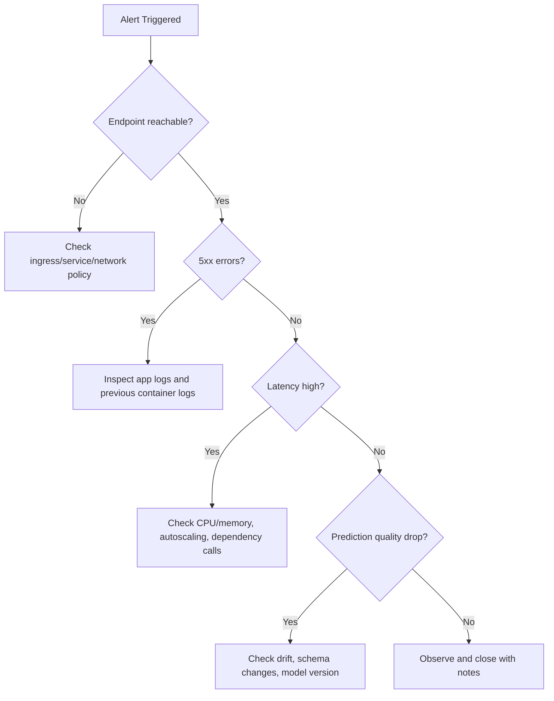


# Deployment Debugging with Kubernetes

This module provides a practical incident-response path for ML endpoints running on
Kubernetes-backed infrastructure.


!!! note "How to read it"
    A good vs bad confusion matrix. A strong model concentrates mass on the diagonal (correct
    predictions); off-diagonal mass shows which error type dominates — the first clue when debugging
    a quality regression.


!!! note "How to read it"
    A lift curve shows how much better the model ranks positives than random selection. A curve
    hugging the top-left captures most positives in the highest-scoring fraction — valuable for
    prioritized review queues.


!!! note "How to read it"
    The ROC curve plots true-positive vs false-positive rate across thresholds. A curve bowing
    toward the top-left (higher AUC) ranks better; the diagonal is random guessing.

## Key tools

- kubectl
- kind
- minikube
- kubeadm

## Debugging workflow

1. Confirm deployment and pod status.
2. Inspect pod events and restart causes.
3. Inspect container logs (current and previous).
4. Validate service/endpoints and ingress paths.
5. Validate model input payload and schema.
6. Confirm model version and environment alignment.

## Useful commands

```bash
kubectl get pods
kubectl describe pod <pod-name>
kubectl logs <pod-name>
```

Additional high-value commands:

```bash
kubectl get events --sort-by=.lastTimestamp
kubectl logs <pod-name> --previous
kubectl get svc
kubectl get endpoints
```

### Systematic triage sequence

```bash
# 1. Check pod state
kubectl get pods -n <namespace>

# 2. If any pods are not Running, describe to see events
kubectl describe pod <pod-name> -n <namespace>

# 3. Check container logs (running)
kubectl logs <pod-name> -n <namespace> -c <container-name>

# 4. Check previous container logs (if CrashLoopBackOff)
kubectl logs <pod-name> -n <namespace> --previous

# 5. Check service endpoints are populated
kubectl get endpoints <service-name> -n <namespace>

# 6. Port-forward for direct endpoint test
kubectl port-forward svc/<service-name> 8080:80 -n <namespace>
curl -X POST http://localhost:8080/score -d '{"features":[...]}' -H 'Content-Type: application/json'
```

## Common failure patterns

| Symptom | Likely cause | First check |
|---|---|---|
| CrashLoopBackOff | Bad dependency/model load failure | `kubectl logs --previous` |
| 5xx from endpoint | Scoring code exception | container logs + payload schema |
| Timeout errors | Resource pressure or cold start | CPU/memory, readiness probes |
| Wrong predictions after release | Model/version mismatch | image tag + model registry version |

## SRE-style runbook basics

- Define severity levels and escalation contacts.
- Keep rollback commands ready.
- Capture post-incident timeline and root cause.
- Convert incident learnings into tests/alerts.

## Incident severity matrix

| Severity | Criteria | Typical response target |
|---|---|---|
| Sev-1 | Production outage or major business impact | Immediate response |
| Sev-2 | Partial degradation with workaround | <= 1 hour |
| Sev-3 | Non-critical defect or low-impact issue | Planned fix |

## Troubleshooting decision tree



## What to capture in postmortem

1. Detection time and symptom timeline.
2. Root cause and contributing factors.
3. What worked/failed in response.
4. Corrective actions and owners.

### Postmortem template

| Section | Content |
|---|---|
| Incident title | One-line description |
| Date/time | Detection → mitigation → full resolution |
| Severity | Sev-1 / 2 / 3 and impact scope |
| Detection | How was it found (alert, user report, monitoring)? |
| Root cause | Technical root cause (not blame) |
| Contributing factors | Infrastructure, process, or tooling gaps |
| Timeline | Minute-by-minute key actions |
| Impact | Customers / SLO breach duration / data gap |
| What went well | Positive signals in the response |
| What went wrong | Process or tooling failures |
| Action items | Specific, owned, time-bound fixes |

### Turning incidents into improvements

Every Sev-1 and Sev-2 incident should produce at least one concrete prevention action:

| Root cause pattern | Prevention action |
|---|---|
| Model version mismatch | Add version hash check to deployment script |
| Missing schema validation | Add input schema check to scoring script |
| No liveness probe | Add readiness and liveness probes to deployment YAML |
| Stale model drift | Automate weekly drift check + alert |
| Unreproducible environment | Pin all dependencies + register environment version |

## Quick self-check

1. Which command helps diagnose why a pod restarted?
2. Why should you check `--previous` logs?
3. What is one sign of model/version mismatch?

## Deep dive: every concept, explained

This section explains the Kubernetes primitives and failure modes behind the commands so the
runbook becomes understandable rather than memorized.

### The Kubernetes objects you are actually debugging

| Object | What it is | Why it matters for ML serving |
|---|---|---|
| **Pod** | Smallest deployable unit; one or more containers sharing network/storage | Your scoring container runs here; pod health = endpoint health |
| **Deployment** | Controller that maintains N pod replicas | Handles rolling updates and self-healing |
| **Service** | Stable virtual IP/DNS load-balancing across pods | Clients hit the Service, not individual pods |
| **Endpoints** | The list of *ready* pod IPs behind a Service | Empty endpoints = traffic has nowhere to go (a common "503") |
| **Ingress** | HTTP routing from outside the cluster to Services | Where external URL → internal Service mapping lives |

The triage sequence in this module walks *outside-in* along this chain (ingress → service →
endpoints → pod → container), because a request fails at whichever link is broken.

### Pod lifecycle and what the states mean

A pod moves through phases, and the failing phase points at the cause:

- **Pending** — scheduler cannot place the pod (insufficient CPU/memory quota, no matching node).
- **ContainerCreating** — image is being pulled or a volume is mounting; a stall here usually
  means a registry/auth or storage problem.
- **Running** — containers started; the app may still be unhealthy if probes fail.
- **CrashLoopBackOff** — the container starts, exits, and Kubernetes restarts it with increasing
  backoff. For ML this almost always means **`init()` failed**: a missing dependency or a model
  that won't load. This is why `kubectl logs --previous` is essential — the current container may
  be too young to have logs, so you read the *crashed* container's output.

### Liveness vs readiness probes

- A **readiness probe** decides whether a pod should receive traffic. Until it passes, the pod is
  kept out of the Service's **Endpoints** list — which is why a slow model load (long cold start)
  shows up as empty endpoints and timeouts rather than errors.
- A **liveness probe** decides whether to *restart* a stuck pod. A deadlocked scoring process with
  no liveness probe will hang forever; with one, Kubernetes recycles it.

Missing probes is a recurring root cause in the prevention table precisely because without them
Kubernetes cannot tell a warming-up pod from a broken one.

### Mapping the common failures to their mechanism

| Symptom | Underlying mechanism | Why the listed check works |
|---|---|---|
| `CrashLoopBackOff` | `init()` raised (bad dep / model load) | `--previous` logs show the exception from the dead container |
| 5xx from endpoint | `run()` raised on a request | Container logs + payload schema reveal the bad input or bug |
| Timeouts | Resource pressure or cold start | CPU/memory + readiness probe state show saturation or slow start |
| Wrong predictions after release | Image tag points at the wrong model version | Compare deployed image tag against the model-registry version |

### Why model/version mismatch is uniquely an ML failure

In ordinary microservices, "the code is the artifact". In ML, the **model is a separate versioned
artifact** baked into (or mounted by) the image. A deploy can succeed, the service can be healthy,
and predictions can still be silently wrong because the image references model `v2` while the
intended one was `v3`. This is why the prevention action is a **version-hash check** at deploy
time, and why lineage (from the environment module) matters: it lets you prove which model version
is actually serving.

### From incident to prevention — the reliability flywheel

The postmortem template and "incident → prevention" table encode an **SRE** principle: every
Sev-1/Sev-2 must yield at least one durable safeguard (a probe, a schema check, a version
assertion, an automated drift alert). Over time this converts painful one-off outages into
permanent tests and alerts, steadily lowering the rate of repeat incidents — the operational
counterpart to the validation gates and SLOs introduced earlier in the course.

