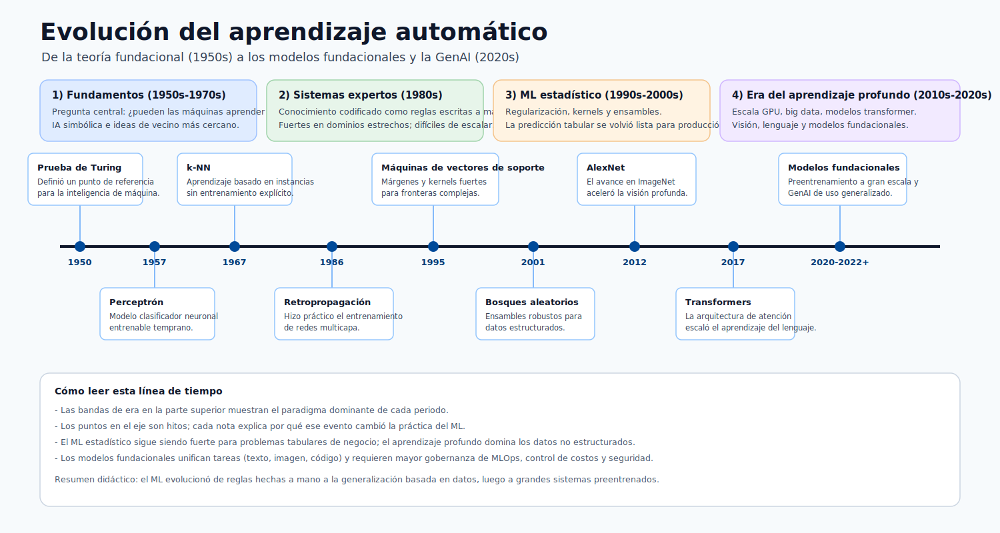

# Centro de Capacitación de Azure Machine Learning

Este centro de capacitación cubre Azure Machine Learning desde los fundamentos hasta las
operaciones en producción, con fórmulas, arquitectura, guías de despliegue y referencias visuales.

Modelo de progresión:

- Principiante: comprender los fundamentos de IA/ML y las bases de la plataforma.
- Intermedio: construir flujos de datos, entrenamiento y evaluación.
- Avanzado: desplegar, monitorear, depurar y gobernar sistemas de ML en producción.

## Evolución del Machine Learning

El machine learning como campo científico comenzó en la década de 1950, y luego atravesó
múltiples eras según la potencia de cómputo, la disponibilidad de datos y los avances algorítmicos.

> **Nota - Cómo leer esta línea de tiempo:** Cada banda de color es el *paradigma dominante* de una era, y los puntos en el eje son los
> avances que desencadenaron el siguiente cambio. Léela para entender por qué el Azure ML moderno debe admitir
> *tanto* el ML clásico (aún el mejor para datos tabulares de negocio) como los modelos profundos/fundacionales (mejores para
> datos no estructurados) : la plataforma abarca toda la historia, no solo la era más reciente.

### Eras destacadas

1. Fundamentos (1950s-1970s): ideas del test de Turing, perceptrones, métodos de vecinos más cercanos.
2. Era de los sistemas expertos (1980s): IA basada en reglas en flujos de trabajo empresariales.
3. Era del ML estadístico (1990s-2000s): SVMs, bosques aleatorios, modelado probabilístico.
4. Era del aprendizaje profundo (2010s): las GPU y los grandes conjuntos de datos habilitaron las redes neuronales profundas.
5. Era de los modelos fundacionales (2020s+): transformadores, grandes modelos de lenguaje, IA multimodal.

### Por qué esto importa para quienes aprenden Azure ML

- Explica por qué el MLOps moderno incluye tanto flujos de ML clásico como de aprendizaje profundo.
- Aclara cuándo los modelos más simples pueden superar a los modelos neuronales más grandes en datos tabulares.
- Enmarca las necesidades actuales de producción: monitoreo, gobernanza, seguridad y control de costos.

## Ruta de Aprendizaje

	<a class="home-card" href="modules/introduction/">
		<h3>Introducción y Ciclo de Vida</h3>
		
IA vs ML vs ciencia de datos, categorías de IA y ciclo de vida integral de Azure ML.

	</a>
	<a class="home-card" href="modules/ml-foundations/">
		<h3>Fundamentos de ML</h3>
		
Taxonomía completa de ML: supervisado, no supervisado, RL, semi/auto-supervisado, con fórmulas y guía de selección.

	</a>
	<a class="home-card" href="modules/azure-ml-environment/">
		<h3>Entorno de Azure ML</h3>
		
Taxonomía del área de trabajo, tipos de cómputo, registro de modelos y endpoints.

	</a>
	<a class="home-card" href="modules/environment-setup/">
		<h3>Configuración del Entorno</h3>
		
Configuración de Conda/pip, validación de paquetes y consistencia del entorno de ejecución.

	</a>
	<a class="home-card" href="modules/data-preparation/">
		<h3>Preparación de Datos</h3>
		
Recolección de datos, limpieza, manejo de esquemas y estrategia de división.

	</a>
	<a class="home-card" href="modules/model-types/">
		<h3>Tipos de Modelos</h3>
		
Familias de algoritmos con formulaciones matemáticas representativas.

	</a>
	<a class="home-card" href="modules/training-automl/">
		<h3>Entrenamiento y AutoML</h3>
		
Flujo de búsqueda de AutoML, opciones de cómputo y pipeline práctico de entrenamiento.

	</a>
	<a class="home-card" href="modules/performance-metrics/">
		<h3>Métricas de Rendimiento</h3>
		
Métricas de clasificación y regresión, fórmulas e interpretación.

	</a>
	<a class="home-card" href="modules/results-explainability/">
		<h3>Resultados y Explicabilidad</h3>
		
Análisis de resultados, detección de deriva y métodos de explicabilidad.

	</a>
	<a class="home-card" href="modules/deployment/">
		<h3>Despliegue</h3>
		
Registro, scoring, despliegue de endpoints y patrones de servicio.

	</a>
	<a class="home-card" href="modules/deployment-debug-k8s/">
		<h3>Depuración de Despliegue</h3>
		
Solución de problemas centrada en Kubernetes para incidencias de endpoints en producción.

	</a>

## Referencia

	<a class="home-card" href="reference/">
		<h3>Inicio de Referencia</h3>
		
Material de apoyo para implementación y operaciones.

	</a>
	<a class="home-card" href="reference/model-math-deep-dive/">
		<h3>Análisis Matemático Profundo de Modelos</h3>
		
Explicaciones a nivel de fórmula, objetivos, supuestos y compensaciones para los modelos de ML principales.

	</a>
	<a class="home-card" href="reference/cli-commands/">
		<h3>Comandos CLI</h3>
		
Referencias de línea de comandos para tareas de configuración, ejecución y despliegue.

	</a>
	<a class="home-card" href="reference/glossary/">
		<h3>Glosario</h3>
		
Términos esenciales de Azure ML y MLOps usados a lo largo de esta capacitación.

	</a>

