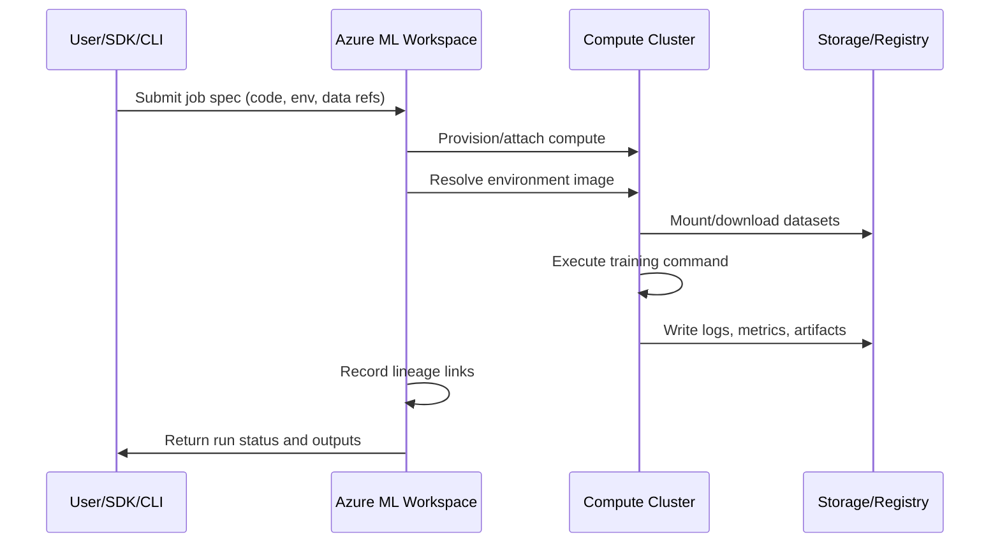
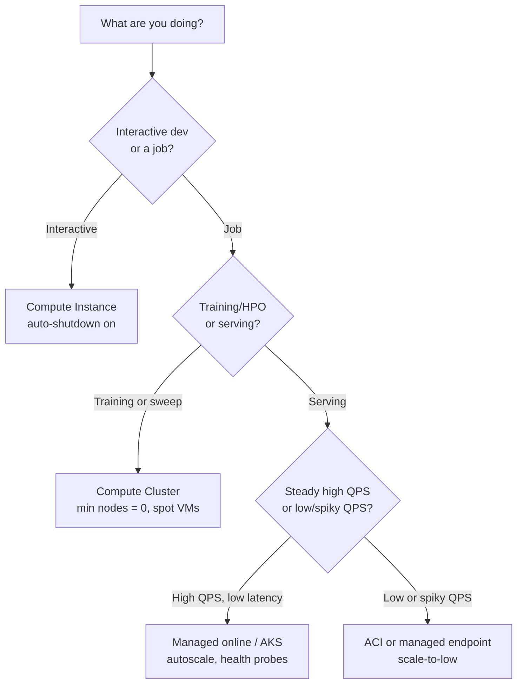

# Entorno de Azure ML

Este módulo explica los bloques de construcción de la plataforma Azure ML y cómo elegir las opciones de cómputo y
de servicio según la escala, la latencia y el costo.

## Activos principales del área de trabajo

- Área de trabajo (workspace)
- Instancia de cómputo
- Clúster de cómputo
- Activos de datos
- Registro de modelos
- Endpoints

## Plano de control vs plano de datos

| Plano | Responsabilidad |
|---|---|
| Plano de control | Metadatos de activos, historial de ejecuciones, permisos, gobernanza |
| Plano de datos | Ejecución de cómputo real, inferencia del modelo, movimiento de datos |

## Taxonomía del área de trabajo


> **Nota - Qué muestra esto:** La taxonomía del área de trabajo de Azure ML : cómo el área de trabajo contiene cómputo, activos de datos, modelos y
> endpoints bajo un mismo límite de gobernanza. Úsala para ver qué tipo de activo posee cada artefacto que
> crearás en los módulos posteriores.


> **Nota - Qué muestra esto:** Cómo un *entorno* versionado (imagen base + dependencias fijadas) se reutiliza tanto en el entrenamiento
> como en la inferencia. Compartir un mismo entorno es lo que evita el sesgo entre entrenamiento y servicio : el mismo código
> comportándose de forma diferente en producción que en el entrenamiento.

Conceptos clave:

- Experimento : una ejecución de entrenamiento rastreada.
- Modelo registrado : artefacto entrenado almacenado con versión y linaje.
- Endpoint : superficie de despliegue para las solicitudes de scoring.

Términos clave adicionales:

- Entorno : dependencias de tiempo de ejecución fijadas e imagen base.
- Almacén de datos (datastore) : conexión de almacenamiento registrada.
- Conjunto de datos/activo de datos : referencia de datos versionada usada por los trabajos.


> **Nota - Qué muestra esto:** La anatomía de un endpoint de Azure ML : la superficie de despliegue que recibe las solicitudes de scoring,
> aplica la autenticación y enruta el tráfico a una o más versiones del modelo. Este es el objeto
> al que los consumidores realmente llaman.

## Guía de cómputo

- Instancia de cómputo para desarrollo
- Clúster de cómputo para entrenamiento escalable
- ACI o AKS para servicio

División práctica:

- Clúster de cómputo de AML : entrenamiento, sweeps, iteraciones paralelas de AutoML.
- Clúster de inferencia de AKS : despliegue de nivel de producción y autoescalado.

## Matriz de decisión de cómputo

| Necesidad | Opción recomendada |
|---|---|
| Exploración y depuración en notebooks | Instancia de cómputo |
| Entrenamiento paralelizado y HPO | Clúster de cómputo |
| Prototipo rápido de endpoint | ACI |
| Producción, autoescalado, alta disponibilidad | AKS |

## Línea base de seguridad y gobernanza

- Usa identidades administradas para el acceso a datos.
- Restringe las rutas de red con endpoints privados donde sea posible.
- Usa RBAC de privilegio mínimo.
- Mantén el linaje desde los datos hasta el modelo y el endpoint para la auditabilidad.

## Flujo de ejecución del backend (qué sucede después de enviar)



## Mapa de linaje de activos

| Activo | Versionado | Producido por | Consumido por |
|---|---|---|---|
| Activo de datos | Sí | Trabajo de registro de datos | Trabajos de entrenamiento/inferencia |
| Entorno | Sí | Construcción/fijación del entorno | Entrenamiento y despliegue |
| Modelo | Sí | Salida de la ejecución de entrenamiento | Endpoints en línea/por lotes |
| Despliegue de endpoint | Sí (con revisiones) | Pipeline de despliegue | Consumidores (apps/APIs) |

## Consideraciones empresariales

- Estrategia multi-área de trabajo : separar `dev`, `test`, `prod` con puertas de promoción.
- Estrategia de registro : registro de modelos central para compartir entre áreas de trabajo.
- Modelo de acceso : acceso humano vía grupos RBAC; acceso de cargas de trabajo vía identidad administrada.
- Rastro de cumplimiento : preservar IDs de ejecución, versiones de modelos, versiones de conjuntos de datos y revisiones de despliegue.

## Referencia de roles RBAC de Azure ML

| Rol | Asignatario típico | Permisos |
|---|---|---|
| Owner | Líderes del equipo de plataforma | Control total, incluida la asignación de roles |
| Contributor | Ingenieros de ML | Crear/administrar todos los activos, sin cambios de roles |
| AzureML Data Scientist | Científicos de datos | Ejecutar experimentos, registrar modelos, desplegar |
| AzureML Compute Operator | Equipo de operaciones | Iniciar/detener cómputo, ver ejecuciones |
| Reader | Partes interesadas | Solo ver activos e historial de ejecuciones |

## Análisis a fondo : cada concepto, explicado

Esta sección explica *por qué* existe cada bloque de construcción de Azure ML y qué problema resuelve,
no solo cómo se llama.

### El área de trabajo como unidad de gobernanza

Un **área de trabajo** es el contenedor de nivel superior que une el cómputo, los datos, los modelos y los
endpoints bajo un mismo límite de identidad y acceso. Existe para que todo lo relacionado con un proyecto
: quién puede tocarlo, qué ejecuciones produjeron qué modelo, qué versión de datos lo entrenó : quede
registrado en un solo lugar auditable. Tras bambalinas, un área de trabajo aprovisiona recursos de Azure
asociados : una **cuenta de almacenamiento** (artefactos, conjuntos de datos), **Key Vault** (secretos), **Container
Registry** (imágenes de entorno) y **Application Insights** (telemetría). Comprender esta
asignación explica la mayoría de los problemas de permisos y de red que encontrarás más adelante.

### Plano de control vs plano de datos : por qué importa la división

- El **plano de control** maneja los *metadatos y la intención* : "registrar este conjunto de datos", "iniciar este
  trabajo", "quién tiene permitido desplegar". Es ligero, siempre activo, y es donde viven la gobernanza,
  el linaje y el RBAC.
- El **plano de datos** maneja el *trabajo real* : levantar máquinas virtuales, mover gigabytes, ejecutar bucles de
  entrenamiento, servir inferencia. Es donde se determinan el costo y el rendimiento.

Esta separación es la razón por la que puedes enviar un trabajo (plano de control) y dejar que se ponga en cola hasta que el cómputo
(plano de datos) esté disponible, y por la que el permiso para *ver* un activo es distinto del permiso para
*ejecutar* cómputo costoso con él.

### Instancia de cómputo vs clúster de cómputo vs clúster de inferencia

| Cómputo | Ciclo de vida | Por qué existe |
|---|---|---|
| Instancia de cómputo | Una sola VM de desarrollo siempre activa | Notebooks interactivos, depuración, asociada a una sola identidad de usuario |
| Clúster de cómputo | Autoescala de 0→N nodos por trabajo, luego de vuelta a 0 | Entrenamiento paralelo, sweeps de hiperparámetros, pruebas de AutoML; pagas solo mientras los trabajos se ejecutan |
| AKS / inferencia administrada | Pods de larga duración con autoescalado | Servicio de baja latencia y alta disponibilidad con sondas de estado |

La idea económica clave : **el cómputo de entrenamiento debe escalar a cero cuando está inactivo** (a ráfagas, por lotes),
mientras que **el cómputo de servicio permanece caliente** (estable, sensible a la latencia). Elegir el equivocado es una
causa principal de facturas de nube sorpresivas.

### Activos, versionado y linaje

Cada activo de primera clase (datos, entorno, modelo, despliegue de endpoint) está **versionado**. Esto
no es burocracia : es lo que hace que un sistema de ML sea *reproducible* y *auditable*:

- **Activo de datos** : un puntero versionado a los datos en un almacén de datos, de modo que una ejecución registra *exactamente* con qué
  instantánea se entrenó.
- **Entorno** : un tiempo de ejecución fijado (imagen base + versiones de dependencias). Reutilizar el mismo
  entorno para el entrenamiento y la inferencia evita la clase de errores del tipo "funciona en el entrenamiento, se rompe en producción".
- **Modelo** : el artefacto entrenado más los metadatos que lo vinculan de vuelta a la ejecución, los datos y el
  entorno que lo produjeron (su **linaje**).
- **Despliegue de endpoint** : una configuración de servicio con revisiones, de modo que el tráfico se pueda dividir o
  revertir entre versiones.

El linaje es la cadena `datos v → ejecución → modelo v → revisión de endpoint`. Cuando una predicción de producción
es cuestionada (auditoría, incidente, revisión de equidad), el linaje te permite reconstruir con precisión cómo se
produjo.

### Conceptos de identidad y acceso

- **Identidad administrada** : una credencial administrada por Azure asociada a una carga de trabajo (no a una persona) para que
  los trabajos puedan leer datos o registros *sin secretos incrustados*. Es el valor predeterminado seguro.
- **RBAC (control de acceso basado en roles)** : permisos otorgados a identidades vía roles. El
  principio de **privilegio mínimo** significa dar a cada identidad el rol mínimo necesario (por ejemplo,
  Contributor para los ingenieros, no Owner), limitando el radio de impacto si las credenciales se ven comprometidas.
- **Endpoint privado** : enruta el tráfico hacia el área de trabajo a través de una ruta de red privada en lugar de
  la internet pública, reduciendo la exposición para las cargas de trabajo reguladas.

### El flujo de envío a resultado, desmitificado

Cuando envías un trabajo, el plano de control valida la especificación, aprovisiona o asocia el cómputo del plano de
datos, resuelve la imagen del entorno (descargando o construyendo el contenedor), monta la
versión de datos referenciada, ejecuta tu comando, transmite los logs/métricas/artefactos de vuelta al almacenamiento y
registra el linaje. Conocer esta secuencia es lo que te permite depurar una ejecución atascada : cada flecha en el
diagrama de secuencia anterior es un lugar donde un trabajo puede fallar (cuota, construcción de imagen, montaje de datos, error de código).

## Estrategia de versionado de entornos

Los entornos de Azure ML son inmutables una vez publicados. Enfoque de versionado recomendado:

1. Fija todos los paquetes con versiones exactas en `conda.yml` o `requirements.txt`.
2. Usa el nombre del entorno + versión (por ejemplo, `fraud-train:3`) como referencia en los trabajos.
3. Reconstruye el entorno cuando cualquier dependencia cambie, nunca mutes las versiones existentes.
4. Reutiliza el **mismo** entorno para el entrenamiento y la inferencia para garantizar la compatibilidad.

```yaml
# Example conda.yml
name: fraud-train
channels:
  - defaults
dependencies:
  - python=3.10
  - pip:
    - scikit-learn==1.3.0
    - azureml-sdk==1.55.0
    - pandas==2.0.3
    - lightgbm==4.0.0
```

## Consejos de gestión de costos

| Práctica | Ahorra |
|---|---|
| Establecer el mínimo de nodos del clúster de cómputo = 0 | Evita cargos por cómputo inactivo |
| Usar VMs spot/de baja prioridad para el entrenamiento | Reducción del 60-80% del costo de cómputo |
| Establecer el apagado automático en las instancias de cómputo | Evita el gasto inactivo nocturno |
| Usar ACI para endpoints de bajo QPS en lugar de AKS | Elimina la sobrecarga del clúster |

## Elegir cómputo : un flujo de decisión

Elegir el cómputo es principalmente función de dos preguntas : si el trabajo es *interactivo o por lotes*, y
si es *sensible a la latencia u orientado al rendimiento*. Este flujo captura el camino común.



## Errores comunes de entorno y cómputo

Estos son los problemas que más a menudo bloquean un primer despliegue de Azure ML. Reconocer el síntoma
ahorra horas de depuración.

| Síntoma | Causa probable | Solución |
|---|---|---|
| Trabajo atascado en "Queued" por mucho tiempo | Clúster en el máximo de nodos o cuota agotada | Aumentar la cuota, incrementar el máximo de nodos o usar un SKU de VM más pequeño |
| "Image build failed" antes de que comience el entrenamiento | Dependencias sin fijar o en conflicto en el entorno | Fijar versiones exactas; construir y probar la imagen del entorno una vez, luego reutilizarla |
| El modelo funciona en un notebook pero falla en el endpoint | Sesgo de entorno entre entrenamiento y servicio | Reutilizar el *mismo* entorno registrado para el entrenamiento y la inferencia |
| El endpoint devuelve 401/403 | Clave o token faltante, o RBAC demasiado restrictivo | Usar la clave/token del endpoint; otorgar al llamador el rol correcto |
| Factura mensual sorpresiva | Instancia de cómputo dejada en ejecución, o AKS sobreaprovisionado | Habilitar el apagado automático; establecer el mínimo de nodos del clúster en 0; dimensionar correctamente el servicio |

> **Consejo - Lista de verificación de reproducibilidad:** Antes de llamar a un resultado "terminado", confirma que tres versiones estén
> fijadas y registradas : la versión de los **datos**, la versión del **entorno** y el commit del **código**.
> Con esas tres, cualquier ejecución en esta área de trabajo se puede reproducir exactamente, que es todo el sentido
> del modelo de activos.

## Autoevaluación rápida

1. ¿Cuál es la diferencia entre el plano de control y el plano de datos, y cuál determina el costo?
2. ¿Por qué un clúster de cómputo de entrenamiento debe escalar a cero pero un clúster de servicio debe permanecer caliente?
3. ¿Qué tres cosas versionadas deben registrarse para reproducir una ejecución de entrenamiento?
4. ¿Por qué reutilizar un mismo entorno para el entrenamiento y la inferencia evita toda una clase de errores?
