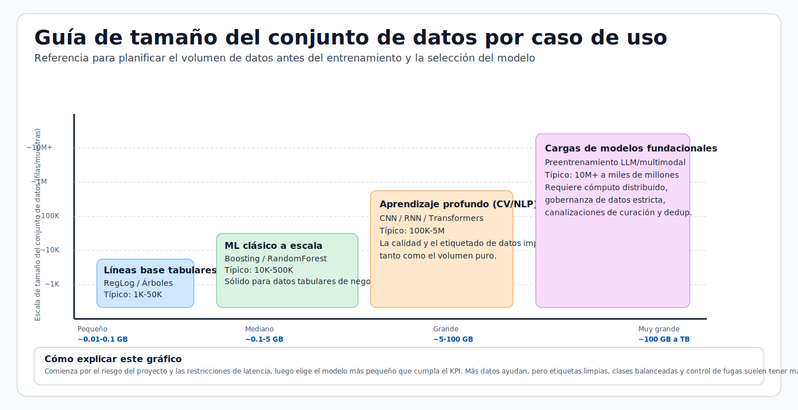

# Preparación de datos

La preparación de datos suele ser la etapa de mayor esfuerzo en la entrega de ML. Este módulo enseña
cómo pasar de datos en bruto a datos listos para el modelo con calidad, reproducibilidad y
prevención de fugas.

## Visión general del ciclo de vida de los datos

Esta secuencia ilustra el ciclo de vida: encuadre del negocio, recopilación de datos, ingeniería
de características y dimensionamiento del conjunto de datos para un entrenamiento de modelo fiable.


> **Nota - Lo que muestra:** El ciclo de vida de los datos por etapa : desde el encuadre del negocio hasta la recopilación y la ingeniería de características.
> La mayor parte del esfuerzo de entrega vive en estas etapas tempranas, y los defectos aquí limitan la calidad que cualquier modelo
> puede alcanzar.


> **Nota - Lo que muestra:** Cómo se recopilan los objetivos primarios y secundarios junto con las características. Definir el objetivo
> con precisión (y cuándo se conoce) es lo que más adelante evita la fuga del objetivo.


> **Consejo - Punto práctico:** La ingeniería de características debería ocurrir *mientras* comprendes los datos, pero las transformaciones deben ajustarse
> solo sobre la partición de entrenamiento. Diseñar las características y la estrategia de partición juntas es la forma de mantener el
> preprocesamiento libre de fugas.



> **Consejo - Cómo usar este gráfico:** Empareja tu caso de uso con una banda de tamaño de conjunto de datos antes de comprometerte con una familia de modelos. Las
> líneas base tabulares necesitan mucho menos datos que el aprendizaje profundo; las cargas de trabajo de modelos fundacionales necesitan órdenes de
> magnitud más. Dimensionar los datos primero evita elegir un modelo que no puedes alimentar.

> **Nota - Referencia de GB:** En la planificación de conjuntos de datos, el almacenamiento de los proveedores suele estar en unidades decimales:
> 1 KB = 1.000 bytes, 1 MB = 1.000.000 bytes, 1 GB = 1.000.000.000 bytes.
> Las herramientas de memoria pueden mostrar unidades binarias en su lugar: 1 GiB = 1.073.741.824 bytes,
> por lo que 1 GB es aproximadamente 0,93 GiB.

## Lista de verificación de preparación

- Eliminar duplicados y nulos
- Validar el esquema y los tipos de datos
- Dividir los conjuntos de entrenamiento y prueba
- Registrar los conjuntos de datos en Azure ML

## Dimensiones de la calidad de los datos

| Dimensión | Por qué importa |
|---|---|
| Completitud | Los valores faltantes pueden sesgar el entrenamiento |
| Consistencia | La desviación de esquema/tipo rompe los pipelines |
| Exactitud | Las etiquetas ruidosas reducen el techo del modelo |
| Oportunidad | Los datos obsoletos perjudican la relevancia en producción |

## Pipeline mínimo de preprocesamiento

1. Eliminar duplicados y registros no válidos.
2. Definir las columnas de características y objetivo.
3. Manejar los valores faltantes (estrategia de imputación).
4. Codificar las características categóricas.
5. Dividir los datos con una estrategia segura ante fugas.

División útil:

```python
from sklearn.model_selection import train_test_split
X_train, X_test, y_train, y_test = train_test_split(X, y, test_size=0.33, random_state=1)
```

Para la previsión de series temporales, usa divisiones cronológicas (nunca un barajado aleatorio a través del tiempo).

Los siguientes elementos visuales refuerzan cómo se dividen y validan los conjuntos de datos supervisados antes del
entrenamiento, además de una referencia de tipos de datos para evitar errores de esquema y de conversión.


> **Nota - Lo que muestra:** El flujo de datos a través de las etapas de entrenamiento y prueba. El conjunto de prueba se ramifica temprano y permanece
> intacto hasta la evaluación final : la disciplina que mantiene honestas las puntuaciones fuera de línea.


> **Nota - Lo que muestra:** Una división de entrenamiento/prueba. Para el desequilibrio de clases usa una división *estratificada* para preservar las proporciones de clase; para
> series temporales usa una división *cronológica* para que el modelo nunca entrene sobre datos futuros.


> **Nota - Lo que muestra:** Una referencia de los tipos de datos de Python/pandas. Validar los tipos de datos contra tu contrato de datos detecta
> la desviación de esquema y los errores silenciosos de conversión antes de que corrompan el entrenamiento.

## Advertencia sobre la fuga de datos

La fuga ocurre cuando información futura/del objetivo entra en las características de entrenamiento. Causas típicas:

- Ajustar preprocesadores sobre los datos completos antes de la división.
- Incluir campos posteriores al resultado.
- División aleatoria sobre datos temporales.

La fuga crea métricas fuera de línea infladas y un mal comportamiento en producción.

### Patrón de pipeline correcto vs incorrecto

```python
# WRONG: fit scaler on full dataset before split
scaler = StandardScaler()
X_scaled = scaler.fit_transform(X)  # leaks test statistics into train
X_train, X_test = train_test_split(X_scaled, ...)

# CORRECT: fit scaler only on training data
X_train, X_test, y_train, y_test = train_test_split(X, y, test_size=0.2, random_state=42)
scaler = StandardScaler()
X_train_scaled = scaler.fit_transform(X_train)  # fit on train only
X_test_scaled = scaler.transform(X_test)         # transform test using train stats
```

Envuelve esto en un `sklearn.pipeline.Pipeline` para que fit/transform se apliquen siempre de forma consistente:

```python
from sklearn.pipeline import Pipeline
from sklearn.preprocessing import StandardScaler
from sklearn.linear_model import LogisticRegression

pipeline = Pipeline([
    ("scaler", StandardScaler()),
    ("model", LogisticRegression())
])
pipeline.fit(X_train, y_train)   # scaler.fit only on X_train inside
pipeline.score(X_test, y_test)   # scaler.transform on X_test
```

## Contrato de datos (recomendado)

Define un contrato antes del entrenamiento para que todos los productores/consumidores se alineen:

| Campo | Tipo | Anulable | Rango/patrón permitido | Notas |
|---|---|---|---|---|
| `customer_id` | string | No | UUID regex | Identificador único |
| `event_ts` | datetime | No | ISO-8601 | Marca de tiempo del evento (UTC) |
| `label` | int | Sí | 0 o 1 | Nulo para filas solo de inferencia |
| `amount` | float | No | >= 0 | Característica monetaria |

## Compuertas de validación antes del entrenamiento

1. **Compuerta de esquema**: las columnas y los tipos de datos coinciden con el contrato.
2. **Compuerta de calidad**: las tasas de nulos, las tasas de duplicados y las comprobaciones de valores atípicos dentro de los umbrales.
3. **Compuerta de desviación**: el cambio de distribución de las características por debajo de los límites configurados.
4. **Compuerta de fugas**: sin características posteriores al resultado en el conjunto de entrenamiento.

## Estrategias de división por tipo de problema

| Problema | División recomendada | Notas |
|---|---|---|
| Clasificación/regresión tabular IID | División aleatoria entrenamiento/validación/prueba | Usar división estratificada si existe desequilibrio de clases |
| Series temporales | División cronológica (ventanas deslizantes/expandidas) | El barajado aleatorio destruye el orden temporal |
| Datos correlacionados por entidad (usuarios/dispositivos) | División por grupo según la clave de entidad | Evita la filtración entre entidades |
| Detección de eventos raros | División aleatoria estratificada | Garantiza la clase minoritaria en cada pliegue |

## Análisis a fondo: cada concepto, explicado

Esta sección explica el razonamiento detrás de cada paso de preparación para que las reglas se conviertan en
principios que puedas aplicar a nuevos conjuntos de datos.

### Por qué la preparación de datos domina el esfuerzo

Un modelo solo puede aprender la señal que sobrevive en los datos. Cada defecto : una fila mal etiquetada,
una característica filtrada, una unidad inconsistente : establece un techo rígido sobre la calidad alcanzable que ningún
algoritmo puede romper. Este es el significado práctico de "basura entra, basura sale", y
es por eso que los equipos pasan la mayor parte de su tiempo aquí.

### Imputación: elegir cómo rellenar los valores faltantes

La **imputación** reemplaza los valores faltantes para que los modelos que no pueden aceptar nulos puedan ejecutarse. El método
codifica una suposición sobre *por qué* falta el valor:

| Estrategia | Suposición | Riesgo |
|---|---|---|
| Relleno con media/mediana | Falta al azar; el valor central es representativo | Reduce la varianza, oculta estructura |
| Relleno con moda (categórico) | La categoría más frecuente es un valor predeterminado seguro | Sobrerrepresenta a la mayoría |
| Basada en modelo (kNN/MICE) | La ausencia es predecible a partir de otras características | Más costosa, puede filtrar si se ajusta sobre los datos completos |
| Indicador de "faltante" | La ausencia en sí misma es informativa | Añade dimensionalidad |

De forma crucial, el imputador debe **ajustarse solo sobre la partición de entrenamiento**, y luego aplicarse a validación
y prueba : de lo contrario, las estadísticas de los datos retenidos se filtran al entrenamiento.

### Codificación de características categóricas

Los modelos operan sobre números, así que las categorías deben convertirse:

- La **codificación one-hot** crea una columna binaria por categoría. Segura para características de baja cardinalidad;
  explota la dimensionalidad para las de alta cardinalidad.
- La **codificación ordinal** asigna categorías a enteros. Solo válida cuando las categorías tienen un verdadero
  orden (por ejemplo, pequeño/mediano/grande), de lo contrario inventa una clasificación falsa.
- La **codificación por objetivo/media** reemplaza una categoría con la media del objetivo para esa categoría. Potente
  para alta cardinalidad pero una *fuente principal de fugas* : debe calcularse dentro de los pliegues de validación cruzada,
  nunca sobre el conjunto de datos completo.

Los modelos basados en árboles (y CatBoost de forma nativa) toleran las categóricas en bruto mejor que los modelos lineales,
lo cual es parte de por qué dominan los problemas tabulares.

### Por qué escalar, y por qué ajustar solo en el entrenamiento

El **escalado de características** (por ejemplo, `StandardScaler`: restar la media, dividir por la desviación estándar) pone
las características en rangos comparables. Importa para los modelos basados en distancia y gradiente (kNN, SVM,
modelos lineales, redes neuronales) donde una característica de gran magnitud dominaría de otro modo; los modelos
de árboles son invariantes a la escala y no lo necesitan. La media y la desviación estándar del escalador son
*parámetros aprendidos* : ajustarlos sobre el conjunto de datos completo antes de dividir permite que las estadísticas del conjunto de prueba
influyan en la transformación de entrenamiento, la fuga mostrada en el ejemplo INCORRECTO anterior.

### Fuga de datos, formalizada

La **fuga** es cualquier situación donde información no disponible en el momento de la predicción entra en el entrenamiento.
Infla las métricas fuera de línea y colapsa en producción. Tres mecanismos se repiten:

1. **Fuga de preprocesamiento** : ajustar escaladores/imputadores/codificadores sobre datos que incluyen la partición
   de prueba. Se corrige ajustando las transformaciones dentro de un `Pipeline` *después* de la división.
2. **Fuga del objetivo** : una característica que es un sustituto de, o se calcula a partir de, el resultado (por ejemplo,
   "account_closed_date" al predecir la fuga de clientes). Se corrige auditando la temporización de disponibilidad de cada característica
   en relación con el momento de la predicción.
3. **Fuga temporal** : barajar aleatoriamente datos ordenados en el tiempo de modo que el modelo "vea el futuro".
   Se corrige con divisiones cronológicas.

El patrón `Pipeline` es la defensa estructural: como `fit` solo ve datos de entrenamiento y
`transform` se reaplica de forma idéntica a los datos nuevos, la fuga a través del preprocesamiento se vuelve
imposible por construcción.

### Entrenamiento / validación / prueba, y estratificación

- El **entrenamiento** ajusta los parámetros, la **validación** ajusta los hiperparámetros y compara modelos, la **prueba**
  da una estimación final no sesgada.
- La **división estratificada** preserva la proporción de clases en cada partición. Sin ella, una clase positiva rara
  (por ejemplo, 1% de fraude) puede quedar subrepresentada o ausente de un pliegue, haciendo que las métricas sean ruidosas o
  indefinidas. Estratifica sobre la etiqueta para la clasificación; para series temporales, nunca barajes.

### El contrato de datos y las compuertas de validación como cortafuegos de calidad

El **contrato de datos** (esquema, tipos, anulabilidad, rangos) convierte las suposiciones implícitas en un
acuerdo exigible entre los productores de datos y el pipeline de entrenamiento. Las cuatro **compuertas de
validación** (esquema, calidad, desviación, fuga) son comprobaciones automatizadas que *bloquean* que un conjunto de datos defectuoso
llegue al entrenamiento : el equivalente en ingeniería de datos de las pruebas unitarias. Esto desplaza los fallos
hacia la izquierda, donde son baratos de corregir, en lugar de descubrirlos como predicciones de producción
degradadas semanas después.

### Manejo de datos desequilibrados

Muchos problemas de alto valor (fraude, fuga de clientes, defectos) tienen una clase positiva rara. Un modelo ingenuo puede
obtener 99% de exactitud prediciendo siempre "negativo" mientras detecta cero positivos, así que el desequilibrio
debe manejarse de forma deliberada:

| Técnica | Cómo funciona | A qué prestar atención |
|---|---|---|
| Pesos de clase | Penalizar más los errores en la clase rara dentro de la pérdida | Lo más simple, sin cambio de datos; ajustar el peso |
| Sobremuestreo (por ejemplo, SMOTE) | Sintetizar más ejemplos de la minoría | Ajustar solo sobre la partición de entrenamiento, nunca antes de la división |
| Submuestreo | Descartar ejemplos de la mayoría | Desecha datos; usar cuando la mayoría es enorme |
| Ajuste de umbral | Mover el corte de decisión después del entrenamiento | Desacopla el modelo del corte de negocio |

> **Nota - Remuestrear después de dividir:** Cualquier remuestreo (SMOTE, sub/sobremuestreo) debe ocurrir
> *dentro* del pliegue de entrenamiento únicamente. Remuestrear antes de la división filtra vecinos sintéticos de las filas
> de prueba al entrenamiento y produce puntuaciones fuera de línea demasiado optimistas.

### Ejemplo de división estratificada

```python
from sklearn.model_selection import train_test_split

# stratify= ensures label proportions are preserved in each split
X_train, X_test, y_train, y_test = train_test_split(
    X, y, test_size=0.2, random_state=42, stratify=y
)
```

## Patrones de ingeniería de características

- Numéricas: escalado, recorte, transformaciones logarítmicas.
- Categóricas: one-hot, codificación por objetivo (con pliegues seguros ante fugas).
- Temporales: retardos, agregados móviles, características de calendario/estacionalidad.
- Texto: tokenización, TF-IDF, embeddings.

### Ejemplo de transformación logarítmica (numérica sesgada)

```python
import numpy as np
import pandas as pd

df["amount_log"] = np.log1p(df["amount"])  # log1p = log(1+x), safe for 0 values
```

### Agregado móvil (características de series temporales)

```python
df = df.sort_values("event_ts")
df["spend_7d"] = df.groupby("customer_id")["amount"].transform(
    lambda x: x.rolling(window=7, min_periods=1).sum()
)
```

### Codificación por objetivo con protección ante fugas (entre pliegues)

```python
from category_encoders import TargetEncoder
from sklearn.model_selection import cross_val_score

enc = TargetEncoder(smoothing=10)
X_encoded = enc.fit_transform(X_train[["category"]], y_train)
# The encoder estimates within-fold statistics when used inside a cross-validation pipeline
```

## Lista de verificación de reproducibilidad

- Persistir el pipeline de transformación junto con los artefactos del modelo.
- Versionar las instantáneas del conjunto de datos y las definiciones de esquema.
- Almacenar las semillas de división y los índices de división para reejecuciones exactas.
- Registrar la lista de características y el orden de características usado para el entrenamiento.

## Autoevaluación rápida

1. ¿Por qué la división aleatoria es incorrecta para la mayoría de las tareas de previsión?
2. ¿Qué dimensión de calidad se ve afectada por una discrepancia de esquema?
3. ¿Cuál es una fuente común de fuga de datos?
4. ¿Por qué un escalador o imputador debe ajustarse solo sobre la partición de entrenamiento?
5. ¿En qué parte del pipeline debe ocurrir SMOTE/sobremuestreo, y por qué?
