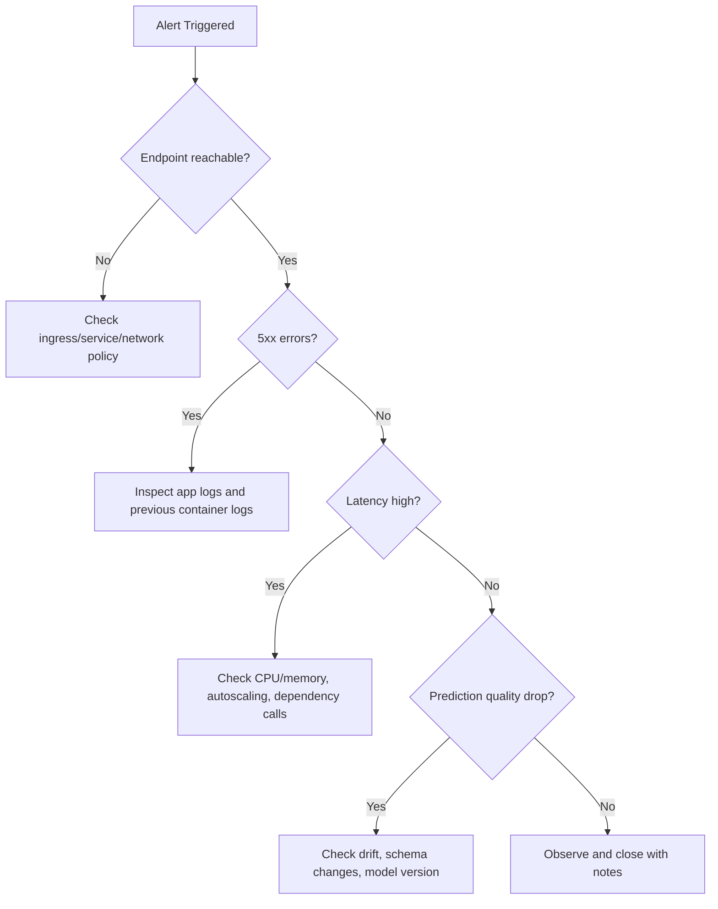

# Depuración de despliegues con Kubernetes

Este módulo proporciona una ruta práctica de respuesta a incidentes para endpoints de ML que se ejecutan en
infraestructura respaldada por Kubernetes.


> **Nota - Cómo leerla:** Una matriz de confusión buena vs mala. Un modelo fuerte concentra la masa en la diagonal (predicciones
> correctas); la masa fuera de la diagonal muestra qué tipo de error domina : la primera pista al depurar
> una regresión de calidad.


> **Nota - Cómo leerla:** Una curva de lift muestra cuánto mejor clasifica el modelo los positivos que la selección aleatoria. Una curva
> que se ciñe a la parte superior izquierda captura la mayoría de los positivos en la fracción de mayor puntuación : valiosa para
> colas de revisión priorizadas.


> **Nota - Cómo leerla:** La curva ROC traza la tasa de verdaderos positivos vs falsos positivos a través de los umbrales. Una curva que se inclina
> hacia la parte superior izquierda (mayor AUC) clasifica mejor; la diagonal es adivinanza aleatoria.

## Herramientas clave

- kubectl
- kind
- minikube
- kubeadm

## Flujo de trabajo de depuración

1. Confirmar el estado del despliegue y de los pods.
2. Inspeccionar los eventos de los pods y las causas de reinicio.
3. Inspeccionar los registros del contenedor (actuales y previos).
4. Validar las rutas de servicio/endpoints e ingress.
5. Validar la carga útil de entrada del modelo y el esquema.
6. Confirmar la alineación de la versión del modelo y del entorno.

## Comandos útiles

```bash
kubectl get pods
kubectl describe pod <pod-name>
kubectl logs <pod-name>
```

Comandos adicionales de alto valor:

```bash
kubectl get events --sort-by=.lastTimestamp
kubectl logs <pod-name> --previous
kubectl get svc
kubectl get endpoints
```

### Secuencia de triaje sistemático

```bash
# 1. Check pod state
kubectl get pods -n <namespace>

# 2. If any pods are not Running, describe to see events
kubectl describe pod <pod-name> -n <namespace>

# 3. Check container logs (running)
kubectl logs <pod-name> -n <namespace> -c <container-name>

# 4. Check previous container logs (if CrashLoopBackOff)
kubectl logs <pod-name> -n <namespace> --previous

# 5. Check service endpoints are populated
kubectl get endpoints <service-name> -n <namespace>

# 6. Port-forward for direct endpoint test
kubectl port-forward svc/<service-name> 8080:80 -n <namespace>
curl -X POST http://localhost:8080/score -d '{"features":[...]}' -H 'Content-Type: application/json'
```

## Patrones de fallo comunes

| Síntoma | Causa probable | Primera verificación |
|---|---|---|
| CrashLoopBackOff | Mala dependencia/fallo de carga del modelo | `kubectl logs --previous` |
| 5xx desde el endpoint | Excepción en el código de scoring | registros del contenedor + esquema de la carga útil |
| Errores de tiempo de espera | Presión de recursos o arranque en frío | CPU/memoria, sondas de preparación |
| Predicciones incorrectas tras el lanzamiento | Desajuste de modelo/versión | etiqueta de imagen + versión del registro de modelos |

## Conceptos básicos de runbook estilo SRE

- Define niveles de severidad y contactos de escalamiento.
- Mantén listos los comandos de reversión.
- Captura la cronología posterior al incidente y la causa raíz.
- Convierte los aprendizajes del incidente en pruebas/alertas.

## Matriz de severidad de incidentes

| Severidad | Criterios | Objetivo de respuesta típico |
|---|---|---|
| Sev-1 | Interrupción de producción o impacto importante en el negocio | Respuesta inmediata |
| Sev-2 | Degradación parcial con solución alternativa | <= 1 hora |
| Sev-3 | Defecto no crítico o problema de bajo impacto | Corrección planificada |

## Árbol de decisión para la resolución de problemas



## Qué capturar en el postmortem

1. Tiempo de detección y cronología de los síntomas.
2. Causa raíz y factores contribuyentes.
3. Qué funcionó/falló en la respuesta.
4. Acciones correctivas y responsables.

### Plantilla de postmortem

| Sección | Contenido |
|---|---|
| Título del incidente | Descripción de una línea |
| Fecha/hora | Detección → mitigación → resolución completa |
| Severidad | Sev-1 / 2 / 3 y alcance del impacto |
| Detección | ¿Cómo se encontró (alerta, reporte de usuario, monitoreo)? |
| Causa raíz | Causa raíz técnica (no culpas) |
| Factores contribuyentes | Brechas de infraestructura, proceso o herramientas |
| Cronología | Acciones clave minuto a minuto |
| Impacto | Clientes / duración del incumplimiento del SLO / brecha de datos |
| Qué salió bien | Señales positivas en la respuesta |
| Qué salió mal | Fallos de proceso o herramientas |
| Elementos de acción | Correcciones específicas, con responsable y plazo definido |

### Convertir incidentes en mejoras

Cada incidente Sev-1 y Sev-2 debe producir al menos una acción de prevención concreta:

| Patrón de causa raíz | Acción de prevención |
|---|---|
| Desajuste de versión del modelo | Agregar verificación de hash de versión al script de despliegue |
| Validación de esquema faltante | Agregar verificación de esquema de entrada al script de scoring |
| Sin sonda de vivacidad | Agregar sondas de preparación y vivacidad al YAML de despliegue |
| Drift de modelo obsoleto | Automatizar verificación semanal de drift + alerta |
| Entorno no reproducible | Fijar todas las dependencias + registrar la versión del entorno |

## Autoevaluación rápida

1. ¿Qué comando ayuda a diagnosticar por qué se reinició un pod?
2. ¿Por qué deberías revisar los registros `--previous`?
3. ¿Cuál es una señal de desajuste de modelo/versión?

## Análisis profundo: cada concepto, explicado

Esta sección explica las primitivas de Kubernetes y los modos de fallo detrás de los comandos para que el
runbook se vuelva comprensible en lugar de memorizado.

### Los objetos de Kubernetes que realmente estás depurando

| Objeto | Qué es | Por qué importa para el servicio de ML |
|---|---|---|
| **Pod** | La unidad desplegable más pequeña; uno o más contenedores que comparten red/almacenamiento | Tu contenedor de scoring se ejecuta aquí; salud del pod = salud del endpoint |
| **Deployment** | Controlador que mantiene N réplicas de pods | Maneja actualizaciones progresivas y autorreparación |
| **Service** | IP/DNS virtual estable que balancea la carga entre pods | Los clientes llegan al Service, no a los pods individuales |
| **Endpoints** | La lista de IPs de pods *listos* detrás de un Service | Endpoints vacíos = el tráfico no tiene a dónde ir (un "503" común) |
| **Ingress** | Enrutamiento HTTP desde fuera del clúster hacia los Services | Donde vive el mapeo de URL externa → Service interno |

La secuencia de triaje en este módulo recorre *de afuera hacia adentro* a lo largo de esta cadena (ingress → service →
endpoints → pod → container), porque una solicitud falla en cualquier eslabón que esté roto.

### El ciclo de vida del pod y qué significan los estados

Un pod se mueve a través de fases, y la fase que falla apunta a la causa:

- **Pending** : el planificador no puede colocar el pod (cuota insuficiente de CPU/memoria, sin nodo coincidente).
- **ContainerCreating** : la imagen se está descargando o un volumen se está montando; un estancamiento aquí usualmente
  significa un problema de registro/autenticación o de almacenamiento.
- **Running** : los contenedores arrancaron; la aplicación aún puede estar en mal estado si las sondas fallan.
- **CrashLoopBackOff** : el contenedor arranca, se cierra y Kubernetes lo reinicia con un retroceso
  creciente. Para ML esto casi siempre significa que **`init()` falló**: una dependencia faltante o un modelo
  que no se carga. Por eso `kubectl logs --previous` es esencial : el contenedor actual puede
  ser demasiado nuevo para tener registros, así que lees la salida del contenedor *que se estrelló*.

### Sondas de vivacidad vs preparación

- Una **sonda de preparación** decide si un pod debe recibir tráfico. Hasta que pase, el pod se
  mantiene fuera de la lista de **Endpoints** del Service : por eso una carga lenta del modelo (arranque en frío largo)
  se manifiesta como endpoints vacíos y tiempos de espera en lugar de errores.
- Una **sonda de vivacidad** decide si *reiniciar* un pod atascado. Un proceso de scoring en bloqueo mutuo sin
  sonda de vivacidad se colgará para siempre; con una, Kubernetes lo recicla.

La ausencia de sondas es una causa raíz recurrente en la tabla de prevención precisamente porque sin ellas
Kubernetes no puede distinguir un pod en calentamiento de uno roto.

### Mapear los fallos comunes a su mecanismo

| Síntoma | Mecanismo subyacente | Por qué funciona la verificación listada |
|---|---|---|
| `CrashLoopBackOff` | `init()` lanzó una excepción (mala dep / carga del modelo) | Los registros `--previous` muestran la excepción del contenedor muerto |
| 5xx desde el endpoint | `run()` lanzó una excepción en una solicitud | Los registros del contenedor + esquema de la carga útil revelan la entrada incorrecta o el bug |
| Tiempos de espera | Presión de recursos o arranque en frío | El estado de CPU/memoria + sonda de preparación muestran saturación o arranque lento |
| Predicciones incorrectas tras el lanzamiento | La etiqueta de imagen apunta a la versión incorrecta del modelo | Comparar la etiqueta de imagen desplegada con la versión del registro de modelos |

### Por qué el desajuste de modelo/versión es exclusivamente un fallo de ML

En los microservicios ordinarios, "el código es el artefacto". En ML, el **modelo es un artefacto versionado
separado** incorporado en (o montado por) la imagen. Un despliegue puede tener éxito, el servicio puede estar saludable,
y las predicciones aún pueden ser silenciosamente incorrectas porque la imagen referencia el modelo `v2` mientras que el
modelo previsto era `v3`. Por eso la acción de prevención es una **verificación de hash de versión** en el momento del
despliegue, y por qué el linaje (del módulo de entorno) importa: te permite probar qué versión del modelo
está realmente sirviendo.

### Del incidente a la prevención : el volante de inercia de la fiabilidad

La plantilla de postmortem y la tabla "incidente → prevención" codifican un principio **SRE**: cada
Sev-1/Sev-2 debe producir al menos una salvaguarda duradera (una sonda, una verificación de esquema, una aserción
de versión, una alerta de drift automatizada). Con el tiempo esto convierte las interrupciones puntuales y dolorosas en
pruebas y alertas permanentes, reduciendo de forma constante la tasa de incidentes repetidos : la contraparte
operativa de las puertas de validación y los SLOs introducidos anteriormente en el curso.

## Autoevaluación rápida (análisis profundo)

1. La secuencia de triaje se mueve "de afuera hacia adentro" a lo largo de ingress → service → endpoints → pod → container. ¿Por qué ese orden es más eficiente que empezar en el pod?
2. Un Service devuelve 503 pero cada pod muestra `Running`. ¿Qué objeto inspeccionarías a continuación, y qué te diría un contenido vacío?
3. ¿Por qué `CrashLoopBackOff` para un contenedor de ML casi siempre apunta a `init()` en lugar de a `run()`?
4. Explica la diferencia entre una sonda de preparación y una sonda de vivacidad, y a cuál afecta primero una carga lenta del modelo.
5. ¿Por qué un despliegue puede estar "saludable" y aun así servir predicciones incorrectas, y qué única verificación en el momento del despliegue lo previene?
