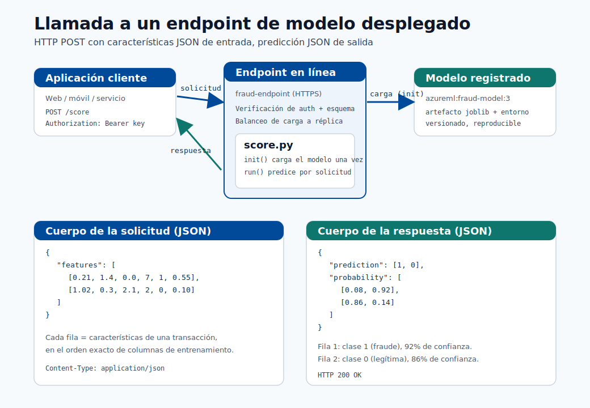
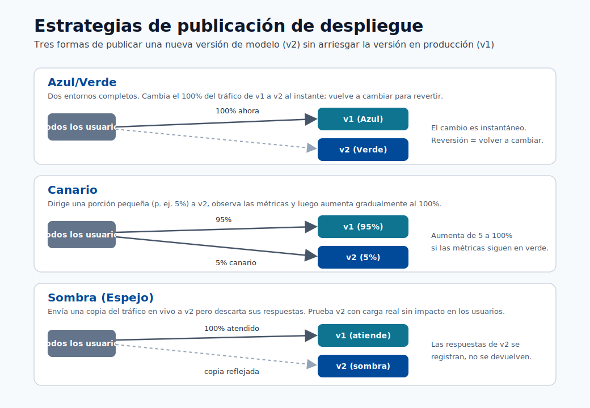
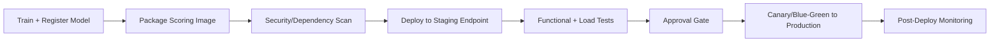
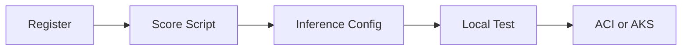

# Despliegue

Este módulo cubre el camino desde el artefacto del modelo hasta el endpoint de producción, incluyendo
patrones de despliegue, estrategias de lanzamiento y salvaguardas operativas.


> **Nota - Qué muestra esto:** El contraste entre el modelo de *entrenamiento* (sin conexión, por lotes, optimizado para la precisión) y el
> modelo de *despliegue* (en línea, sin estado, optimizado para la latencia). El mismo artefacto sirve a dos contextos de ejecución muy
> diferentes.


> **Nota - Qué muestra esto:** El flujo de despliegue desde el modelo registrado hasta el endpoint activo. Cada etapa : empaquetar, validar
> localmente, desplegar, enrutar tráfico : es un punto de control donde un lanzamiento puede detectarse antes de que los clientes
> se vean afectados.


> **Nota - Qué muestra esto:** Una visión general de alto nivel de las opciones de despliegue (endpoints en línea vs por lotes). Elige según *quién está
> esperando*: un usuario/aplicación en tiempo real → endpoint en línea; una tabla completa puntuada durante la noche → endpoint
> por lotes.

## Pasos del despliegue

1. Registrar el modelo
2. Construir el script de scoring con init y run
3. Crear el entorno de inferencia
4. Validar el despliegue local
5. Desplegar en ACI o AKS

### Estructura del script de scoring (Azure ML SDK v2)

```python
import json
import numpy as np
import joblib
from azureml.core.model import Model

def init():
    global model
    model_path = Model.get_model_path("fraud-model")
    model = joblib.load(model_path)

def run(raw_data: str) -> str:
    data = json.loads(raw_data)
    features = np.array(data["features"])
    prediction = model.predict(features)
    probability = model.predict_proba(features)
    return json.dumps({
        "prediction": prediction.tolist(),
        "probability": probability.tolist()
    })
```

Reglas clave para un script de scoring de nivel de producción:

- `init()` se ejecuta una vez al inicio; carga el modelo aquí, no en `run()`.
- `run()` se invoca en cada solicitud; mantenlo sin estado.
- Valida el esquema de entrada dentro de `run()` antes de llamar al modelo.
- Nunca registres PII en bruto; registra solo IDs hasheados y metadatos de predicción.

## Tipos de endpoint

| Tipo | Mejor para | Compromiso |
|---|---|---|
| Endpoint en línea | Predicciones en tiempo real | Requiere operaciones de baja latencia |
| Endpoint por lotes | Trabajos de scoring sin conexión a gran escala | No es en tiempo real |

## Ejemplo de extremo a extremo: llamar a un modelo desplegado

Esto recorre exactamente cómo se ve un modelo desplegado en la práctica : la API, qué envías,
cómo llamarla y qué se devuelve : usando el `fraud-endpoint` del script de scoring anterior.



> **Nota - Cómo leer este diagrama:** El cliente envía un `POST` HTTPS con un cuerpo JSON de filas
> de características. El endpoint autentica la llamada, valida el esquema y la enruta a una réplica activa.
> Internamente, `init()` ya ha cargado el modelo registrado una vez, por lo que `run()` solo realiza la
> predicción rápida y devuelve un cuerpo JSON con la clase predicha y la probabilidad por clase.

### 1. Cómo se ve la API

Después del despliegue, Azure ML te da dos cosas:

| Elemento | Ejemplo | Dónde obtenerlo |
|---|---|---|
| URI de scoring | `https://fraud-endpoint.eastus.inference.ml.azure.com/score` | `az ml online-endpoint show -n fraud-endpoint --query scoring_uri` |
| Clave/token de autenticación | `Bearer <primary-key>` | `az ml online-endpoint get-credentials -n fraud-endpoint` |

El contrato es un simple HTTP POST:

| Campo | Valor |
|---|---|
| Método | `POST` |
| Ruta | `/score` |
| Encabezados | `Content-Type: application/json`, `Authorization: Bearer <key>` |
| Cuerpo | Objeto JSON: `{"features": [[...], [...]]}` |

### 2. La solicitud que envías

```json
{
  "features": [
    [0.21, 1.4, 0.0, 7, 1, 0.55],
    [1.02, 0.3, 2.1, 2, 0, 0.10]
  ]
}
```

Cada arreglo interno es un registro, con los valores en el **mismo orden exacto de columnas usado durante el entrenamiento**.
Aquí enviamos dos transacciones en una sola llamada (el procesamiento por lotes reduce la sobrecarga por solicitud).

### 3. Cómo llamarla

=== "curl"

    ```bash
    curl -X POST "https://fraud-endpoint.eastus.inference.ml.azure.com/score" \
      -H "Content-Type: application/json" \
      -H "Authorization: Bearer $ENDPOINT_KEY" \
      -d '{"features": [[0.21, 1.4, 0.0, 7, 1, 0.55], [1.02, 0.3, 2.1, 2, 0, 0.10]]}'
    ```

=== "Python"

    ```python
    import os
    import requests

    url = "https://fraud-endpoint.eastus.inference.ml.azure.com/score"
    headers = {
        "Content-Type": "application/json",
        "Authorization": f"Bearer {os.environ['ENDPOINT_KEY']}",
    }
    payload = {"features": [[0.21, 1.4, 0.0, 7, 1, 0.55],
                            [1.02, 0.3, 2.1, 2, 0, 0.10]]}

    response = requests.post(url, json=payload, headers=headers, timeout=10)
    response.raise_for_status()
    result = response.json()

    for i, (label, proba) in enumerate(zip(result["prediction"], result["probability"])):
        confidence = max(proba)
        print(f"row {i}: class={label} confidence={confidence:.0%}")
    ```

=== "JavaScript"

    ```javascript
    const res = await fetch("https://fraud-endpoint.eastus.inference.ml.azure.com/score", {
      method: "POST",
      headers: {
        "Content-Type": "application/json",
        Authorization: `Bearer ${process.env.ENDPOINT_KEY}`,
      },
      body: JSON.stringify({
        features: [
          [0.21, 1.4, 0.0, 7, 1, 0.55],
          [1.02, 0.3, 2.1, 2, 0, 0.10],
        ],
      }),
    });
    const result = await res.json();
    console.log(result.prediction, result.probability);
    ```

### 4. La respuesta que recibes

```json
{
  "prediction": [1, 0],
  "probability": [
    [0.08, 0.92],
    [0.86, 0.14]
  ]
}
```

### 5. Cómo leer el resultado

| Fila | `prediction` | `probability` `[P(class0), P(class1)]` | Significado |
|---|---|---|---|
| 0 | `1` | `[0.08, 0.92]` | Marcada como **fraude** con un 92% de confianza |
| 1 | `0` | `[0.86, 0.14]` | Predicha como **legítima** con un 86% de confianza |

- `prediction` es la clase elegida por el modelo por fila (aquí `1 = fraude`, `0 = legítima`).
- `probability` da la confianza por clase; los valores de cada fila suman `1.0`.
- Tu aplicación decide el **umbral de acción**: por ejemplo, bloquear automáticamente en `P(fraud) >= 0.90`, enviar a
  revisión manual entre `0.50` y `0.90`, y permitir por debajo de `0.50`. El modelo devuelve puntuaciones; la
  regla de negocio las convierte en decisiones.

> **Consejo - Maneja los errores en el cliente:** Espera también respuestas distintas de `200` : `401/403` (clave incorrecta o expirada),
> `400` (desajuste de esquema/forma), `429` (limitación, espera y reintenta) y `503` (réplica
> en arranque en frío o sobrecarga). Siempre establece un tiempo de espera y un pequeño reintento con retroceso, como se indica en la
> lista de verificación de fiabilidad a continuación.

## Estrategias de lanzamiento



> **Consejo - Cómo elegir:** Las tres protegen el modelo activo (v1) mientras validan uno nuevo (v2). **Blue-green** cambia el 100%
> del tráfico de una vez y revierte volviendo a cambiar : la más simple, pero el radio de impacto es toda la
> base de usuarios durante el momento del cambio. **Canary** envía una pequeña porción (por ejemplo, 5%) a v2 y aumenta
> solo mientras las métricas se mantienen saludables : el despliegue progresivo más seguro. **Shadow** refleja el tráfico
> real hacia v2 pero descarta sus respuestas, por lo que puedes probar con carga de producción sin ningún impacto
> en el cliente antes de cualquier cambio real.

- Blue/green: cambia el tráfico a una nueva versión completamente preparada.
- Canary: envía primero un pequeño porcentaje de tráfico a la nueva versión.
- Shadow: refleja el tráfico para observación sin servir respuestas.

### Cuándo usar cada estrategia

| Estrategia | Usar cuando | Nivel de riesgo |
|---|---|---|
| Blue/green | La reversión debe ser instantánea; la nueva versión está bien probada | Bajo (con reversión lista) |
| Canary | Se necesita validar el nuevo modelo en tráfico real con baja exposición | Medio |
| Shadow | Se necesita comparar el nuevo modelo sin exposición al cliente | Muy bajo (sin impacto en producción) |
| Actualización progresiva | Microservicio sin estado sin estado específico del modelo | Bajo |

### Configurar la división de tráfico canary (endpoint en línea administrado de Azure ML)

```yaml
# deployment.yml
$schema: https://azuremlschemas.azureedge.net/latest/managedOnlineDeployment.schema.json
name: blue
endpoint_name: fraud-endpoint
model: azureml:fraud-model:3
code_configuration:
  code: ./src
  scoring_script: score.py
environment: azureml:fraud-infer:2
instance_type: Standard_DS2_v2
instance_count: 1
```

Después de desplegar tanto `blue` como `green`:

```bash
# Route 10% traffic to canary (green)
az ml online-endpoint update \
  --name fraud-endpoint \
  --traffic "blue=90 green=10"
```

## Lista de verificación de fiabilidad

1. Sondas de salud y verificaciones de vivacidad configuradas.
2. Validación del esquema de solicitud/respuesta en el script de scoring.
3. Tiempos de espera y reintentos definidos en la capa del cliente y del servicio.
4. Criterios de reversión definidos antes del lanzamiento.

## Lista de verificación de seguridad

- Aplica claves/tokens de autenticación y rota las credenciales.
- Restringe la exposición de red (endpoints privados cuando sea posible).
- Registra el acceso y los metadatos de predicción para auditorías.

## Pipeline de despliegue CI/CD (recomendado)



## Conceptos básicos de planificación de capacidad

Estimación de réplicas requeridas:

$$
R \approx \left\lceil \frac{QPS\cdot t_{p95}}{u}\right\rceil
$$

donde:

- $QPS$: solicitudes esperadas por segundo
- $t_{p95}$: tiempo de servicio p95 (segundos)
- $u$: utilización objetivo por réplica (por ejemplo, 0.6 a 0.8)

## Tabla de SLI/SLO en tiempo de ejecución

| SLI | SLO típico |
|---|---|
| Disponibilidad | >= 99.9% |
| Latencia p95 | <= 250 ms |
| Tasa de error | <= 1% |
| Frescura de la versión del modelo | <= 30 días (dependiente de la política) |



## Autoevaluación rápida

1. ¿Cuándo es mejor un endpoint por lotes que un endpoint en línea?
2. ¿Por qué ejecutar un paso de validación local antes del despliegue en la nube?
3. ¿Cuál es la ventaja del lanzamiento canary?

## Análisis profundo: cada concepto, explicado

Esta sección explica los conceptos de despliegue para que cada elección operativa tenga una justificación clara.

### Por qué se separan `init()` y `run()`

El script de scoring tiene dos funciones por diseño:

- **`init()`** se ejecuta **una vez** cuando el contenedor arranca. Cargar el modelo (a menudo cientos de MB)
  es costoso, por lo que hacerlo aquí : en una variable global : significa que ocurre una sola vez, no por solicitud.
- **`run()`** se ejecuta **por solicitud** y debe ser **sin estado**: sin estado mutable compartido entre
  llamadas, de modo que las solicitudes concurrentes no puedan corromperse entre sí. La ausencia de estado es también lo que hace que el
  servicio sea escalable horizontalmente : cualquier réplica puede manejar cualquier solicitud.

Esta separación determina directamente la latencia: la carga del modelo es un costo único de **arranque en frío**;
`run()` es la ruta **activa** por solicitud que optimizas.

### Endpoints en línea vs por lotes : ajustar la forma a la carga de trabajo

| Dimensión | Endpoint en línea | Endpoint por lotes |
|---|---|---|
| Disparador | Solicitud HTTP síncrona | Trabajo programado / bajo demanda |
| Objetivo de latencia | Milisegundos por solicitud | Rendimiento sobre millones de filas |
| Escalado | Mantener réplicas activas | Arrancar, procesar, escalar a cero |
| Usar cuando | Un usuario/aplicación espera la respuesta | Puntuar una tabla completa durante la noche |

La decisión se trata de *quién está esperando*: una verificación de fraude en el pago necesita un endpoint en línea; puntuar
todo el registro de transacciones de ayer es más barato y más simple como un trabajo por lotes.

### Estrategias de lanzamiento y el riesgo que gestionan

Las tres estrategias existen para limitar el radio de impacto de un modelo defectuoso:

- **Blue/green** mantiene la versión antigua (blue) completamente en ejecución mientras se prepara la nueva (green),
  luego cambia el 100% del tráfico de una vez. La reversión es instantánea : cambiar de vuelta. Mejor cuando confías en la nueva
  versión y necesitas un cambio sin tiempo de inactividad.
- **Canary** enruta una porción *pequeña* (por ejemplo, 10%) a la nueva versión y observa las métricas antes de
  aumentar. Valida sobre **tráfico real** con exposición controlada : la forma más segura de detectar
  problemas que las pruebas sin conexión pasan por alto.
- **Shadow** envía una copia del tráfico al nuevo modelo pero descarta sus respuestas, por lo que se
  evalúa contra entradas de producción con **cero impacto en el cliente**. Ideal para modelos de alto riesgo
  donde incluso un 10% de exposición es demasiado riesgoso.

La división de tráfico de Azure (`blue=90 green=10`) es el mecanismo concreto que implementa canary en un
endpoint en línea administrado.

### Planificación de capacidad: de dónde proviene la fórmula de réplicas

$R \approx \lceil \tfrac{QPS\cdot t_{p95}}{u}\rceil$ es la **Ley de Little** aplicada al servicio.
$QPS\cdot t_{p95}$ es el número promedio de solicitudes *en vuelo* en cualquier momento (tasa de llegada por
tiempo de servicio); dividir por la utilización objetivo $u$ (por ejemplo, 0.7, dejando margen para ráfagas y
latencia de cola) da el conteo de réplicas, redondeado hacia arriba. Usar $t_{p95}$ en lugar de la media dimensiona la
flota para un tiempo de servicio realista del peor caso, de modo que el SLO se mantenga bajo carga y no solo en
promedio.

### SLIs, SLOs y por qué la frescura del modelo es uno de ellos

Un **SLI** es una señal medida (disponibilidad, latencia p95, tasa de error); un **SLO** le adjunta un
objetivo ("p95 ≤ 250 ms"). Incluir la **frescura de la versión del modelo** como un SLO es lo que distingue al
servicio de ML del servicio web ordinario : un endpoint perfectamente disponible que sirve un modelo obsoleto y con drift
sigue fallando en su trabajo. Esto conecta la salud del despliegue de vuelta con el monitoreo de drift del
módulo anterior.

### Por qué la validación local precede al despliegue en la nube

Validar el contenedor de scoring localmente detecta los fallos baratos y comunes : malas dependencias,
errores de carga del modelo, desajustes de esquema : en segundos, antes de pagar por el aprovisionamiento en la nube y
antes de arriesgar un despliegue de producción fallido. Es el análogo de despliegue de ejecutar pruebas unitarias
antes de fusionar: falla rápido, falla barato.

### Conceptos de seguridad en el servicio

- Las **claves/tokens de autenticación** garantizan que solo los llamantes autorizados lleguen al endpoint; **rotarlos**
  limita el daño de una credencial filtrada.
- Los **endpoints privados** mantienen el tráfico fuera de la internet pública para datos regulados.
- Registrar **metadatos de predicción pero nunca PII en bruto** (registra IDs hasheados, no campos personales) brinda
  auditabilidad sin crear una responsabilidad de protección de datos : el mismo principio que aplican las reglas del
  script de scoring.

## Autoevaluación rápida (análisis profundo)

1. ¿Por qué el modelo se carga en `init()` y no en `run()`?
2. ¿Qué propiedad debe tener `run()` para permitir el escalado horizontal, y por qué?
3. Compara los lanzamientos canary y shadow: ¿cuál expone a los clientes al nuevo modelo y cuál no?
4. En la fórmula de réplicas $R \approx \lceil QPS \cdot t_{p95} / u \rceil$, ¿por qué usar el tiempo de servicio p95 en lugar de la media?
5. ¿Por qué la frescura de la versión del modelo se trata como un SLO junto con la latencia y la disponibilidad?
