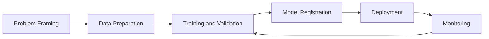
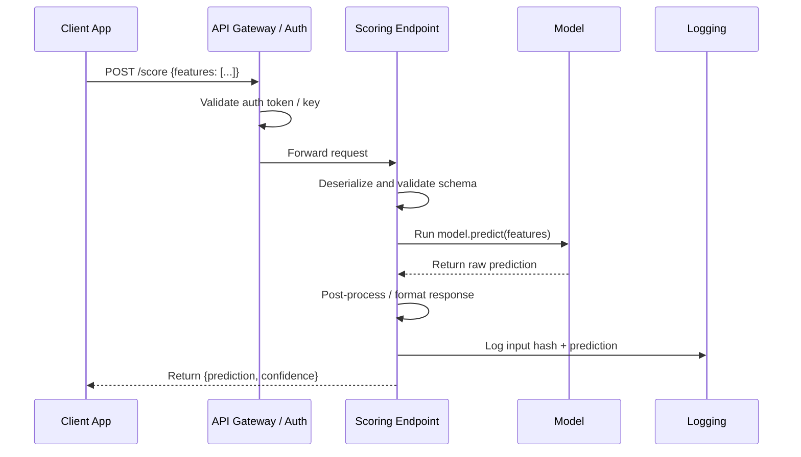

# Introducción y ciclo de vida del ML

Este curso está diseñado para estudiantes que comienzan desde cero y avanzan hacia el  
pensamiento de MLOps en producción. El objetivo no es solo definir términos, sino construir intuición sobre cómo  
se diseñan, se entregan y se operan los sistemas reales de ML.

## Para quién es esto

- Principiantes que saben poco o nada sobre ML.
- Ingenieros que saben programar pero necesitan comprender la plataforma de ML de extremo a extremo.
- Equipos que se preparan para desplegar cargas de trabajo de Azure ML en producción.

## Resultados de aprendizaje

Al finalizar este módulo, deberías ser capaz de:

1. Explicar la diferencia entre IA, ML y ciencia de datos.
2. Identificar las principales categorías de IA y ML.
3. Describir el ciclo de vida de Azure ML desde el planteamiento del problema hasta el monitoreo.
4. Explicar cómo un modelo desplegado se expone como una API o servicio web.

## IA vs ML vs ciencia de datos

| Tema                         | Qué es                                                                                | Objetivo                                  | Salida típica                |
| ---------------------------- | ------------------------------------------------------------------------------------ | ----------------------------------------- | ---------------------------- |
| IA (Inteligencia Artificial) | Campo amplio de construcción de sistemas que realizan tareas que requieren inteligencia similar a la humana | Razonar, planear, percibir, generar, decidir | Comportamiento inteligente   |
| ML (Aprendizaje Automático)  | Subconjunto de la IA donde los sistemas aprenden patrones a partir de datos          | Predecir/estimar resultados a partir de ejemplos | Modelo entrenado          |
| Ciencia de datos             | Práctica interdisciplinaria de extraer conocimiento a partir de datos                | Comprender los datos y apoyar las decisiones | Análisis, tableros, modelos |

Relación clave para principiantes:

- La **IA** es el paraguas que abarca todo.
- El **ML** es una de las principales formas de construir sistemas de IA.
- La **ciencia de datos** usa estadística, ML y conocimiento del dominio para resolver problemas de negocio  
y comunicar hallazgos.

En resumen : la IA es la misión, el ML es un método y la ciencia de datos es la práctica más amplia.

## Principales categorías de IA

| Categoría                  | Descripción                                  | Ejemplos del mundo real                            |
| -------------------------- | -------------------------------------------- | -------------------------------------------------- |
| IA simbólica / basada en reglas | Reglas y lógica explícitas creadas por humanos | Sistemas expertos, motores de reglas de negocio  |
| IA de aprendizaje automático | Aprende a partir de datos en lugar de reglas codificadas a mano | Puntuación de fraude, pronóstico de demanda     |
| IA generativa              | Aprende a generar contenido nuevo            | Generación de texto, generación de imágenes, asistentes de código |
| Búsqueda/planificación clásica | Encuentra acciones para optimizar un objetivo | Planificación de rutas, programación             |

Nota práctica : muchas soluciones empresariales combinan categorías. Ejemplo : un sistema de fraude puede  
usar puntuación de ML supervisado más barreras de protección basadas en reglas.

## Tipos de ML de un vistazo

| Tipo                     | Requisito de datos                | Tarea típica                      |
| ------------------------ | --------------------------------- | --------------------------------- |
| Aprendizaje supervisado  | Datos etiquetados $(X, y)$        | Clasificación, regresión          |
| Aprendizaje no supervisado | Datos sin etiquetar $X$         | Agrupamiento, detección de anomalías |
| Aprendizaje por refuerzo | Entorno + señal de recompensa     | Decisión/control secuencial       |
| Aprendizaje semisupervisado | Pocos etiquetados + muchos sin etiquetar | Clasificación con etiquetas escasas |
| Aprendizaje autosupervisado | Etiquetas generadas a partir de los propios datos | Aprendizaje de representaciones (NLP/CV) |

## Puntos de confusión comunes

- Un modelo puede ser "preciso" pero aun así inutilizable si la latencia es demasiado alta.
- Un modelo puede ser estadísticamente sólido pero fallar en las comprobaciones de equidad/cumplimiento.
- Un modelo no es un producto por sí solo; el sistema de datos y de operaciones que lo rodea importa.
- El aprendizaje profundo es un subconjunto del ML, no algo separado; usa redes neuronales con muchas capas.
- "Entrenar" un modelo significa encontrar valores de parámetros que minimicen una función de pérdida sobre los datos, no enseñar en el sentido humano.

## Ejemplo del mundo real : recomendación de comercio electrónico

Para concretar esto, así es como toda la pila tecnológica se asigna a un producto:

| Aspecto               | Elección tecnológica               | Etapa del ciclo de vida del ML |
| --------------------- | ---------------------------------- | ------------------ |
| Recolectar eventos de usuario | Transmisión de eventos (Kafka, Event Hub) | Ingesta de datos     |
| Almacenar características | Feature store o Azure Data Lake   | Preparación de datos   |
| Entrenar el modelo    | Trabajo de entrenamiento de Azure ML | Entrenamiento     |
| Servir recomendaciones | Endpoint en línea (AKS)           | Despliegue          |
| Detectar modelo obsoleto | Monitor de data drift de Azure ML | Monitoreo            |

El modelo es un componente. El pipeline que lo rodea es lo que lo hace confiable.

## Por qué importa Azure ML

Azure Machine Learning te ofrece la plataforma administrada para ejecutar el ciclo de vida completo con  
reproducibilidad y gobernanza : activos de datos/modelos versionados, ejecuciones rastreadas, endpoints de  
despliegue y monitoreo.

Azure Machine Learning organiza el ciclo de vida de extremo a extremo:

1. Planteamiento del problema
2. Preparación de datos
3. Entrenamiento y validación
4. Registro del modelo
5. Despliegue
6. Monitoreo y reentrenamiento

Esto no es un camino lineal. Los sistemas de producción hacen un ciclo continuo desde el monitoreo de vuelta a  
los datos y el entrenamiento cuando la calidad del modelo o las distribuciones de datos cambian.

### Qué hace cada etapa

| Etapa            | Pregunta principal                          | Salida clave                                 |
| ---------------- | ------------------------------------------- | -------------------------------------------- |
| Planteamiento del problema | ¿Qué decisión estamos tratando de mejorar? | Definición de KPI de negocio, criterios de éxito |
| Preparación de datos | ¿Confiamos en los datos y las etiquetas?  | Conjunto de datos validado y versionado      |
| Entrenamiento    | ¿Qué modelo aprende mejor la señal?         | Modelos candidatos con métricas rastreadas   |
| Registro         | ¿El artefacto está versionado y es reproducible? | Modelo registrado con linaje              |
| Despliegue       | ¿Los consumidores pueden llamar a este modelo de forma segura? | Endpoint activo con autenticación y monitoreo |
| Monitoreo        | ¿La calidad es estable a lo largo del tiempo en producción? | Alertas de drift y de calidad, señales de reentrenamiento |

Nota : la etapa 1 (planteamiento del problema) a menudo recibe poca inversión. La razón más común por la que los proyectos de ML fallan es un objetivo de negocio mal definido, no un modelo débil.

> **Nota - Qué muestra esto:** La pila de ML de producción es mucho más grande que el modelo en sí : la ingesta, el almacenamiento de características,  
> la orquestación del entrenamiento, el servicio y el monitoreo son todas herramientas distintas. La conclusión para quienes aprenden Azure  
> ML es que elegir un modelo es una casilla entre muchas : la mayor parte del trabajo de confiabilidad ocurre en  
> la infraestructura circundante.

> **Nota - Qué muestra esto:** Las etapas del flujo de trabajo se asignan una a una al ciclo de vida de Azure ML (planteamiento del problema → datos →  
> entrenamiento → registro → despliegue → monitoreo). Observa el bucle de regreso del monitoreo a  
> los datos/entrenamiento : el ML de producción es iterativo, no un pipeline unidireccional.

> **Nota - Qué muestra esto:** Una vista de extremo a extremo de cómo los datos en bruto se convierten en una predicción servida. Úsala para ubicar dónde encaja cada  
> módulo posterior : la preparación de datos, el entrenamiento del modelo, el despliegue y el monitoreo son todas etapas  
> de este único flujo.

## Servicio web vs API

- Un modelo de Azure ML desplegado normalmente se expone como un endpoint de API REST.
- En la práctica, los equipos suelen decir "servicio web" para referirse a la interfaz de scoring desplegada.

## Análisis a fondo : cada concepto, explicado

Esta sección amplía los términos usados arriba para que ningún concepto quede como una caja negra.

### Qué significa realmente "aprender a partir de datos"

Un programa clásico es una función fija escrita por un humano : `output = program(input)`.  
El aprendizaje automático **invierte** esto. Tú proporcionas ejemplos de entradas y salidas deseadas, y  
un procedimiento de optimización busca una función que las reproduzca y, lo que es crucial,  
*generalice* a entradas no vistas. Formalmente, el ML asume que los datos provienen de una distribución  
conjunta desconocida $P(X, Y)$, y el objetivo es aprender una función $f$ que minimice el  
**riesgo esperado** sobre esa distribución:

$$  
R(f) = \mathbb{E}_{(x,y)\sim P}\big[\mathcal{L}(f(x), y)\big]  
$$

Como $P$ es desconocida, en su lugar minimizamos el **riesgo empírico** sobre una muestra finita  
(el conjunto de entrenamiento). Toda la disciplina del ML consiste en hacer que esa aproximación  
sea confiable : por eso la calidad de los datos, la validación y el monitoreo importan tanto como el  
algoritmo.

### IA, ML, aprendizaje profundo y GenAI como conjuntos anidados

| Término                 | Alcance preciso                                                               | Qué lo distingue                                          |
| ----------------------- | ----------------------------------------------------------------------------- | --------------------------------------------------------- |
| Inteligencia Artificial | Cualquier sistema que exhibe un comportamiento "inteligente" orientado a objetivos | Incluye lógica escrita a mano, búsqueda y aprendizaje |
| Aprendizaje Automático  | Sistemas de IA que mejoran a partir de datos                                  | Los parámetros se *ajustan*, no se codifican a mano       |
| Aprendizaje Profundo    | ML que usa redes neuronales multicapa                                         | Aprende representaciones jerárquicas de características de forma automática |
| IA Generativa           | Modelos que aprenden $P(X)$ (o $P(X\mid \text{prompt})$) para sintetizar datos nuevos | Produce contenido en lugar de solo etiquetas/puntuaciones |

El modelo mental : cada uno es un subconjunto estricto del anterior. Una regresión logística es  
ML pero no aprendizaje profundo; una CNN es aprendizaje profundo; un modelo de difusión o un LLM es aprendizaje profundo  
*y* IA generativa.

### Supervisado, no supervisado y por refuerzo : la señal que impulsa el aprendizaje

Las familias difieren solo en **qué señal de retroalimentación está disponible**:

- **Supervisado**: cada ejemplo lleva una respuesta correcta $y$. La pérdida mide directamente la  
brecha entre la predicción y la verdad, de modo que el gradiente "sabe" en qué dirección moverse.
- **No supervisado**: no hay $y$. En su lugar, el objetivo recompensa la estructura que el modelo  
descubre por sí mismo : minimizar el error de reconstrucción, maximizar la compacidad de los grupos o  
maximizar la verosimilitud de los datos bajo un modelo de densidad.
- **Por refuerzo**: la retroalimentación es una **recompensa** escalar y retardada obtenida al interactuar con un  
entorno. La parte difícil es la *asignación de crédito* : decidir qué acciones anteriores causaron  
una recompensa posterior.
- El **autosupervisado** es el puente que impulsa los modelos fundacionales : fabrica una  
señal supervisada *a partir de los propios datos* (predecir la palabra enmascarada, el siguiente token, el  
parche de imagen faltante), brindando los beneficios de escala del aprendizaje supervisado sin etiquetas manuales.

### Por qué "el pipeline importa más que el modelo"

El diagrama del ciclo de vida es un bucle cerrado a propósito. En producción, el modo de falla dominante es  
no un algoritmo débil, sino un **cambio de distribución**: los datos que el modelo ve en producción  
se alejan de los datos con los que fue entrenado (`P_train(X) ≠ P_prod(X)`), de modo que un modelo que era  
preciso al lanzarse se degrada silenciosamente. La arista de retroalimentación monitoreo → entrenamiento existe para  
detectar esto y reentrenar. Esta es la idea central de **MLOps**: tratar los datos, los modelos y los  
despliegues como activos versionados, comprobables y observables en lugar de artefactos de un solo uso.

### Latencia, rendimiento y por qué un "buen" modelo puede ser inutilizable

Dos términos operativos aparecen a lo largo del curso:

- **Latencia** : tiempo para atender una sola solicitud (a menudo medido en el percentil p95 o p99,  
no en el promedio, porque la latencia de cola es lo que los usuarios sienten).
- **Rendimiento** : solicitudes atendidas por segundo (QPS) con una latencia aceptable.

Un modelo que obtiene 0.99 de AUC pero necesita 800 ms por llamada puede ser inútil para un flujo de pago  
con un presupuesto de 100 ms. Por lo tanto, la selección del modelo es siempre una optimización *conjunta* sobre  
la exactitud, la latencia, el costo y las restricciones de gobernanza : un tema que se repite en cada módulo posterior.

### Planteamiento del problema en la práctica : convertir un objetivo de negocio en una tarea de ML

El planteamiento del problema es la etapa donde la mayoría de los proyectos se ganan o se pierden silenciosamente, así que merece una  
lista de verificación concreta. El trabajo consiste en traducir un deseo de negocio vago ("reducir la fuga de clientes") en una  
tarea de aprendizaje precisa y medible. Cinco preguntas fuerzan esa traducción:

1. **¿Qué decisión cambia a causa de la predicción?** Si ningún humano o sistema actuará
  de manera diferente, el modelo no tiene valor. "Predecir la fuga de clientes" solo es útil si activa una  
   oferta de retención. La decisión define todo el proyecto.
2. **¿Cuál es la unidad de predicción?** ¿Una fila por cliente? ¿Por cliente por mes? ¿Por
  sesión? Esto fija la granularidad de tus datos y etiquetas.
3. **¿Qué es exactamente la etiqueta?** "Fuga de clientes" debe convertirse en una regla : por ejemplo, "ninguna compra en
  los próximos 60 días". Las etiquetas ambiguas producen modelos que aprenden lo incorrecto.
4. **¿Cómo se ve el éxito como un número?** Vincula el modelo a un KPI de negocio (ingresos
  retenidos, fraude detectado, costo evitado), no solo a la exactitud. Esta es la métrica por la que se juzga el  
   proyecto.
5. **¿Cuál es el costo de cada tipo de error?** Un falso positivo (marcar a un cliente leal) y
  un falso negativo (pasar por alto a uno que se va) rara vez cuestan lo mismo. Esta asimetría impulsa la función  
   de pérdida y el umbral de decisión en los módulos posteriores.

> **Nota - La trampa del planteamiento:** Un modelo técnicamente excelente construido sobre un problema mal planteado  
> es peor que inútil : produce respuestas seguras y bien validadas a la pregunta equivocada.  
> Dedica tiempo real aquí antes de tocar los datos o los algoritmos.

### Un recorrido numérico concreto

Para desmitificar que "el modelo es solo matemáticas", aquí está el ejemplo de extremo a extremo más pequeño posible. Supongamos  
que predecimos si un correo electrónico es spam a partir de una sola característica, el número de enlaces sospechosos $x$. Un  
modelo de regresión logística aprende dos números, un peso $w$ y un sesgo $b$, y calcula:

$$  
\hat{p} = \frac{1}{1 + e^{-(wx + b)}}  
$$

Digamos que el entrenamiento se estabiliza en $w = 1.2$ y $b = -2.0$. Para un correo electrónico con $x = 3$ enlaces, la puntuación es  
$wx + b = 1.6$, y $\hat{p} = 1/(1 + e^{-1.6}) \approx 0.83$. Con un umbral de decisión de  
$0.5$, el correo electrónico se marca como spam. Cada modelo en este curso es una versión más rica de exactamente  
esto : aprender parámetros a partir de ejemplos, combinarlos con la entrada para obtener una puntuación y luego aplicar un  
umbral para tomar una decisión.

### API REST, endpoint y servicio web : la misma idea en distintas capas

- Una **API REST** es un contrato HTTP : un cliente envía una solicitud (normalmente JSON) a una URL y  
obtiene una respuesta estructurada. "REST" significa que usa verbos HTTP estándar y es sin estado.
- Un **endpoint** en Azure ML es el despliegue concreto y direccionable de esa API, con  
autenticación, escalado y enrutamiento de tráfico incorporados.
- "**Servicio web**" es el nombre informal que los equipos dan al endpoint en ejecución. Los tres describen  
lo mismo visto desde el contrato, la plataforma y el vocabulario del equipo respectivamente.

Distinción práctica:

- La **API** describe el contrato (esquema de solicitud/respuesta, autenticación, versionado).
- El **servicio web** es la implementación alojada de esa API.
- En los endpoints en línea de Azure ML, diseñas el contrato de la API a través del payload de scoring  
y la autenticación del endpoint, y Azure aloja el servicio.

### Flujo de una solicitud de inferencia (simple)

1. El cliente envía un payload JSON al URI del endpoint.
2. La autenticación del endpoint valida la identidad/clave.
3. El script de scoring analiza la entrada y ejecuta el modelo.
4. La API devuelve la respuesta de predicción + metadatos.

### Flujo de una solicitud de inferencia (detallado)

Consideraciones clave de producción para este flujo:

- La **validación del esquema en el script de scoring** protege contra formas de entrada inesperadas.
- El **registro de hashes de entrada** (no PII en bruto) permite el análisis de drift y la auditoría posteriores.
- Los **tiempos de espera y reintentos** deben definirse tanto en la capa del gateway como en la del cliente para evitar fallas silenciosas.

> **Consejo - Modelo mental:** Un *servicio web* es el despliegue en ejecución; la *API* es el contrato que los clientes usan para llamarlo.  
> En Azure ML, un modelo se envuelve detrás de un endpoint REST : los clientes envían JSON y reciben una  
> predicción, sin saber qué modelo o framework se ejecuta por debajo.

> **Nota - Comparación rápida:** La tabla contrasta el término informal *servicio web* con el término técnico *API*. Ambos  
> describen la misma interfaz de scoring desplegada desde dos ángulos : el proceso en ejecución frente al  
> contrato HTTP que expone.

## Glosario de términos clave

Este glosario reúne en un solo lugar el vocabulario presentado arriba para que los módulos posteriores puedan darlo por  
sabido. Cada término se define en una sola oración sencilla.

| Término             | Significado                                                                            |
| ------------------- | -------------------------------------------------------------------------------------- |
| Modelo              | Una función con números aprendidos (parámetros) que convierte entradas en predicciones. |
| Parámetro / peso    | Uno de los números que el proceso de entrenamiento ajusta; juntos almacenan lo aprendido. |
| Característica      | Una sola columna de entrada (una propiedad medible) que el modelo lee.                 |
| Etiqueta / objetivo | La respuesta correcta adjunta a cada ejemplo de entrenamiento en el aprendizaje supervisado. |
| Función de pérdida  | Un solo número que mide cuán equivocado está el modelo; el entrenamiento intenta hacerlo pequeño. |
| Entrenamiento       | El proceso de optimización que busca los parámetros que minimizan la pérdida.          |
| Generalización      | Qué tan bien se desempeña el modelo con datos que nunca vio durante el entrenamiento.  |
| Sobreajuste         | Memorizar el ruido del entrenamiento, de modo que la exactitud cae con datos nuevos.   |
| Inferencia / scoring | Usar un modelo entrenado para hacer predicciones sobre entradas nuevas.               |
| Endpoint            | El servicio desplegado y direccionable que sirve un modelo a través de HTTP.           |
| Drift               | Un cambio en la distribución de los datos de producción que degrada la calidad del modelo con el tiempo. |
| MLOps               | Tratar los datos, los modelos y los despliegues como activos versionados, probados y monitoreados. |

## Autoevaluación rápida

1. ¿Es todo sistema de IA un sistema de ML?
2. En producción, ¿qué etapa detecta los problemas de drift?
3. ¿Cuál es la diferencia entre API y servicio web?
4. Dado un objetivo de negocio, ¿cuáles son las cinco preguntas de planteamiento del problema que debes responder primero?
5. ¿Por qué un modelo con excelente exactitud puede aun así ser la elección equivocada para producción?
