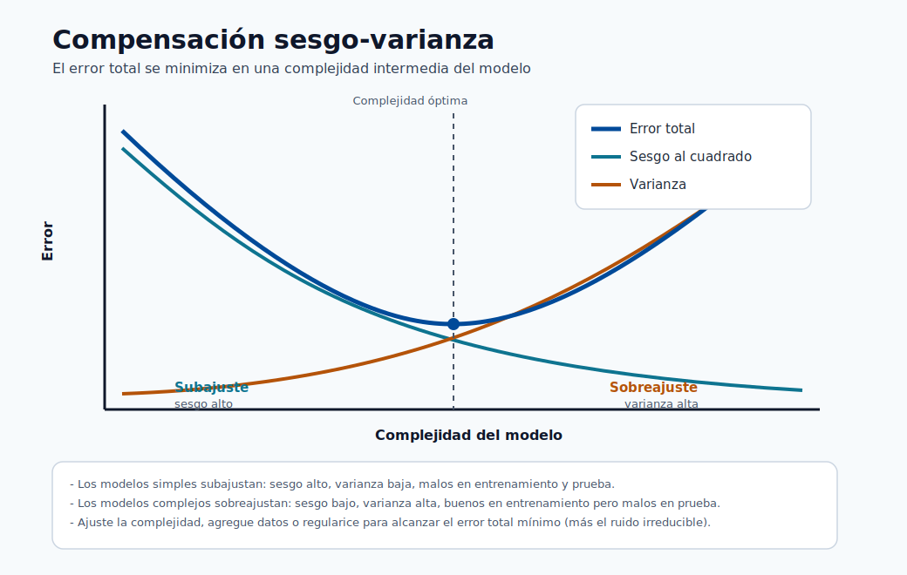

# Fundamentos del ML

Este módulo construye la base matemática y conceptual necesaria para todos los módulos posteriores.  
Comienza desde los primeros principios y luego avanza hacia las familias de modelos y la lógica de selección.

## Familias de aprendizaje fundamentales

- Aprendizaje supervisado : clasificación y regresión
- Aprendizaje no supervisado : agrupamiento y asociación
- Aprendizaje por refuerzo : aprendizaje de políticas a partir de recompensas

Familias modernas adicionales usadas en producción:

- Aprendizaje semisupervisado : combinar un pequeño conjunto etiquetado con un gran conjunto sin etiquetar.
- Aprendizaje autosupervisado : crear señales de supervisión a partir de los propios datos.
- Aprendizaje en línea : actualizar los modelos de forma continua a partir de datos en streaming/nuevos.

Qué recordar:

- El supervisado aprende a partir de respuestas conocidas.
- El no supervisado descubre estructura sin etiquetas.
- El de refuerzo aprende a través de la interacción y la recompensa.

> **Nota - Qué muestra esto:** Las principales familias de aprendizaje una al lado de la otra. El eje distintivo es la *señal de retroalimentación*:
> respuestas etiquetadas (supervisado), solo estructura (no supervisado) o recompensa por interacción
> (refuerzo). Identificar qué señal proporcionan tus datos es el primer paso para elegir un
> enfoque.

> **Nota - Qué muestra esto:** Las tareas de ML organizadas por *objetivo* (predecir una clase, predecir un número, agrupar registros, reducir
> dimensiones). Asigna tu pregunta de negocio a uno de estos objetivos antes de elegir un algoritmo :
> el objetivo restringe tanto la familia del modelo como la métrica de evaluación.

## Tipos de problemas

- Supervisado : clasificación y regresión
- No supervisado : agrupamiento y asociación
- Refuerzo : control y optimización de políticas

## Conceptos básicos de datos y notación

- Conjunto de datos : $D = (x_i, y_i)_{i=1}^{N}$ para el aprendizaje supervisado.
- Vector de características : $x_i \in \mathbb{R}^{d}$.
- Objetivo/etiqueta : $y_i$.
- Modelo : $f_{\theta}(x)$ con parámetros $\theta$.

## Categorías de aprendizaje supervisado

| Categoría                  | Tipo de salida              | Ejemplos                          | Métricas típicas             |
| -------------------------- | --------------------------- | --------------------------------- | ---------------------------- |
| Clasificación binaria      | Clase 0/1                   | Fraude sí/no, fuga de clientes sí/no | Precisión, Exhaustividad, F1, AUC |
| Clasificación multiclase   | Una de $K$ clases           | Categoría de producto, clase de diagnóstico | Macro-F1, exactitud, log loss |
| Clasificación multietiqueta | Múltiples clases por muestra | Etiquetar documentos/temas       | Micro-F1, pérdida de Hamming |
| Regresión                  | Valor continuo              | Precio, demanda, latencia         | MAE, RMSE, $R^2$             |
| Pronóstico de series temporales | Valores futuros a lo largo del tiempo | Ventas, energía, tráfico    | MAPE, RMSE, sMAPE           |

### Intuición de clasificación vs regresión

- La clasificación predice qué clase.
- La regresión predice cuánto.

El mismo conjunto de características puede admitir ambas según el objetivo de negocio.

## Categorías de aprendizaje no supervisado

| Categoría                | Propósito                                   | Métodos típicos                          |
| ------------------------ | ------------------------------------------- | ---------------------------------------- |
| Agrupamiento             | Agrupar observaciones similares             | K-Means, DBSCAN, agrupamiento jerárquico |
| Reducción de dimensionalidad | Comprimir características conservando la estructura | PCA, UMAP, autoencoders             |
| Minería de asociación    | Encontrar reglas de coocurrencia            | Apriori, FP-growth                       |
| Detección de anomalías   | Detectar patrones raros/anormales           | Isolation Forest, One-Class SVM          |

## Semisupervisado y autosupervisado

- El semisupervisado es útil cuando las etiquetas son costosas. Ejemplo : tienes 1,000 imágenes médicas etiquetadas y 50,000 sin etiquetar. Un enfoque semisupervisado entrena sobre ambas, propagando etiquetas a partir de predicciones con confianza.
- El autosupervisado es común en los modelos fundacionales (GPT, BERT, CLIP) y en los pipelines de preentrenamiento. El modelo se entrena sobre una tarea proxy cuyas etiquetas provienen de los propios datos, por ejemplo predecir la siguiente palabra o reconstruir un parche enmascarado.
- Ambos reducen la dependencia del etiquetado manual, que es costoso y lento a gran escala.

| Enfoque         | Requisito de etiquetas  | Algoritmos comunes                        |
| --------------- | ----------------------- | ----------------------------------------- |
| Supervisado     | Todas las muestras etiquetadas | Regresión logística, XGBoost, NN     |
| Semisupervisado | Pequeña fracción etiquetada | Propagación de etiquetas, pseudoetiquetado |
| Autosupervisado | No se necesitan etiquetas | Autoencoders enmascarados, aprendizaje contrastivo |

## Componentes del aprendizaje por refuerzo

El RL normalmente se modela como un Proceso de Decisión de Markov (MDP):

$$  
(\mathcal{S},\mathcal{A},P,R,\gamma)  
$$

donde:

- $\mathcal{S}$: conjunto de estados
- $\mathcal{A}$: conjunto de acciones
- $P$: dinámica de transición
- $R$: función de recompensa
- $\gamma$: factor de descuento

Concepto de función de valor:

$$  
V^{\pi}(s)=\mathbb{E}*{\pi}\left[\sum*{t=0}^{\infty}\gamma^t r_t\mid s_0=s\right]  
$$

Objetivo:

$$  
\max_{\pi}\mathbb{E}*{\pi}\left[\sum*{t=0}^{\infty}\gamma^t r_t\right]  
$$

Objetivo supervisado:

$$  
\min_{\theta} \frac{1}{N}\sum_{i=1}^{N}\mathcal{L}(f_{\theta}(x_i), y_i)  
$$

Esto es la minimización del riesgo empírico : encontrar los parámetros que minimizan la pérdida promedio de entrenamiento.

Funciones de pérdida comunes:

$$  
\mathcal{L}*{MSE}=\frac{1}{N}\sum*{i=1}^{N}(y_i-\hat{y}_i)^2  
$$

$$  
\mathcal{L}*{BCE}=-\frac{1}{N}\sum*{i=1}^{N}\left[y_i\log(\hat{p}_i)+(1-y_i)\log(1-\hat{p}_i)\right]  
$$

Entropía cruzada multiclase:

$$  
\mathcal{L}*{CE}=-\frac{1}{N}\sum*{i=1}^{N}\sum_{k=1}^{K}y_{ik}\log(\hat{p}_{ik})  
$$

Objetivo de optimización con regularización:

$$  
\min_{\theta}\frac{1}{N}\sum_{i=1}^{N}\mathcal{L}(f_{\theta}(x_i),y_i)+\lambda R(\theta)  
$$

Actualización por descenso de gradiente:

$$  
\theta_{t+1}=\theta_t-\eta\nabla_{\theta}\mathcal{L}  
$$

Regularización:

$$  
\min_{\theta}\frac{1}{N}\sum_{i=1}^{N}\mathcal{L}(f_{\theta}(x_i),y_i)+\lambda R(\theta)  
$$

Opciones comunes:

- Regularización L1 : $R(\theta)=\lVert\theta\rVert_1$ (dispersión, selección de características)
- Regularización L2 : $R(\theta)=\lVert\theta\rVert_2^2$ (reducción de pesos, estabilidad)

## Sobreajuste y generalización

- El error de entrenamiento puede disminuir mientras el error de prueba aumenta (sobreajuste).
- Usa la separación entrenamiento/validación/prueba y la validación cruzada.
- Prefiere modelos más simples cuando el rendimiento es comparable.

Tamaños prácticos de partición (regla general):

| Partición  | Proporción típica  | Propósito                                   |
| ---------- | ------------------ | ------------------------------------------- |
| Entrenamiento | 60-80%          | Ajustar los parámetros del modelo           |
| Validación | 10-20%             | Afinar hiperparámetros y comparar modelos   |
| Prueba     | 10-20%             | Evaluación final imparcial antes del despliegue |

El conjunto de prueba **nunca** debe usarse durante la selección del modelo. Usarlo para la selección es una forma de fuga de datos que hace que las puntuaciones offline sean demasiado optimistas.

Validación cruzada : cuando los datos son limitados, la CV de k-pliegues usa todos los datos tanto para entrenamiento como para validación rotando los pliegues. K=5 o K=10 es lo típico.

## Intuición de sesgo-varianza

> **Nota - Cómo leer este gráfico:** A medida que crece la complejidad, el **sesgo al cuadrado** cae (el modelo puede ajustar más) mientras que la **varianza** sube
> (el modelo reacciona más a la muestra de entrenamiento particular). Su suma : el error total : tiene forma de U
> minimizada en una complejidad intermedia. A la izquierda del mínimo hay subajuste; a la derecha hay
> sobreajuste. El piso de la curva nunca llega a cero debido al ruido irreducible $\sigma^2$.

- Sesgo alto : modelo demasiado simple, subajusta. Síntoma : baja exactitud de entrenamiento y baja exactitud de prueba.
- Varianza alta : modelo demasiado complejo, sobreajusta. Síntoma : alta exactitud de entrenamiento, exactitud de prueba mucho más baja.

El error de prueba esperado se descompone como:

$$  
\mathbb{E}[(y-\hat{f}(x))^2] = \text{Bias}^2 + \text{Variance} + \sigma^2  
$$

donde $\sigma^2$ es el ruido irreducible.

El objetivo práctico es equilibrar ambos:

| Técnica                       | Aborda                             |
| ----------------------------- | ---------------------------------- |
| Más datos de entrenamiento    | Reduce la varianza                 |
| Regularización (L1/L2)        | Reduce la varianza                 |
| Selección/ingeniería de características | Puede reducir el sesgo y la varianza |
| Modelo más complejo           | Reduce el sesgo (riesgo : más varianza) |
| Métodos de ensamble           | Reduce ambos (normalmente)         |

## Cómo elegir rápidamente un tipo de ML

| Si tu pregunta es...                               | Usa...                   |
| -------------------------------------------------- | ------------------------ |
| ¿Puedo predecir este objetivo conocido?            | Aprendizaje supervisado  |
| ¿Puedo agrupar registros similares sin etiquetas?  | Aprendizaje no supervisado |
| ¿Puede un agente aprender a través de la interacción y la recompensa? | Aprendizaje por refuerzo |
| Tengo pocas etiquetas pero muchos datos sin etiquetar | Aprendizaje semisupervisado |

## Errores típicos que evitar

- Usar solo la exactitud en conjuntos de datos muy desequilibrados.
- Mezclar datos de entrenamiento/prueba durante el preprocesamiento (fuga de datos).
- Ignorar el concept drift después del despliegue.
- Tratar la puntuación del modelo como el único KPI sin validar el impacto en el negocio.

## Análisis a fondo : cada concepto, explicado

Esta sección desglosa la notación y los objetivos de arriba para que cada símbolo tenga un significado claro  
y una razón de existir.

### Leer la configuración supervisada $D = (x_i, y_i)_{i=1}^{N}$

- $N$ es el número de ejemplos de entrenamiento. Más ejemplos reducen la **varianza** (ver abajo) porque  
el promedio empírico es una estimación más ajustada de la expectativa verdadera.
- $x_i \in \mathbb{R}^{d}$ es un **vector de características** : una fila de $d$ números que describen un ejemplo.  
La dimensión $d$ es el *tamaño del espacio de características*; un $d$ alto con un $N$ pequeño es la clásica  
"maldición de la dimensionalidad", donde los datos se vuelven dispersos y las distancias pierden sentido.
- $y_i$ es la **etiqueta**. Su tipo decide la tarea : discreto → clasificación, continuo →  
regresión, ordenado en el tiempo → pronóstico.
- $f_\theta$ es el **modelo** : una función parametrizada. $\theta$ son los **parámetros**  
(pesos) que el optimizador ajusta. Cualquier cosa que estableces *antes* del entrenamiento (profundidad del árbol, tasa de  
aprendizaje, fuerza de regularización) es un **hiperparámetro**, afinado con datos de validación, no aprendido.

### Minimización del riesgo empírico (ERM), paso a paso

El objetivo $\min_\theta \frac{1}{N}\sum_i \mathcal{L}(f_\theta(x_i), y_i)$ dice:  
"elige los parámetros que hagan el error promedio sobre los datos de entrenamiento lo más pequeño posible".

- $\mathcal{L}$ es la **función de pérdida** : puntúa cuán equivocada está una sola predicción.
- El $\frac{1}{N}\sum$ convierte las pérdidas por ejemplo en un **promedio** (el *riesgo empírico*),  
que es nuestro sustituto computable del verdadero riesgo esperado sobre $P(X,Y)$.
- La ERM solo funciona si la muestra de entrenamiento se parece a los datos de producción. Cuando no es así, un riesgo  
de entrenamiento bajo no implica un riesgo bajo en el mundo real : por eso exactamente reservamos datos de prueba.

### Por qué cada función de pérdida tiene la forma que tiene

- El **MSE** $\frac{1}{N}\sum (y_i-\hat y_i)^2$ eleva los errores al cuadrado, de modo que los errores grandes dominan. Es  
la pérdida de máxima verosimilitud cuando el ruido es gaussiano, por lo que se empareja con la regresión.
- La **entropía cruzada binaria (BCE)** $-\frac{1}{N}\sum [y\log\hat p + (1-y)\log(1-\hat p)]$  
mide la *sorpresa* de la etiqueta verdadera bajo la probabilidad predicha. Explota cuando  
el modelo está equivocado con confianza ($\hat p \to 0$ mientras $y=1$), lo que desalienta fuertemente  
el exceso de confianza. Es la pérdida de máxima verosimilitud para un objetivo de Bernoulli.
- La **entropía cruzada categórica** generaliza la BCE a $K$ clases sumando la sorpresa sobre la  
etiqueta one-hot $y_{ik}$.

### Descenso de gradiente : qué controla cada símbolo

La actualización $\theta_{t+1} = \theta_t - \eta\nabla_\theta\mathcal{L}$ es el caballo de batalla del ML.

- $\nabla_\theta\mathcal{L}$ es el **gradiente** : la dirección de *aumento* más pronunciado de la  
pérdida. Moverse en la dirección del gradiente *negativo* reduce la pérdida.
- $\eta$ es la **tasa de aprendizaje** (tamaño del paso). Demasiado grande → el optimizador se pasa y  
diverge; demasiado pequeña → el entrenamiento es lento y puede estancarse en regiones planas. En la práctica es el  
hiperparámetro más importante de afinar.
- Las variantes importan operativamente : el GD por **lotes** usa todos los datos por paso (estable, lento);  
el GD **estocástico** usa un ejemplo (ruidoso, rápido); el GD por **minilotes** (el estándar) hace un balance entre  
ambos y es lo que usan los frameworks de aprendizaje profundo.

### Regularización L1 vs L2 : geometría y efecto

La regularización agrega una penalización $\lambda R(\theta)$ para desalentar los modelos complejos:

- La **L1** ($\lVert\theta\rVert_1$) tiene esquinas en su región de restricción, así que el óptimo a menudo  
cae exactamente sobre un eje → algunos pesos se vuelven **exactamente cero** → selección automática de características  
y modelos dispersos.
- La **L2** ($\lVert\theta\rVert_2^2$) reduce todos los pesos suavemente hacia cero sin forzar  
que ninguno se anule → soluciones más estables y mejor condicionadas.
- $\lambda$ es la **fuerza de regularización** : un $\lambda$ mayor → modelo más simple → más sesgo,  
menos varianza. Se afina con datos de validación, nunca con el conjunto de prueba.

### Descomposición sesgo-varianza, en términos sencillos

$\mathbb{E}[(y-\hat f(x))^2] = \text{Bias}^2 + \text{Variance} + \sigma^2$ divide el  
error esperado de un modelo en tres fuentes:

- **Sesgo** : error por suposiciones equivocadas (modelo demasiado simple para captar el patrón). Un sesgo alto  
se muestra como baja exactitud *tanto* de entrenamiento como de prueba (subajuste).
- **Varianza** : error por la sensibilidad a la muestra de entrenamiento particular. Una varianza alta se muestra  
como una gran brecha entre alta exactitud de entrenamiento y menor exactitud de prueba (sobreajuste).
- $\sigma^2$ : **ruido irreducible** en las propias etiquetas. Ningún modelo puede superar este piso; está  
determinado por la calidad de los datos, no por la elección del algoritmo.

El arte de modelar consiste en moverse a lo largo de esta compensación : agregar capacidad para reducir el sesgo, agregar datos  
o regularización para reducir la varianza : hasta que la *suma* se minimice.

### Validación cruzada y por qué el conjunto de prueba es sagrado

- La **validación cruzada de k-pliegues** rota qué pliegue se reserva, de modo que cada ejemplo se usa tanto para  
entrenamiento como para validación a lo largo de los pliegues. La puntuación promediada es una estimación de menor varianza de la  
generalización que una sola partición, esencial cuando los datos son escasos.
- El **conjunto de prueba** se toca exactamente una vez, al final mismo. Cualquier decisión (elección de modelo,  
umbral, hiperparámetro) influida por el rendimiento de prueba filtra información y hace que la  
puntuación reportada tenga un sesgo optimista, una forma sutil pero común de **fuga de datos**.

### Uniéndolo todo : diagnosticar subajuste vs sobreajuste

La teoría se vuelve accionable cuando puedes leer una curva de aprendizaje. Grafica el error de entrenamiento y de validación
a medida que aumentas la capacidad del modelo (o el tiempo de entrenamiento), y la brecha entre las dos curvas
te dice exactamente qué hacer a continuación:

| Lo que observas | Diagnóstico | Qué hacer |
|---|---|---|
| Error de entrenamiento alto, error de validación alto (cercanos entre sí) | Subajuste (sesgo alto) | Agregar capacidad : modelo más rico, más características, menos regularización, entrenar más tiempo |
| Error de entrenamiento bajo, error de validación mucho más alto (gran brecha) | Sobreajuste (varianza alta) | Reducir la varianza : más datos, regularización más fuerte, modelo más simple, parada temprana |
| Error de entrenamiento y de validación ambos bajos y cercanos | Buen ajuste | Detente; este es el punto óptimo de la curva de sesgo-varianza |
| Ambos errores atascados por encima de un piso aceptable | Ruido irreducible o problemas de etiquetas | Mejorar la calidad de los datos/etiquetas; ningún algoritmo puede superar el piso $\sigma^2$ |

> **Consejo - Lee la brecha, no el número absoluto:** La *distancia* entre el error de entrenamiento y el de validación
> diagnostica el problema. Una brecha pequeña significa un problema de sesgo (agregar capacidad); una brecha grande significa
> un problema de varianza (agregar datos o regularización). Este único hábito guía la mayor parte de la depuración de modelos.

### Un ejemplo concreto de sesgo-varianza

Imagina ajustar una curva a puntos ruidosos muestreados de una onda suave:

- Una **línea recta** (polinomio de grado 1) no puede curvarse para seguir la onda : se equivoca de la
  misma manera sin importar qué muestra extraigas. Eso es **sesgo alto, varianza baja**.
- Un **polinomio de grado 15** se contornea a través de cada punto, incluido el ruido. Extrae una nueva muestra
  y se contornea de manera completamente diferente. Eso es **sesgo bajo, varianza alta**.
- Un **polinomio de grado 3** capta la forma de la onda ignorando el ruido. Es estable
  entre muestras y preciso : el mínimo de la curva de error total.

La regularización, más datos y el ensamblado son simplemente herramientas que te permiten usar un modelo flexible
(sesgo bajo) mientras domas su contorneo (controlando la varianza).

## Autoevaluación rápida

1. Dado un vector de características $x_i \in \mathbb{R}^d$ y una etiqueta $y_i$, ¿cómo distingues si la
   tarea es de clasificación, regresión o pronóstico?
2. ¿Por qué la entropía cruzada binaria castiga tan duramente una predicción equivocada con confianza?
3. ¿Cuál es la diferencia práctica entre la regularización L1 y L2 sobre los pesos aprendidos?
4. Ves un 99% de exactitud de entrenamiento y un 74% de exactitud de validación. ¿Qué parte de la
   compensación sesgo-varianza es el problema, y cuáles son dos soluciones?
5. ¿Por qué el conjunto de prueba debe usarse solo una vez, y cómo se llama cuando violas esto?
