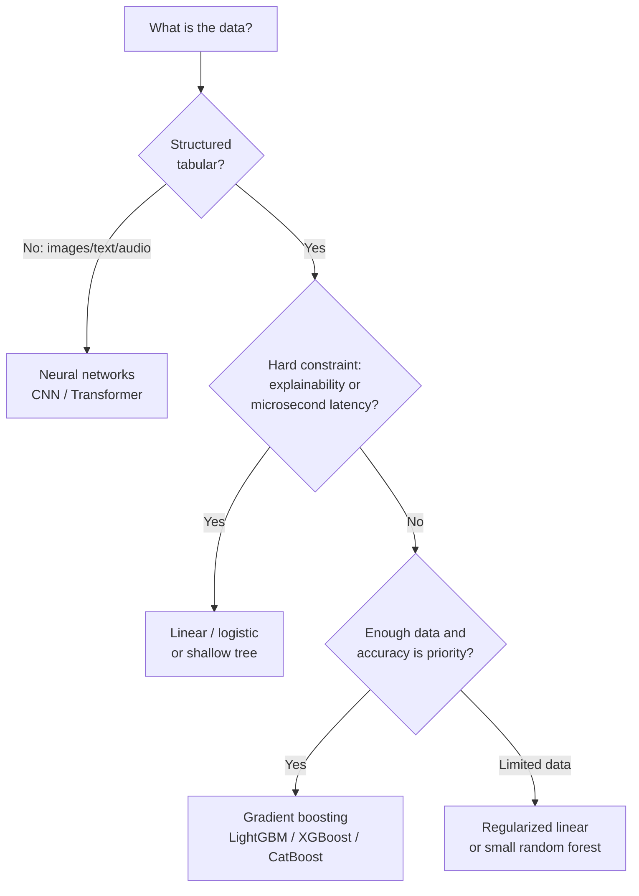

# Tipos de modelos


> **Nota - Lo que muestra:** Un esquema lógico para implementar un modelo : desde el tipo de problema hasta la familia de algoritmos y las restricciones de
> despliegue. Úsalo para trazar cómo una pregunta de negocio se reduce a una elección de modelo específica.

Este módulo conecta las familias de algoritmos con los tipos de problemas y las restricciones de despliegue.

## Algoritmos comunes por tarea

- Clasificación: regresión logística, bosque aleatorio, potenciación del gradiente, SVM
- Regresión: regresión lineal, regresor de bosque aleatorio, XGBoost
- Previsión: AutoARIMA, Prophet, variantes de potenciación del gradiente

## Guía rápida de familias de modelos

| Familia | Fortaleza | Debilidad | Uso típico |
|---|---|---|---|
| Modelos lineales | Rápidos, interpretables | Capacidad no lineal limitada | Líneas base, regresión tabular |
| Conjuntos de árboles | Fuerte rendimiento tabular | Mayor memoria/latencia | Datos de negocio estructurados |
| Métodos de núcleo | Buen comportamiento basado en márgenes | Mal escalado con datos muy grandes | Clasificación de tamaño medio |
| Redes neuronales | Alto poder de representación | Intensivas en datos y ajuste | Visión, PLN, patrones complejos |

Objetivo regularizado:

$$
\min_{\theta} \frac{1}{N}\sum_{i=1}^{N}\mathcal{L}(f_{\theta}(x_i), y_i) + \lambda R(\theta)
$$

## Formas matemáticas representativas

Probabilidad de la regresión logística:

$$
\hat{p}=\sigma(\theta^T x)=\frac{1}{1+e^{-\theta^T x}}
$$

Interpretación de la frontera de decisión:

- Si $\hat{p} > \tau$, predecir la clase positiva.
- El umbral $\tau$ debería ajustarse según el equilibrio de costos de negocio.

Regla de decisión de Naive Bayes:

$$
P(y\mid x_1,\dots,x_n)\propto P(y)\prod_{i=1}^{n}P(x_i\mid y)
$$

Nota sobre la suposición: Naive Bayes asume la independencia condicional de las características.

Objetivo de Elastic Net:

$$
\min_{\theta}\frac{1}{2N}\|y-X\theta\|_2^2+\lambda\left(\alpha\|\theta\|_1+\frac{1-\alpha}{2}\|\theta\|_2^2\right)
$$

LightGBM y los modelos de potenciación del gradiente construyen árboles aditivos:

$$
F_m(x)=F_{m-1}(x)+\nu\,h_m(x)
$$

donde $h_m(x)$ es el aprendiz débil ajustado en la etapa $m$ y $\nu$ es la tasa de aprendizaje.

## Selección práctica de modelos

| Restricción | Preferencia |
|---|---|
| Necesidad de explicabilidad | Modelos lineales, árboles poco profundos |
| Mejor exactitud tabular | Potenciación del gradiente (LightGBM/XGBoost/CatBoost) |
| Latencia muy baja | Modelo lineal o de árbol optimizado |
| Datos de entrenamiento limitados | Modelos regularizados más simples |
| Características dispersas de alta dimensión | Modelos lineales dispersos (SGDClassifier, Elastic Net) |
| Mezcla de numéricas + categóricas | Conjuntos de árboles o CatBoost (manejo nativo de categóricas) |

## Intuición del árbol de decisión

Los árboles de decisión dividen los datos maximizando una medida de pureza en cada nodo:

$$
\text{Gini impurity} = 1 - \sum_{k=1}^{K} p_k^2
$$

$$
\text{Information gain} = H(S) - \sum_{v} \frac{|S_v|}{|S|} H(S_v)
$$

donde $H(S) = -\sum_k p_k \log_2 p_k$ es la entropía del conjunto $S$.

Los árboles profundos sobreajustan. Los bosques aleatorios promedian muchos árboles entrenados sobre muestras de bootstrap y subconjuntos aleatorios de características. Esto reduce la varianza sin mucho aumento en el sesgo.

## Mecánica de la potenciación del gradiente

La potenciación del gradiente construye árboles de forma iterativa para corregir los errores residuales:

| Iteración | Qué se aprende |
|---|---|
| 0 | Predicción base (media o frecuencia de clase) |
| 1 | Árbol ajustado al gradiente de la pérdida (residuos de primer orden) |
| 2 | Árbol ajustado a los residuos restantes |
| ... | Cada paso reduce los residuos hacia cero |

Hiperparámetros clave que más importan:

| Parámetro | Efecto |
|---|---|
| `n_estimators` | Más árboles = más capacidad (riesgo: sobreajuste sin parada temprana) |
| `learning_rate` (encogimiento $\nu$) | Menor = más conservador, normalmente mejor con más árboles |
| `max_depth` / `num_leaves` | Controla la complejidad del árbol (principal perilla de sobreajuste) |
| `min_child_samples` | Regulariza el tamaño de la hoja |
| `subsample` / `colsample_bytree` | Muestreo estocástico de columnas/filas, reduce la varianza |

## Sesgo, varianza y complejidad

- Aumentar la complejidad del modelo normalmente reduce el sesgo pero aumenta la varianza.
- La regularización, la poda y la parada temprana son controles prácticos.

## Consideraciones avanzadas

- Calibración: las probabilidades predichas deberían reflejar la frecuencia real de los eventos.
- Equidad: evaluar el rendimiento por grupo, no solo la puntuación global.
- Robustez: probar bajo ruido, ausencia de valores y distribuciones desplazadas.

## Métodos de conjunto en la práctica

Tres patrones principales de conjunto más allá de la potenciación del gradiente:

| Método | Idea | Beneficio |
|---|---|---|
| Bagging | Entrenar modelos sobre muestras de bootstrap, promediar predicciones | Reduce la varianza |
| Boosting | Entrenar modelos secuencialmente, cada uno corrigiendo al anterior | Reduce el sesgo de forma iterativa |
| Stacking | Entrenar un metamodelo sobre predicciones fuera de pliegue de modelos base | A menudo la mejor exactitud final |

Ejemplo de stacking (2 capas):

```python
from sklearn.ensemble import StackingClassifier
from sklearn.linear_model import LogisticRegression
from sklearn.ensemble import RandomForestClassifier
from lightgbm import LGBMClassifier

estimators = [
    ("rf", RandomForestClassifier(n_estimators=100)),
    ("lgbm", LGBMClassifier(n_estimators=200)),
]
stacker = StackingClassifier(estimators=estimators, final_estimator=LogisticRegression())
stacker.fit(X_train, y_train)
```

## Complejidad del algoritmo y equilibrio de latencia

| Tipo de modelo | Latencia de inferencia | Huella de memoria | Notas |
|---|---|---|---|
| Regresión logística | Muy baja (us) | Muy pequeña | Una sola multiplicación de matrices |
| Árbol de decisión poco profundo | Baja (us) | Pequeña | Recorrido del árbol |
| Bosque aleatorio (100 árboles) | Media (ms) | Media | N recorridos de árbol |
| LightGBM (1000 árboles) | Baja-media | Media | Por hojas, bien optimizado |
| Red neuronal profunda | Alta (ms-s en CPU) | Grande | Se prefiere la inferencia por lotes |

## Análisis a fondo: cada concepto, explicado

Esta sección conecta las ecuaciones anteriores con la intuición y los equilibrios de ingeniería.

### Modelos lineales y logísticos : la línea base interpretable

Un **modelo lineal** predice $\hat y = \theta^T x$: cada característica contribuye con un voto ponderado, y
el peso $\theta_j$ es directamente legible como "efecto de la característica $j$". La **regresión logística**
envuelve esto en la **sigmoide** $\sigma(z) = \tfrac{1}{1+e^{-z}}$, que comprime cualquier número real
en $(0,1)$ para que la salida sea una probabilidad válida. El modelo es lineal en *log-probabilidades*: un cambio
unitario en $x_j$ multiplica las probabilidades por $e^{\theta_j}$. Esta transparencia es por la que los modelos lineales
siguen siendo la línea base predeterminada y la elección cuando los reguladores exigen decisiones explicables.

### El umbral de decisión $\tau$ es una palanca de negocio, no una constante

Un clasificador produce una probabilidad; convertirla en un sí/no necesita un **umbral** $\tau$
(predeterminado 0,5). Mover $\tau$ intercambia precisión por exhaustividad: un equipo de fraude que teme el fraude no detectado
baja $\tau$ (detectar más, aceptar más falsas alarmas); un equipo que teme bloquear buenos
clientes lo sube. El $\tau$ correcto se establece por el *costo relativo* de los dos tipos de error, no
por el algoritmo : por lo que los umbrales se ajustan después del entrenamiento, contra el costo de negocio.

### Naive Bayes y la suposición de independencia

$P(y\mid x) \propto P(y)\prod_i P(x_i\mid y)$ proviene directamente de la regla de Bayes, con una
suposición simplificadora ("ingenua"): las características son **condicionalmente independientes dada la clase**.
Esto casi nunca es literalmente cierto, sin embargo, el modelo funciona sorprendentemente bien para texto/spam porque
necesita muy pocos datos y el entrenamiento es solo contar frecuencias. Conocer la suposición te dice
su modo de fallo: las características fuertemente correlacionadas obtienen su evidencia contada por duplicado.

### Árboles, impureza y por qué los conjuntos superan a los árboles individuales

Un **árbol de decisión** divide repetidamente los datos para hacer que cada grupo resultante sea más "puro":

- La **impureza de Gini** $1-\sum_k p_k^2$ y la **entropía** $-\sum_k p_k\log_2 p_k$ ambas miden cuán
  mezcladas están las etiquetas de un nodo; se elige una división para reducir esto lo máximo (**ganancia de información**).
- Un solo árbol profundo memoriza los datos de entrenamiento → **alta varianza / sobreajuste**.
- Los **bosques aleatorios** corrigen esto mediante **bagging**: entrenar muchos árboles sobre muestras de bootstrap con subconjuntos
  aleatorios de características y promediarlos. Promediar árboles decorrelacionados cancela sus errores individuales,
  recortando la varianza con poco sesgo añadido.
- La **potenciación del gradiente** toma la ruta opuesta: construir árboles **secuencialmente**, cada uno ajustado
  a los *errores residuales* (el gradiente de la pérdida) del conjunto actual. La actualización
  $F_m(x) = F_{m-1}(x) + \nu\,h_m(x)$ añade cada nuevo aprendiz débil escalado por el **encogimiento**
  $\nu$. Un $\nu$ pequeño con muchos árboles es la receta bien conocida para la mejor exactitud tabular.

### Los hiperparámetros de la potenciación, y lo que realmente controlan

- `n_estimators` es *capacidad*: más árboles ajustan una estructura más fina pero sobreajustan sin parada temprana
  sobre un conjunto de validación.
- `learning_rate` ($\nu$) es *cautela por paso*: menor significa que cada árbol corrige menos, por lo que el
  conjunto generaliza mejor : pero necesita proporcionalmente más árboles.
- `max_depth` / `num_leaves` es la *principal perilla de sobreajuste*: limita cuán complejo puede llegar a ser cualquier
  árbol individual.
- `subsample` / `colsample_bytree` inyectan **estocasticidad** (muestreo de filas/columnas) que
  decorrelaciona los árboles y reduce la varianza, muy parecido a como lo hace un bosque aleatorio.

### Bagging vs boosting vs stacking : una frase cada uno

- El **bagging** reduce la **varianza** promediando modelos independientes (bosque aleatorio).
- El **boosting** reduce el **sesgo** corrigiendo secuencialmente los errores (XGBoost/LightGBM).
- El **stacking** entrena un **metamodelo** sobre las predicciones fuera de pliegue de diversos modelos base para
  aprovechar sus fortalezas complementarias : normalmente la mayor exactitud, a costa de complejidad
  y latencia.

### Calibración, equidad, robustez : las preocupaciones de grado de producción

- **Calibración**: un modelo está calibrado si, entre las predicciones de "70% de probabilidad", alrededor del 70%
  son realmente positivas. Los árboles potenciados a menudo están *mal calibrados* y se benefician del escalado de Platt
  o de la regresión isotónica antes de usar las probabilidades en decisiones.
- **Equidad**: la exactitud agregada puede ocultar que un modelo rinde peor para un subgrupo. Evalúa siempre
  las métricas *por segmento*, no solo globalmente.
- **Robustez**: los datos de producción son más ruidosos que los de entrenamiento; prueba el modelo bajo ruido inyectado,
  campos faltantes y distribuciones desplazadas antes de confiar en él.

### Por qué la latencia y la memoria pertenecen a la selección de modelos

La tabla de latencia/huella anterior es un recordatorio de que el "mejor" modelo es el que cumple
*todas* las restricciones. Un conjunto de 1000 árboles que añade 30 ms por llamada puede romper un SLA en tiempo real, mientras
que una regresión logística de una sola multiplicación de matrices sirve en microsegundos. La exactitud es necesaria pero
nunca suficiente : el costo, la latencia, la interpretabilidad y la mantenibilidad son criterios de selección
de igual importancia.

## Un diagrama de flujo de selección de modelos

La mayoría de las elecciones de modelos tabulares se reducen a unas pocas preguntas sobre el tipo de datos, el tamaño y las restricciones.
Este flujo es una primera pasada rápida; confirma siempre con una línea base validada.



> **Consejo - Empieza simple, escala con evidencia:** Ajusta siempre primero una línea base barata (regresión
> logística o un árbol pequeño). Pasa a la potenciación o al aprendizaje profundo solo cuando el error de la línea base
> sea genuinamente el cuello de botella y la exactitud adicional valga el costo y la latencia añadidos.

## Cuándo recurrir realmente al aprendizaje profundo

El aprendizaje profundo no es el valor predeterminado para datos tabulares; la potenciación del gradiente normalmente lo iguala o supera
ahí a una fracción del costo. Recurre a las redes neuronales cuando se cumpla una de estas condiciones:

| Situación | Por qué ganan las redes neuronales |
|---|---|
| Entrada no estructurada (imágenes, audio, texto en bruto) | Aprenden la representación de características automáticamente |
| Conjuntos de datos muy grandes (millones+ de ejemplos) | La capacidad escala con los datos; la potenciación se estanca |
| Interacciones de características complejas que la ingeniería manual no puede capturar | Las capas profundas componen características jerárquicamente |
| Hay disponible aprendizaje por transferencia desde un modelo preentrenado | El ajuste fino supera al entrenamiento desde cero con pocos datos |

## Autoevaluación rápida

1. ¿Por qué la regresión logística sigue siendo la línea base predeterminada a pesar de su simplicidad?
2. ¿Qué intercambia el parámetro de encogimiento $\nu$ (learning_rate) en la potenciación del gradiente?
3. En una frase cada uno, ¿en qué se diferencian el bagging, el boosting y el stacking?
4. Un modelo potenciado produce "0,7" pero solo el 50% de tales casos son positivos: ¿qué está mal y cómo lo arreglas?
5. Nombra dos razones para elegir una red neuronal sobre la potenciación del gradiente.
