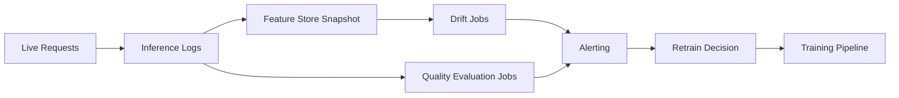

# Resultados y explicabilidad

Este módulo enseña cómo pasar de reportar la puntuación del modelo a un análisis confiable del comportamiento
del modelo para las partes interesadas técnicas y no técnicas.

## Artefactos de revisión del modelo

- Matriz de confusión
- Curvas ROC y de precisión-recall
- Importancia de características
- Explicaciones SHAP y LIME

## Explicabilidad global frente a local

| Tipo | Propósito | Ejemplo |
|---|---|---|
| Global | Explicar el comportamiento general del modelo | Características principales en todas las muestras |
| Local | Explicar una sola predicción | Por qué se predijo que el cliente A es de alto riesgo |

Usa ambas:

- La global explica el comportamiento a nivel de estrategia y ayuda a los científicos de datos a verificar que el modelo aprendió señales reales (no artefactos de fuga).
- La local respalda las revisiones a nivel de caso, las apelaciones y los registros de auditoría regulatoria.

### Ejemplo de resumen SHAP (modelo tabular)

```python
import shap
import lightgbm as lgb

model = lgb.LGBMClassifier().fit(X_train, y_train)
explainer = shap.TreeExplainer(model)
shap_values = explainer.shap_values(X_test)

# Global importance plot
shap.summary_plot(shap_values[1], X_test, plot_type="bar")

# Local explanation for one prediction
shap.force_plot(explainer.expected_value[1], shap_values[1][0], X_test.iloc[0])
```

### Interpretación de los valores SHAP

- Valor SHAP de la característica $j$ en la muestra $i$: el cambio en la salida del modelo atribuible a la característica $j$.
- SHAP positivo = empuja la predicción hacia arriba. SHAP negativo = empuja la predicción hacia abajo.
- La suma de todos los valores SHAP es igual a la salida del modelo menos el valor esperado.

## Monitoreo y drift

Drift de covariables (cambio en la distribución de entrada):

$$
P_t(X)\neq P_{t+\Delta}(X)
$$

Drift de concepto (cambio en el mapeo):

$$
P_t(Y\mid X)\neq P_{t+\Delta}(Y\mid X)
$$

Índice de estabilidad de población (PSI):

$$
\mathrm{PSI}=\sum_{b=1}^{B}(a_b-e_b)\ln\frac{a_b}{e_b}
$$

donde $a_b$ y $e_b$ son las proporciones de bin reales y esperadas.

Orientación operativa:

- Establece ventanas baseline a partir de períodos de datos estables.
- Alerta tanto sobre las métricas de drift como sobre los cambios en los KPI del negocio.
- Desencadena el reentrenamiento solo cuando los umbrales persisten, no a partir de picos individuales.


> **Nota - Cómo leerlo:** Curvas ROC buenas frente a malas. Un modelo cuya curva se inclina hacia la esquina superior izquierda separa bien las clases
> (alto AUC); una cercana a la diagonal es poco mejor que el azar. Compara los candidatos en la misma
> división de validación.


> **Nota - Cómo leerlo:** Curvas de precisión-recall buenas frente a malas. En datos desbalanceados las curvas PR son más honestas que ROC : una
> curva que se mantiene alta a medida que aumenta el recall significa que el modelo mantiene la precisión mientras detecta más
> positivos.

Usa explicaciones tanto globales como locales antes del lanzamiento a producción.

## La pila de explicabilidad en la práctica

- SHAP: fuerte para la interpretabilidad de modelos tabulares. Exacto para modelos de árbol (TreeSHAP); aproximado para otros (KernelSHAP).
- LIME: aproximación local alrededor de una predicción usando un modelo lineal sustituto.
- Importancia por permutación: señal global agnóstica del modelo. Mide la caída de accuracy cuando los valores de una característica se mezclan aleatoriamente.

### Elegir entre SHAP y LIME

| Criterio | SHAP | LIME |
|---|---|---|
| Consistencia de las explicaciones | Alta (fundamentada en teoría de juegos) | Varía con la muestra aleatoria |
| Velocidad para modelos de árbol | Rápida (TreeSHAP es $O(TLD^2)$) | Lenta (requiere predicción repetida) |
| Funciona con cualquier modelo | Sí (KernelSHAP) | Sí |
| Adecuado para depuración | Sí | Sí, especialmente para modelos de caja negra |

### Importancia por permutación en código

```python
from sklearn.inspection import permutation_importance

result = permutation_importance(model, X_test, y_test, n_repeats=10, random_state=42)
for i in result.importances_mean.argsort()[::-1]:
    print(f"{X_test.columns[i]:<25} {result.importances_mean[i]:.4f} +/- {result.importances_std[i]:.4f}")
```

## Lista de verificación de gobernanza

1. Documenta los supuestos del modelo y las limitaciones conocidas.
2. Valida el rendimiento por segmentos de usuarios importantes.
3. Rastrea la versión del modelo y los artefactos de explicación juntos.
4. Define una ruta de escalamiento para incidentes del modelo.

## Plantilla de ficha de modelo (recomendada)

| Sección | Qué documentar |
|---|---|
| Uso previsto | Objetivo de negocio, usuarios objetivo, no-objetivos |
| Datos | Fuentes, muestreo, sesgos conocidos |
| Métricas | Métricas primarias/secundarias y umbrales |
| Explicabilidad | Métodos usados (SHAP/LIME/PFI) |
| Equidad | Resultados a nivel de segmento y notas de mitigación |
| Límites de seguridad | Condiciones en las que el modelo no debe usarse |
| Operaciones | Cadencia de reentrenamiento, umbrales de alerta, plan de rollback |

## Arquitectura de monitoreo



## Política de respuesta para alertas de drift

1. Valida la calidad de la alerta (descarta problemas de registro o de pipeline).
2. Comprueba el movimiento del KPI del negocio frente al drift estadístico.
3. Desencadena un reentrenamiento en sombra antes del cambio en producción.
4. Usa un despliegue canary para el modelo de reemplazo.

### Guía de decisión de cadencia de reentrenamiento

| Señal | Acción recomendada |
|---|---|
| PSI > 0.2 en características clave | Desencadena una investigación de drift, considera reentrenar |
| SLO de calidad de predicción no cumplido durante 2+ semanas consecutivas | Reentrenamiento obligatorio + causa raíz |
| Retraso en la retroalimentación de etiquetas (etiquetas obsoletas) | Recopila etiquetas frescas, luego reentrena |
| Auditoría regulatoria o revisión de equidad | Reentrena con un conjunto de datos actualizado y auditado |
| Sin señal de drift durante 3+ meses | Reentrenamiento proactivo programado de todos modos |

### Lista de verificación de monitoreo para nuevos despliegues

1. Conjunto de datos baseline almacenado y con huella digital.
2. Monitor de drift de características configurado (PSI o prueba KS por característica).
3. Monitor de distribución de predicciones configurado.
4. Umbrales de alerta establecidos y webhook de PagerDuty/Teams adjunto.
5. Trabajo de evaluación de calidad del modelo programado (semanal o mensual).
6. Despliegue de rollback etiquetado y accesible.

## Análisis a fondo: cada concepto, explicado

Esta sección explica la teoría detrás de las herramientas de explicabilidad y drift para que puedas confiar
en sus resultados y defenderlos.

### Por qué la explicabilidad es un requisito, no un lujo

Un modelo que no se puede explicar no se puede depurar, auditar ni defender legalmente. La explicabilidad
sirve a tres audiencias distintas: **científicos de datos** que verifican que el modelo aprendió una señal real (no
un artefacto de fuga), **partes interesadas del negocio** que confían en él y lo adoptan, y **reguladores/usuarios
afectados** que tienen derecho a saber por qué se tomó una decisión. Por eso el módulo separa las explicaciones globales
de las locales : responden diferentes preguntas para diferentes personas.

### Global frente a local, con precisión

- Las explicaciones **globales** describen el comportamiento *general* del modelo: qué características importan en
  todas las predicciones. Responden "¿qué aprendió el modelo?"
- Las explicaciones **locales** describen *una* predicción: por qué este cliente fue calificado de alto riesgo. Responden
  "¿por qué esta decisión?" y son lo que un proceso de apelaciones o auditoría necesita.

Un modelo puede tener un comportamiento global sensato pero una explicación local incorrecta para un caso extremo, por lo que ambas
vistas son necesarias antes del lanzamiento.

### SHAP: una división justa del crédito

**SHAP (SHapley Additive exPlanations)** toma prestado el **valor de Shapley** de la teoría de juegos
cooperativos. La idea: tratar cada característica como un "jugador" y la predicción como el "pago", y luego
distribuir justamente el pago entre las características promediando la contribución marginal de cada característica
sobre *todos los órdenes posibles* de las demás. Esto produce la **propiedad de aditividad** que el módulo
señala: los valores SHAP de un ejemplo suman (salida del modelo − salida esperada). Concretamente, un
valor SHAP positivo empujó la predicción hacia arriba; uno negativo la empujó hacia abajo; su total explica
toda la brecha respecto al baseline.

Por qué se prefiere SHAP para modelos tabulares:

- Es **consistente y localmente precisa** (fundamentada en axiomas), por lo que las explicaciones no cambian
  arbitrariamente.
- **TreeSHAP** calcula valores de Shapley exactos para ensambles de árboles en tiempo polinomial
  ($O(TLD^2)$ para $T$ árboles, $L$ hojas, profundidad $D$), lo que lo hace lo bastante rápido para producción.
- Para modelos que no son de árbol, **KernelSHAP** aproxima los mismos valores de forma agnóstica al modelo (más lento).

### LIME e importancia por permutación : las herramientas complementarias

- **LIME** (Local Interpretable Model-agnostic Explanations) explica una predicción muestreando
  puntos perturbados a su alrededor y ajustando un modelo **sustituto** simple (normalmente lineal) localmente.
  Funciona en cualquier caja negra pero, como depende del muestreo aleatorio, sus explicaciones pueden variar
  entre ejecuciones : la debilidad de consistencia señalada en la tabla de comparación.
- La **importancia por permutación** es una señal global, agnóstica al modelo: mezcla los valores de una característica y
  mide cuánto cae la accuracy. Una caída grande significa que el modelo se apoyó en esa característica. Es
  barata e intuitiva pero puede ser engañada por características correlacionadas (mezclar una mientras su correlato
  permanece intacto subestima la importancia).

### Drift: las dos distribuciones que pueden cambiar

El fallo en producción suele rastrearse hasta una distribución que cambia por debajo del modelo:

- **Drift de covariables (datos)** : las entradas cambian: $P_t(X) \neq P_{t+\Delta}(X)$. Ejemplo: un nuevo
  segmento de clientes con patrones de gasto diferentes. El mapeo aún puede ser válido, pero el modelo
  ve entradas distintas a sus datos de entrenamiento.
- **Drift de concepto** : la *relación* cambia: $P_t(Y\mid X) \neq P_{t+\Delta}(Y\mid X)$.
  Ejemplo: las tácticas de fraude evolucionan, por lo que las mismas características ahora implican un riesgo diferente. Esto es más
  peligroso porque la función aprendida ahora es simplemente incorrecta.

Distinguirlos importa: el drift de covariables puede corregirse reponderando o recopilando nuevos datos;
el drift de concepto generalmente requiere reentrenar con etiquetas frescas.

### PSI, de forma intuitiva

El **índice de estabilidad de población** $\text{PSI}=\sum_b (a_b-e_b)\ln\tfrac{a_b}{e_b}$ compara la
distribución binada *actual* de una característica ($a_b$) contra un *baseline* ($e_b$). Cada término crece cuando
la participación de un bin se aleja de su participación baseline, por lo que PSI es un único número que mide "cuánto
se ha movido esta distribución". Umbrales comunes: **< 0.1** sin cambio significativo, **0.1–0.2**
moderado (investigar), **> 0.2** significativo (probablemente reentrenar). Es esencialmente una medida de
entropía relativa simetrizada, razón por la cual se combina naturalmente con las pruebas KS en los monitores de drift.

### Por qué el reentrenamiento se basa en umbrales y persistencia, no en reflejos

La orientación operativa : alertar sobre drift persistente, validar contra los KPI del negocio, probar en sombra
antes de cambiar : existe porque el reentrenamiento es costoso y arriesgado. Un único pico de drift puede ser un
fallo de registro; reaccionar a él rota los modelos innecesariamente. La disciplina es: confirmar que la señal es
real *y* sostenida *y* ligada a un movimiento de KPI, y luego reentrenar hacia un despliegue en **sombra** o **canary**
antes de promover. Esto vincula la explicabilidad/el monitoreo de vuelta a las estrategias de lanzamiento del módulo de
despliegue.

## Autoevaluación rápida

1. ¿Qué pregunta diferente responde una explicación *local* en comparación con una *global*?
2. ¿Por qué los valores SHAP de una sola predicción suman "salida del modelo menos valor esperado"?
3. ¿Cuándo elegirías LIME sobre TreeSHAP, y cuál es la principal debilidad de LIME?
4. ¿Cuál es la diferencia entre el drift de covariables y el drift de concepto, y cuál suele forzar el reentrenamiento?
5. Una característica clave muestra PSI = 0.27: ¿qué indica eso y qué deberías hacer antes de reentrenar?
